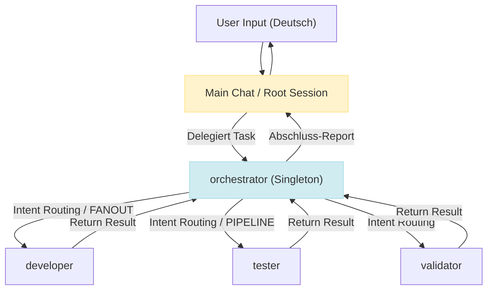
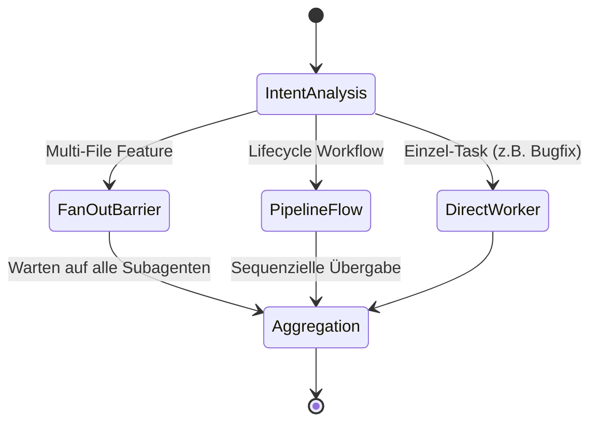

# Kernprinzip 2: Orchestrator-First & Singleton Orchestrator Pattern

> **Typ:** Concept  
> **Status:** Active  
> **Relevante Komponenten:** `agents/1-generic/orchestrator.md`, `rules/1-generic/issue-lifecycle.md`, A2A Anti-Re-Delegation Gates

---

## 1. Übersicht & Motivation

In verteilten Multi-Agenten-Systemen führt die direkte Ausführung komplexer Aufgaben im Hauptchat (Main Chat) häufig zu Unordnung, fehlender Traceability und unvollständigen Validierungen. agent-meta erzeugt eine klare **Delegations-Pyramide** durch das **Orchestrator-First-Prinzip**: 

Jegliche Aufgabenstellung wird vom Main Chat als Single Entry Point direkt an den `orchestrator`-Agenten übergeben. Der Main Chat fungiert rein als Pass-Through/Interface und führt selbst **keine direkten Code-Änderungen** durch.

---

## 2. Der Critical Gate Rule

Um die Architekturgrenzen durchzusetzen, gilt für den Main Chat folgende unumstößliche Regel:

> **CRITICAL GATE:**  
> Der MAIN CHAT darf nicht selbst Dateien editieren oder Implementierungs-Code generieren.  
> ALL Entwicklungs- und Refactoring-Tasks müssen an den `orchestrator` delegiert werden.

---

## 3. Singleton Orchestrator Pattern

Das **Singleton Orchestrator Pattern** stellt sicher, dass zu jedem Zeitpunkt exakt **ein** zentraler Steuerungs-Agent die Übersicht über die Task-Ausführung und das Token-Budget behält:

1. **Einzigartiger Origin:** Nur die primäre User-Session (`main_chat`) ist berechtigt, eine `orchestrator`-Instanz zu spawnen.
2. **Verbot der Unter-Instanziierung:** Subagenten (wie `developer`, `tester` oder `explorer`) dürfen **niemals** ihrerseits wieder einen `orchestrator` starten.
3. **Zentrales Tracking:** Sämtliche Handshakes, Parallel-Ausführungen (FANOUT) und Ergebnis-Aggregationen (BARRIER) laufen gebündelt im Singleton Orchestrator zusammen.

---

## 4. A2A Anti-Re-Delegation Gates

Um unendliche Schleifen, Deadlocks und Context Bleed bei Agent-to-Agent (A2A) Aufrufen zu verhindern, schützt das Framework den Execution Flow mit vier harten Sicherheitsgrenzen:

| Gate | Regel | Beschreibung & Schutzziel |
|---|---|---|
| **Gate 1: Depth Limit** | `max_depth = 10` | Die maximale Aufruf-Verschachtelung ist auf 10 Stufen begrenzt. |
| **Gate 2: No Self-Handoff** | `no_self_handoff` | Ein Agent darf sich nicht selbst aufrufen (keine direkte Selbstrekursion). |
| **Gate 3: No Back-Delegation** | `no_back_delegation` | Sub-Worker dürfen nicht an den `orchestrator` zurückdelegieren. Das Payload darf nicht mit System-Prompts ("Du bist...") beginnen. |
| **Gate 4: Trace Isolation** | `structured_outputs` | Worker liefern nur isolierte Ergebnisse (`STATUS`, `RESULT`, `ARTIFACTS`). Keinesfalls werden rohe System-Logs zurückpropagiert. |

---

## 5. Intent Routing & Workflow-Muster

Der `orchestrator` zerlegt komplexe Benutzeranforderungen und wählt anhand des Aufgaben-Typs das passende Routing-Muster:

* **Direct Worker:** 1-zu-1 Delegation an Spezialisten (`developer`, `technical-writer`).
* **FANOUT / BARRIER:** Parallele Ausführung mehrerer unabhängiger Teil-Tasks mit abschließender BARRIER-Aggregierung.
* **PIPELINE:** Sequenzielle Stufenkette (z.B. `requirements` → `developer` → `tester` → `validator`).

---

## 6. Querverweise & Verwandte Konzepte

* [[core-principle-a2a-handoff]] — Agent-to-Agent Protokoll und Envelopes
* [[core-principle-dod-presets]] — Definition of Done Validation Gates
* [[core-principle-context-compaction]] — Token-Budget & Isolation
* [[core-principles-overview]] — Gesamtübersicht der agent-meta Prinzipien