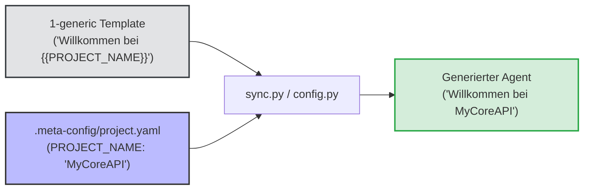
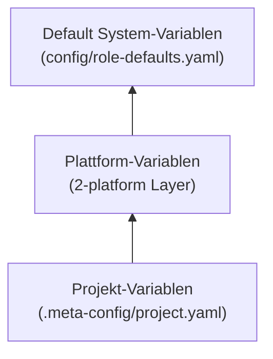

# Kernprinzip 7: PAL Variables & Dynamic Template Substitution

> **Typ:** Concept  
> **Status:** Active  
> **Relevante Komponenten:** `scripts/lib/config.py`, `scripts/lib/agents.py`, `.meta-config/project.yaml`

---

## 1. Übersicht & Motivation

Um Agenten-Templates generisch und projektoffen zu halten, dürfen projektspezifische Bezeichner, Pfade, Sprachen oder DoD-Parameter nicht fest im Quellcode verbaut werden.

**agent-meta** bietet mit dem **PAL Variables System** eine leistungsfähige Build-Zeit-Substitution: Platzhalter in Templates werden von `sync.py` anhand der Projektkonfiguration (`.meta-config/project.yaml`) und der Plattform-Eigenschaften dynamisch aufgelöst.

---

## 2. Invarianten & Nomenklatur-Regeln

Für PAL-Variablen gelten in agent-meta drei unumstößliche System-Invarianten:

1. **Großbuchstaben mit Unterstrich:** Variablennamen im Template sind immer in **GROSSBUCHSTABEN** verfasst, getrennt durch Unterstriche (`{}` oder `{{PROJECT_NAME}}`). MixedCase oder lowercase werden ignoriert.
2. **Escaping-Syntax (`{}`):** Soll ein Variablen-Name in der ausgegebenen Dokumentation als Wörtlicher Text erscheinen, ohne ersetzt zu werden, verwendet man den Escape-Präfix `{}` → wird als Text `{}` ausgegeben.
3. **Build-Zeit Injektion:** Alle Variablen werden deterministisch während der Ausführung von `sync.py` ersetzt. Zur Runtime existieren keine unaufgelösten Platzhalter in den Dateien.

---

## 3. Die Variablen-Kaskade

Bei der Auflösung von Variablen durch `scripts/lib/config.py` gilt folgende Prioritäts-Reihenfolge:

---

## 4. Übersicht wichtiger Standard-Variablen

| Variablen-Name | Zweck & Beschreibung | Beispiel-Wert |
|---|---|---|
| `PROJECT_NAME` | Name des Zielprojekts | `"agent-meta"` |
| `DOD_PRESET` | Aktives Quality Gate Preset | `"rapid-prototyping"` |
| `DEFAULT_LANGUAGE` | Standardsprache für User-Kommunikation | `"Deutsch"` |
| `CODE_LANGUAGE` | Primäre Programmiersprache im Projekt | `"Python"` |
| `SE_MAX_DEPTH` | Maximale Rekursionstiefe der SE-Kaskade | `5` |
| `SE_MAX_CELLS` | Maximale Gesamtzellen der SE-Kaskade | `20` |
| `ORCHESTRATOR_MODE` | Modus des Orchestrators | `"strict"` |

---

## 5. Hinzufügen einer neuen Platzhalter-Variable

Um eine neue Platzhalter-Variable im Framework einzuführen, sind folgende Schritte erforderlich:

1. **Erfassung in Engine:** Registrierung der Variable in `scripts/lib/config.py` in den Methoden `build_variables()` oder `_inject_dod()`.
2. **Dokumentation:** Eintrag in der Variablen-Tabelle der globalen `CLAUDE.md` / `AGENTS.md`.
3. **Template-Nutzung:** Verwendung des Platzhalters `{}` im entsprechenden Agenten-Template.

---

## 6. Querverweise & Verwandte Konzepte

* [[core-principle-provider-agnosticism]] — Provider Abstraction Layer (PAL)
* [[core-principle-composition-system]] — Vererbung von Templates
* [[core-principles-overview]] — Gesamtübersicht der agent-meta Prinzipien