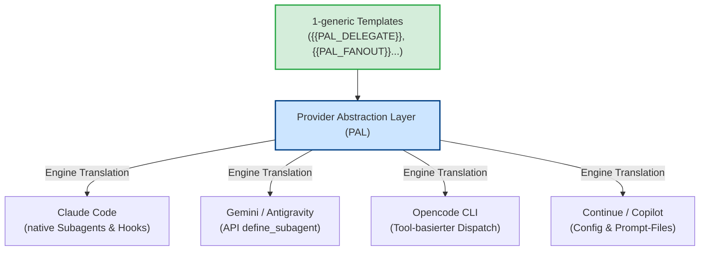
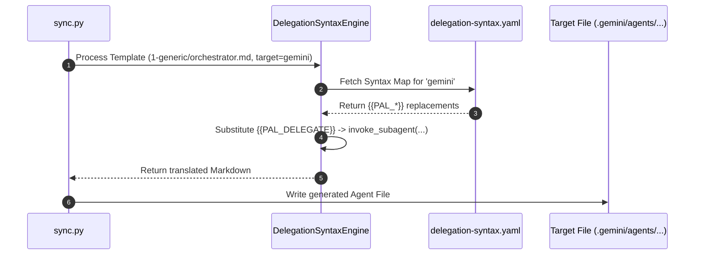

# Kernprinzip 3: Provider Agnosticism & Provider Abstraction Layer (PAL)

> **Typ:** Concept  
> **Status:** Active  
> **Relevante Komponenten:** `config/delegation-syntax.yaml`, `config/provider-capabilities.yaml`, `config/provider-bootstrap.yaml`, `scripts/lib/delegation_syntax.py`, `scripts/lib/bootstrap.py`

---

## 1. Übersicht & Motivation

Ein Kernversprechen von **agent-meta** ist die vollständige **Provider-Agnostik**: Ein Agenten-Template wird genau einmal in `agents/1-generic/` definiert und kann ohne Anpassungen für alle führenden LLM-Plattformen und CLI-Tools generiert werden.

Um plattformspezifischen "Syntax Leak" (z.B. Claude-spezifische `Agent()` Aufrufe in generischen Templates) zu vermeiden, kapselt der **Provider Abstraction Layer (PAL)** die Delegations-Syntaxe, Werkzeuggruppen und Registrierungsmechanismen.



---

## 2. Die drei Säulen des PAL

Der Abstraction Layer gliedert sich in drei aufeinander abgestimmte Konfigurationen und Engines:

### 2.1 Syntax Registry (`config/delegation-syntax.yaml`)
Übersetzt abstrakte Delegations-Platzhalter zur Build-Zeit in die jeweilige Ziel-Syntax des Providers.

```yaml
# Beispielauszug Syntax Registry
claude:
  PAL_DELEGATE: "Invoke agent {{AGENT}} with prompt: {{PROMPT}}"
gemini:
  PAL_DELEGATE: "invoke_subagent(TypeName='{{AGENT}}', Prompt='{{PROMPT}}')"
continue:
  PAL_DELEGATE: "@{{AGENT}} {{PROMPT}}"
```

### 2.2 Capability Matrix (`config/provider-capabilities.yaml`)
Beschreibt die technischen Einschränkungen und Features der jeweiligen Provider-Runtimes. `sync.py` nutzt diese Matrix für bedingtes Rendern und Feature-Flags.

| Provider | `subagent_dispatch` | `parallel_execution` | `file_based_agents` | `hooks` | `bootstrap_required` |
|---|:---:|:---:|:---:|:---:|:---:|
| **Claude Code** | ✅ | ✅ | ✅ | ✅ | ❌ |
| **Gemini / Antigravity** | ✅ | ✅ | ❌ | ❌ | ✅ |
| **Opencode CLI** | ✅ | ✅ | ✅ | ❌ | ❌ |
| **Continue** | ❌ | ❌ | ❌ | ❌ | ✅ |
| **GitHub Copilot** | ❌ | ❌ | ✅ | ❌ | ❌ |

### 2.3 Bootstrap Registry (`config/provider-bootstrap.yaml`)
Legt fest, wie Agenten in Runtimes registriert werden, die keine automatische Ordner-Discovery besitzen:

* **File-based (Claude, Opencode, Copilot):** Agenten werden direkt aus `.claude/agents/` geladen.
* **API-based (Gemini):** Agenten werden zur Session-Start-Zeit dynamisch via `define_subagent` API-Call registriert.
* **Config-based (Continue):** Agenten werden durch `sync.py` deterministisch in `.continue/config.yaml` eingetragen.

---

## 3. Delegation-Syntax Engine Workflow

Während der Generierung durch `sync.py` durchläuft jedes Template die `DelegationSyntaxEngine`:



---

## 4. Richtlinien für Provider-Agnostik

1. **Keine proprietären Tool-Namen in Templates:** In `1-generic/` dürfen keine spezifischen Funktionsnamen wie `Bash()`, `View()` oder `invoke_subagent()` hartverdrahtet werden. Verwende stets `{{PAL_*}}`-Platzhalter.
2. **Fallback-Strategien:** Für Runtimes ohne Subagent-Dispatch (z.B. Continue/Copilot) generiert PAL Anweisungstexte für sequenzielles Abarbeiten durch den menschlichen User oder den Hauptchat.
3. **Plattform-Overrides (`2-platform/`):** Sollte eine Plattform zwingend spezifisches Verhalten benötigen, erfolgt dies über deklarative Composition Patches (siehe [[core-principle-composition-system]]).

---

## 5. Querverweise & Verwandte Konzepte

* [[core-principle-pal-variables]] — Dynamische Variablen im PAL System
* [[core-principle-composition-system]] — 4-Schichten Patching für Plattform-Abweichungen
* [[core-principles-overview]] — Gesamtarchitektur von agent-meta