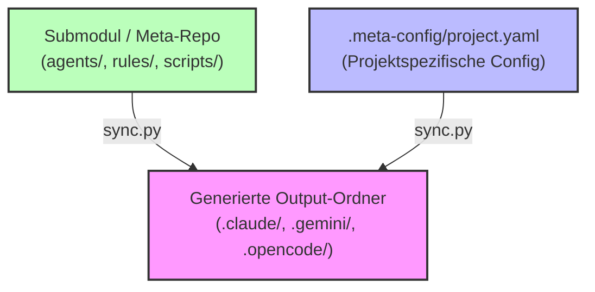

# Kernprinzip 1: Submodule Protection & Drift Prevention

> **Typ:** Concept  
> **Status:** Active  
> **Relevante Komponenten:** `scripts/sync.py`, `.meta-config/project.yaml`, `.meta-config/context-hashes.json`, `hooks/1-generic/sync-on-config-change.sh`

---

## 1. Übersicht & Motivation

Das Framework **agent-meta** wird in Zielprojekten typischerweise als **Git-Submodul** eingebunden. Um die Wartbarkeit über hunderte Projekte hinweg zu sichern und unbeabsichtigte Projektabweichungen (Configuration Drift) zu verhindern, setzt agent-meta auf eine strikte Trennung zwischen **Meta-Quellen** (Templates, Skripte, Rules) und **generierten Provider-Dateien** (`.claude/`, `.gemini/`, `.opencode/`).



---

## 2. Architektonische Entkopplung

### 2.1 Single Source of Truth vs. Generierte Artefakte
* **Invariante 1:** Dateien in `.claude/agents/`, `.gemini/agents/` oder `.opencode/agents/` sind **generierte Ausgaben**. Sie dürfen niemals manuell editiert werden.
* **Invariante 2:** Alle projektspezifischen Anpassungen erfolgen ausschließlich in `.meta-config/project.yaml` oder über das 4-Schichten-Composition-System in `agents/3-project/`.

### 2.2 Verzeichnisstruktur & Verantwortlichkeiten
| Pfad / Bereich | Status | Bearbeitung | Zweck |
|---|---|---|---|
| `.agent-meta/` / `external/agent-meta/` | Submodul | Via Submodul-Commits | Universelle Agent-Templates & Generator-Logik |
| `.meta-config/project.yaml` | Projekt-Quelltext | Manuell | Deklarative Projektkonfiguration & Rollenauswahl |
| `.meta-config/context-hashes.json` | Generiert / Git-committet | via `sync.py` | Hash-Registry für Drift-Erkennung |
| `.claude/`, `.gemini/`, `.opencode/` | Generiert | Automatischt via `sync.py` | Provider-spezifische Runtime-Artefakte |

---

## 3. Branch-Guard & Git-Mutation-Regeln

Um versehentliche Mutationen im `main`-Branch zu verhindern, etabliert agent-meta strikte Git-Schutzregeln (Branch-Guard):

1. **Feature-Branch Pflicht:** Entwicklungsarbeiten, Template-Änderungen und `sync.py`-Läufe müssen auf Feature-Branches (`feat/`, `fix/`, `chore/`) durchgeführt werden.
2. **Faustregel:** Sobald `sync.py` ausgeführt wird oder mehr als eine Datei berührt wird, **muss** ein Branch angelegt werden. Direct-Commits auf `main` oder `master` sind gesperrt.
3. **Submodul-Sync:** Änderungen am agent-meta-Core propagieren kontrolliert über Git-Submodul-Commits und Tags.

---

## 4. CI-Checks & Drift-Erkennung

### 4.1 CI-Mode mit `sync.py --check`
Im Continuous Integration Pipeline-Schritt wird verifiziert, dass die im Repository eingecheckten Provider-Context-Dateien (`CLAUDE.md`, `AGENTS.md`, `GEMINI.md` etc.) exakt mit `.meta-config/project.yaml` übereinstimmen.

```bash
# Pure Status-Abfrage im CI-Runner
python .agent-meta/scripts/sync.py --check
```
* **Exit Code `0`:** Alle generierten Dateien sind vollkommen aktuell.
* **Exit Code `1`:** Abweichungen (Drift) entdeckt. Der Build bricht ab.

### 4.2 Hashes & Backup-Mechanismus (`context-hashes.json`)
Zur Verhinderung von lokalem manuellen Überschreiben speichert `sync.py` den SHA-256 Hash der generierten Managed Blocks in `.meta-config/context-hashes.json`:

```json
{
  "version": 1,
  "hashes": {
    "claude": "sha256:7f8a9b...",
    "gemini": "sha256:3e4f5a...",
    "continue": "sha256:1a2b3c..."
  }
}
```

Wenn ein Entwickler händische Änderungen in `CLAUDE.md` vornimmt und danach `sync.py` ausführt:
1. `sync.py` stellt fest, dass der Ist-Hash der Datei nicht mit `context-hashes.json` übereinstimmt.
2. Es erstellt automatisch ein Sicherheits-Backup: `.CLAUDE.md.sync-backup-<timestamp>`.
3. Die Managed Blocks werden deterministisch überschrieben und der neue Hash wird in `context-hashes.json` abgelegt.

---

## 5. Automated Reconciliation via Hook

Der Hook `hooks/1-generic/sync-on-config-change.sh` überwacht Schreibzugriffe auf `.meta-config/project.yaml`. Wird die Projektkonfiguration geändert, wird automatisch ein Lifecycle-Task für den `agent-meta-manager` angelegt, der den Re-Sync anstößt.

---

## 6. Querverweise & Verwandte Konzepte

* [[core-principle-managed-blocks]] — Injizierte Managed Blocks in Provider-Dateien
* [[core-principle-composition-system]] — 4-Schichten-Modell für Patches
* [[core-principles-overview]] — Gesamtschau aller 10 Kernprinzipien