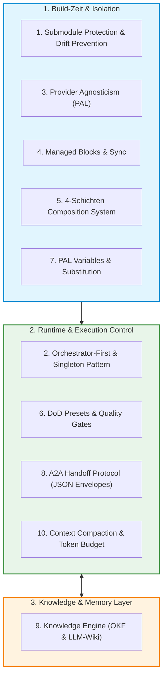
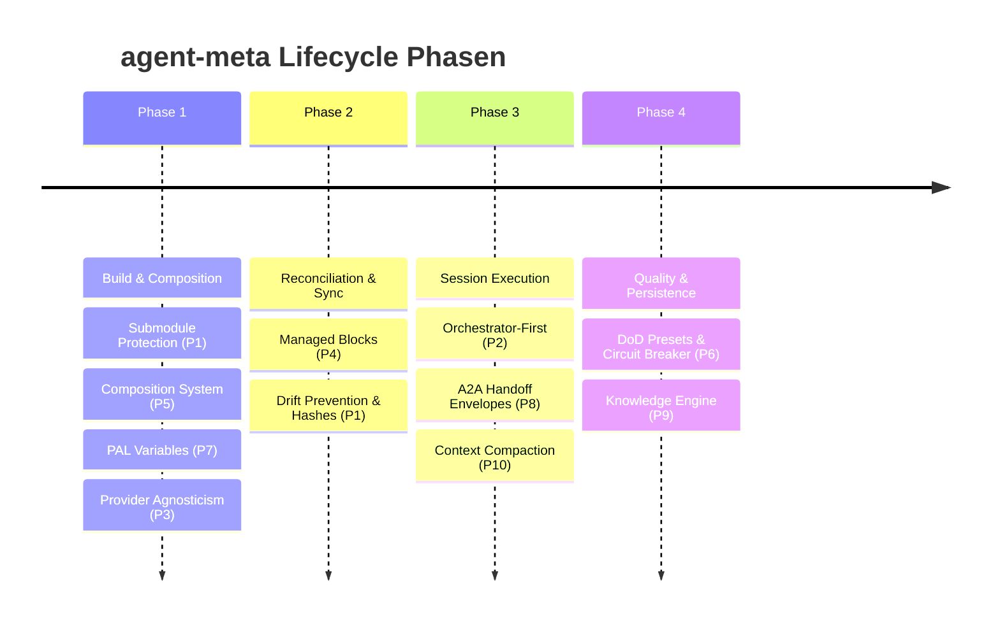

# Die 10 Kernprinzipien von agent-meta — Gesamtschau & Architektur

> **Typ:** Architecture  
> **Status:** Active  
> **Relevante Komponenten:** Gesamtarchitektur von agent-meta (`scripts/sync.py`, `agents/`, `knowledge/`, `schemas/`)

---

## 1. Übersicht

Das Framework **agent-meta** basiert auf 10 fundamentalen Architektur- und Entwurfsprinzipien. Zusammen garantieren sie höchste Code-Qualität, deterministische Multi-Provider-Unterstützung, absolute Skalierbarkeit und den Schutz vor unkontrolliertem Token-Verbrauch oder Codebase-Drift.

---

## 2. Die 10 Kernprinzipien im Überblick

| # | Prinzip | Typ | Haupt-Zweck | Link zum Konzept |
|---|---|---|---|---|
| **1** | **Submodule Protection** | Build / Protection | Entkopplung von Meta-Repo und Generaten, Submodul-Schutz & CI-Drift-Erkennung | [[core-principle-submodule-protection]] |
| **2** | **Orchestrator-First** | Execution Control | Single Entry Point über `orchestrator`, Main Chat Restriction & A2A Anti-Rekursions-Gates | [[core-principle-orchestrator-first]] |
| **3** | **Provider Agnosticism** | Abstraction | Multi-Provider-Unterstützung (Claude, Gemini, Opencode, Continue) ohne Syntax Leak | [[core-principle-provider-agnosticism]] |
| **4** | **Managed Blocks** | Synchronisation | Deterministische Injektion von Steuerdaten in `CLAUDE.md`, `AGENTS.md`, `GEMINI.md` | [[core-principle-managed-blocks]] |
| **5** | **Composition System** | Templating / Patching | Hierarchische 4-Schichten-Vererbung (0-external bis 3-project) & Bleed-Prevention | [[core-principle-composition-system]] |
| **6** | **DoD Presets** | Quality Assurance | Konfigurierbare Abnahme-Stufen (`rapid-prototyping` bis `enterprise`) & Circuit-Breaker | [[core-principle-dod-presets]] |
| **7** | **PAL Variables** | Templating | Dynamische `{}` Build-Zeit-Substitution in Agenten-Templates | [[core-principle-pal-variables]] |
| **8** | **A2A Handoff Protocol** | Inter-Agent Comm | Maschinell validierbare JSON-Envelopes & Datenverträge für Agenten-Koppelung | [[core-principle-a2a-handoff]] |
| **9** | **Knowledge Engine** | Memory / Wiki | Karpathy LLM-Wiki & OKF-Architektur mit 7 spezialisierten Knowledge-Rollen | [[core-principle-knowledge-engine]] |
| **10** | **Context Compaction** | Optimization | Token-Budgeting, Task-Isolation und Compact-Mode Payloads gegen Prompt-Bloat | [[core-principle-context-compaction]] |

---

## 3. Einordnung im Phasen-Lifecycle

Die Kernprinzipien greifen in verschiedenen Phasen des Entwicklungs-Workflows nahtlos ineinander:

1. **Build & Composition Phase:** `sync.py` verarbeitet die 4 Schichten ([[core-principle-composition-system]]), ersetzt PAL-Variablen ([[core-principle-pal-variables]]) und wendet Provider-Syntaxe ([[core-principle-provider-agnosticism]]) an.
2. **Reconciliation Phase:** Generierte Blöcke werden deterministisch in Projektdateien injiziert ([[core-principle-managed-blocks]]) und gegen Drift abgesichert ([[core-principle-submodule-protection]]).
3. **Session Execution Phase:** Der Main Chat übergibt Anfragen an den Singleton Orchestrator ([[core-principle-orchestrator-first]]). Aufgaben werden in isolierte Contexts verpackt ([[core-principle-context-compaction]]) und über A2A JSON Envelopes verschickt ([[core-principle-a2a-handoff]]).
4. **Quality & Persistence Phase:** Nachbesserungen und Abnahmen erfolgen nach den DoD-Regeln ([[core-principle-dod-presets]]), während finale Erkenntnisse in der Knowledge Engine abgelegt werden ([[core-principle-knowledge-engine]]).

---

## 4. Querverweise & Dokumentations-Verzeichnis

* [[core-principle-submodule-protection]] — Detailkonzept Submodul-Schutz
* [[core-principle-orchestrator-first]] — Detailkonzept Orchestrator-First
* [[core-principle-provider-agnosticism]] — Detailkonzept Provider-Agnostik
* [[core-principle-managed-blocks]] — Detailkonzept Managed Blocks
* [[core-principle-composition-system]] — Detailkonzept Composition System
* [[core-principle-dod-presets]] — Detailkonzept DoD Presets
* [[core-principle-pal-variables]] — Detailkonzept PAL Variables
* [[core-principle-a2a-handoff]] — Detailkonzept A2A Handoff Protocol
* [[core-principle-knowledge-engine]] — Detailkonzept Knowledge Engine
* [[core-principle-context-compaction]] — Detailkonzept Context Compaction
