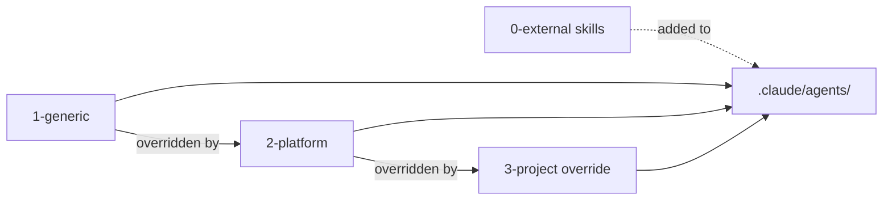

# Framework-Prinzipien der agent-meta Architektur

> **Status:** Verifiziert & Aktiv | **System:** agent-meta Core Architecture  
> **Kontext:** Standards & Governance für Multi-Provider AI-Agenten-Systeme

---

## Executive Summary

Das `agent-meta`-Framework stellt eine standardisierte, plattform- und provider-agnostische Infrastruktur für AI-Agenten bereit. Um Wartbarkeit, Konsistenz und absolute Skalierbarkeit über verschiedenste Zielprojekte und LLM-Plattformen (Claude Code, Gemini/Antigravity, Opencode, Continue, Mammouth, GitHub Copilot) zu garantieren, unterliegt die Architektur sechs zentralen **Framework-Prinzipien**.

Diese Prinzipien verhindern Konfigurations-Drift, schützen Zielprojekte vor ungewollten Breakages bei Framework-Updates, vermeiden Context-Window-Explosionen und sichern deterministische Multi-Agenten-Workflows.

---

## 1. Submodul-Isolationsregel & 3-Ebenen-Konfiguration

### 1.1 Das Isolations-Prinzip

`agent-meta` wird als Git-Submodul (üblicherweise unter `.agent-meta/`) in Zielprojekte eingebunden. Es gilt das strikte **Submodul-Isolationsgesetz**:

> ⚠️ **Invariante:** Das Submodul-Verzeichnis `.agent-meta/` gehört ausschließlich dem Framework. Es ist für das Zielprojekt **strikte Read-Only-Zone** und darf niemals im Zielprojekt manuell bearbeitet werden.

Ein `git submodule update` darf projektspezifische Konfigurationen niemals überschreiben oder beschädigen. Genauso dürfen Änderungen im Zielprojekt niemals das Submodul in einen „dirty state“ versetzen.

```
Zielprojekt/
├── .agent-meta/              ← Ebene 1: Framework-Configs (Git Submodul — READ ONLY)
│   └── config/               ← role-defaults.yaml, dod-presets.yaml, providers, schema
├── .meta-config/             ← Ebene 2: Projekt-Config (Eigentum des Zielprojekts ✅)
│   └── project.yaml          ← Rollen, PAL-Variablen, DoD-Preset, Provider-Auswahl
└── .claude/ | .gemini/ ...   ← Ebene 3: Generierte Provider-Outputs (von sync.py verwaltet)
    ├── agents/               ← Generierte Agenten-Prompts
    ├── rules/                ← Kopierte Governance-Regeln
    └── hooks/                ← Kopierte Shell-Hooks
```

### 1.2 Die 3 Konfigurationsebenen

| Ebene | Pfad | Eigentümer | Zweck & Regeln |
|---|---|---|---|
| **Ebene 1: Framework-Config** | `.agent-meta/config/` | `agent-meta` (Submodul) | Definiert globale Standards (`role-defaults.yaml`, `dod-presets.yaml`, `skills-registry.yaml`). Wird bei Submodul-Updates aktualisiert. **Nicht im Projekt editieren.** |
| **Ebene 2: Projekt-Config** | `.meta-config/project.yaml` | Zielprojekt | Definiert projektspezifische Parameter: aktive Rollen, benutzerdefinierte Variablen, gewähltes DoD-Profil, aktive Provider. **Im Projektversionskontrollsystem committen.** |
| **Ebene 3: Provider-Output** | `.claude/`, `.gemini/`, `.opencode/`, `.continue/`, etc. | `sync.py` Engine | Generierter Laufzeit-Kontext für die jeweiligen LLM-Provider. Darf nicht manuell editiert werden (ausgenommen Abschnitte außerhalb von Managed Blocks in Header-Dateien). |

### 1.3 Externe Skills-Isolation (`0-external/`)

Externe Agenten-Skills werden über `skills-registry.yaml` als eigenständige Submodule unter `0-external/` registriert. Sie werden von `sync.py` isoliert validiert (`approved: true/false`, Pinned Commits) und deterministisch in das Zielprojekt kopiert.

---

## 2. Managed Blocks System

### 2.1 Funktionsweise & Synchronisation

Zielprojekte benötigen oft eigene Anweisungen in zentralen Kontextdateien (wie `CLAUDE.md`, `AGENTS.md`, `GEMINI.md` oder `.continue/config.yaml`). Um manuelle Projekt-Ergänzungen zu bewahren und gleichzeitig automatisierte Updates durch `sync.py` zu ermöglichen, nutzt `agent-meta` **Managed Blocks**:

```markdown
# Projekt-Header (vom Entwickler editiert & gepflegt)
Willkommen im Zielprojekt XYZ! Hier stehen manuelle Befehle und Projekthinweise...

<!-- agent-meta:managed-begin -->
> **ROUTING:** Gemini -> AGENTS.md
`agent-meta v0.86.3` | DoD: `rapid-prototyping` | REQ-Trace: `false`

| Agent | Core Capabilities |
|---|---|
| `orchestrator` | Einstiegspunkt für alle Entwicklungsaufgaben |
... (automatisch generiert von sync.py bei jedem Lauf) ...
<!-- agent-meta:managed-end -->

# Projekt-Footer (optional manueller Text)
```

Bei jedem Lauf liest `sync.py` die Zieldatei, behält den Inhalt außerhalb des Blocks exakt bei und ersetzt strikt **nur** den Bereich zwischen `<!-- agent-meta:managed-begin -->` und `<!-- agent-meta:managed-end -->` (bzw. `# agent-meta:managed-begin` in YAML/TOML).

### 2.2 Drift-Erkennung & Smart Context Regeneration

Um unbeabsichtigte manuelle Manipulationen innerhalb der Managed Blocks oder an generierten Kontextdateien zu erkennen, speichert `agent-meta` SHA-256 Hashes in `.meta-config/context-hashes.json`:

1. **Drift Detection:** Erkennt `sync.py` einen Konflikt zwischen gespeichertem Hash und Dateistatus, wird automatisch ein Backup erstellt (`.CLAUDE.md.sync-backup-<timestamp>`) und eine Warnung ausgegeben.
2. **CI-Mode (`--check`):** Führt `python sync.py --check` aus. Ergibt ein Exit-Code `0`, wenn alle Kontextdateien synchron sind, andernfalls `1` (blockiert fehlerhafte PRs).
3. **Automatic Re-Sync Hook:** Der `sync-on-config-change`-Hook überwacht `.meta-config/project.yaml` und plant nach Änderungen automatisch eine Re-Synchronisation ein.

---

## 3. Provider Abstraction Layer (PAL) & Variablen-System

### 3.1 Das PAL-Konzept

Da verschiedene LLM-Plattformen unterschiedliche Syntaxen für Agenten-Delegation, Parallelisierung und Tooling besitzen, schreibt das `agent-meta`-Framework Vorlagen ausschließlich in der provider-agnostischen Schicht `1-generic/`.

Sämtliche platform-spezifischen Unterschiede werden über **PAL-Platzhalter** abstrahiert. Die Auflösung erfolgt zur Sync-Zeit (`build-time resolution`) durch `sync.py`.

Platzhalter folgen strikt dem Format `{{GROSS_MIT_UNTERSTRICH}}`.

### 3.2 Die zentralen PAL-Variablen

| Platzhalter | Zweck / Semantik | Beispiel Claude Code | Beispiel Gemini / Antigravity | Beispiel Opencode |
|---|---|---|---|---|
| `{{PAL_DELEGATE}}` | Syntax zur Übergabe einer Aufgabe an einen Subagenten | `@developer` | `/invoke developer` | `task(subagent_type="developer", ...)` |
| `{{PAL_FANOUT}}` | Parallele Ausführung *mehrerer Instanzen desselben Agententyps* | `run parallel @tester` | `/fanout tester` | Parallele `task()`-Calls |
| `{{PAL_PARALLEL_GROUP}}` | Parallele Ausführung *verschiedener Agententypen* | `group @frontend @backend` | `/group frontend backend` | Gemischte `task()`-Calls |
| `{{PAL_FALLBACK}}` | Verhalten bei fehlenden nativer Provider-Tools | CLI Fallback | Python Script Fallback | Standard Tool Fallback |
| `{{PAL_TOOL_PREAMBLE}}` | Einleitung der Tool-Dokumentation im System-Prompt | `<tools>...` | `[Tools]...` | System Preamble |
| `{{PARALLEL_PATTERN}}` | Genaue Dispatch-Instruktion für parallele Subagenten | Background Flags (`run_in_background=True`) | Gemini Automatic Parallelization | Multiple `task()` JSON Invokations |

### 3.3 Dynamic Project & Platform Variables

Neben PAL-Variablen unterstützt das System benutzerdefinierte Variablen aus `.meta-config/project.yaml`:
```yaml
variables:
  PROJECT_NAME: "MyEngine"
  BUILD_COMMAND: "cargo build --release"
```
Diese werden ebenfalls zur Sync-Zeit in Platzhalter wie `{{PROJECT_NAME}}` oder `{{BUILD_COMMAND}}` injiziert.

---

## 4. Definition of Done (DoD) Presets & Qualitätsprofile

### 4.1 Hierarchie & Konfiguration

Das Definition of Done (DoD) System steuert die Qualitätsanforderungen für Code-Änderungen und Releases. Qualitätsanforderungen werden über vordefinierte **DoD-Presets** in `.agent-meta/config/dod-presets.yaml` gesteuert und in `.meta-config/project.yaml` ausgewählt.

Es gilt die **Precedence-Regel**:
$$\text{Einzelübersteuerung (`dod:`) } > \text{DoD-Preset (`dod-preset:`) } > \text{Full-Fallback (`full`)}$$

### 4.2 Die 6 Standard-DoD-Presets

| Preset Name | Einsatzzweck | REQ-Traceability | Tests Pflicht | Codebase Overview | Security Audit | Systems Eng. (SE) |
|---|---|:---:|:---:|:---:|:---:|:---:|
| `full` | Enterprise / Reguliert | `true` | `true` | `true` | `false` | `false` |
| `standard` | Standard Softwareprojekte | `false` | `true` | `false` | `false` | `false` |
| `rapid-prototyping` | Prototypen & MVPs (Minimaler Overhead) | `false` | `false` | `false` | `false` | `false` |
| `spec-optional` | SE verfügbar, aber optional | `false` | `true` | `false` | `false` | `"false"` |
| `spec-driven` | SE empfohlen für komplexe Features | `true` | `true` | `false` | `false` | `"recommended"` |
| `spec-certified` | Höchste Sicherheits- & Regulierungsstufe | `true` | `true` | `true` | `true` | `"true"` |

Beispiel-Konfiguration in `.meta-config/project.yaml`:
```yaml
dod-preset: standard
dod:
  security-audit: true # Manuelle Übersteuerung des Presets
```

---

## 5. Orchestrator-First-Architektur & Governance

### 5.1 Main Chat Gate (Critical Gate)

Das fundamentale Architektur-Gesetz von `agent-meta` lautet:

> ⛔ **CRITICAL GATE:** Der Main Chat (die primäre Interaktionsschicht mit dem Benutzer) ist eine reine **Kommunikationsoberfläche (Thin Router)**. Er führt NIEMALS direkt Code-Edits, Dateianalysen oder mehrschrittige Entwicklungsaufgaben aus. **SÄMTLICHE Entwicklungsaufgaben MÜSSEN strikt an den `orchestrator`-Agenten delegiert werden.**

```
                                  MAIN CHAT SESSION
                    (Thin Router / Smarte Kommunikationsoberfläche)
                                          │
                  ┌───────────────────────┴───────────────────────┐
                  │ (Ausnahmen: Atomare Git-Ops, Sync, Feedback) │
                  ▼                                               ▼
         [Orchestrator Gate]                             [Direkte Ausnahmen]
                  │                                         (git, manager)
                  ▼
          ORCHESTRATOR AGENT
   (Task Decomposition & Dispatcher)
                  │
   ┌──────────────┼──────────────┐
   ▼              ▼              ▼
[developer]   [tester]     [validator]
```

### 5.2 A2A Anti-Re-Delegation Gates

Um Endlosschleifen, unkontrollierten Token-Verbrauch und Context-Explosionen bei der Agent-to-Agent (A2A) Kommunikation zu verhindern, erzwingt das Framework fünf strikte Schranken:

1. **Recursion Limit:** Maximale Aufruftiefe 10, Selbst-Handoff verboten (`depth <= 10`).
2. **Payload Limitation:** Delegations-Payloads (`payload.t`) sind auf maximal 300 Zeichen beschränkt.
3. **No Re-Delegation:** Subagenten/Worker dürfen NIEMALS die Kontrolle an den `orchestrator` zurückdelegieren (Payloads wie "Du bist..." sind verboten).
4. **Singleton Orchestrator:** NUR die `main_chat`-Session darf den `orchestrator` instanziieren. Es darf niemals mehr als einen aktiven Orchestrator in einer Task-Hierarchie geben.
5. **Execution-Trace-Isolation:** Worker-Agenten dürfen keine rohen Execution-Logs an den Orchestrator zurückgeben, sondern ausschließlich strukturierte Status-Ergebnisse (`STATUS: SUCCESS|FAILED`, `RESULT: ...`, `ARTIFACTS: [...]`).

### 5.3 Task Decomposition & Parallel Execution Engine

Der Orchestrator verarbeitet Aufgaben mit einer drei-stufigen Execution Engine:

* **FANOUT($N$, AgentType, Tasks):** Startet $N$ unabhängige Instanzen *desselben* Agententyps parallel (z. B. 3 `developer`-Agenten für 3 unzusammenhängende Bugfixes).
* **PARALLEL_GROUP([(Type1, Task1), (Type2, Task2)]):** Startet *verschiedene* Agententypen parallel (z. B. `developer` und `tester`).
* **BARRIER():** Synchronisationspunkt. Der Orchestrator blockiert, bis alle parallelen Sub-Tasks abgeschlossen sind, sammelt die strukturierten Ergebnisse ein und aggregiert den Endstatus für den Main Chat.

### 5.4 Unknown Intent & Meta-Feedback Protocol

Erkennt der Orchestrator einen Benutzer-Intent nicht in seiner Routing-Tabelle, greift das **Unknown Intent Protocol** gemäß `project.yaml` (`orchestrator.unknown-fallback`):

* `meta-feedback` (Default): Der Orchestrator führt die Aufgabe nicht selbst aus, sondern erstellt automatisch ein anonymisiertes Feedback-Issue für das `agent-meta`-Repository.
* `main-chat`: Fallback auf direkte Abarbeitung im Main Chat mit parallelem Feedback.
* `ask-user`: Interaktive Rückfrage an den Entwickler.

---

## 6. Schichten-Modell & Composition-System

### 6.1 Die 4-Schichten-Hierarchie

`agent-meta` kombiniert modulare Agenten-Templates nach einer klar definierten Override-Reihenfolge:

$$\text{1-generic} \longrightarrow \text{2-platform} \longrightarrow \text{3-project/<rolle>.md} \longrightarrow \text{0-external}$$



1. **`1-generic/`**: Provider-agnostische Basis-Templates.
2. **`2-platform/`**: Plattformspezifische Anpassungen (z. B. Claude-spezifische oder Gemini-spezifische Optimierungen).
3. **`3-project/`**: Projekt-spezifische Overrides oder Erweiterungen (`<rolle>-ext.md`).
4. **`0-external/`**: Externe Skill-Pakete aus Dritt-Repositories.

### 6.2 Composition-System & Instruction-Bleed-Prävention

Für `2-platform` und `3-project` unterstützt das System deklarative Composition via Patching:

```yaml
extends: "1-generic/developer.md"
patches:
  - op: replace
    anchor: "## Security Rules"
    content: |
      ## Security Rules
      Strikte Einhaltung von OWASP Top 10.
  - op: append-after
    anchor: "## Workflow"
    content: |
      ### Zusätzlicher Validierungsschritt
      Führe vor dem Commit den linter aus.
```

**Instruction-Bleed-Prävention:** Um zu verhindern, dass gegensätzliche Instruktionen aus verschiedenen Schichten zusammengefügt werden (Cross-Module-Interference), prüft der `sync.py`-Linter Patches auf semantische Redundanz und Widersprüche vor der Code-Generierung.

---

## Verwandte Dokumente & Wiki-Referenzen

* **Orchestrator Architecture:** [orchestrator-first-architecture.md](orchestrator-first-architecture.md)
* **Layer Model:** [architecture-layer-model.md](architecture-layer-model.md)
* **Sync Flow Engine:** [architecture-sync-flow.md](architecture-sync-flow.md)
* **PAL Variable Reference:** [../entities/pal-variables.md](../entities/pal-variables.md)
* **Composition System:** [../entities/composition-system.md](../entities/composition-system.md)
* **Architecture Breakdown Laws:** [architecture-law.md](architecture-law.md)

### 7. Core-Prinzipien Einzelübersicht (Verweise)

- [Core Principle: Submodul Protection](core-principle-submodule-protection.md)
- [Core Principle: Managed Blocks](core-principle-managed-blocks.md)
- [Core Principle: PAL Variables](core-principle-pal-variables.md)
- [Core Principle: DoD Presets](core-principle-dod-presets.md)
- [Core Principle: Orchestrator-First Architecture](core-principle-orchestrator-first.md)
- [Core Principle: Composition System](core-principle-composition-system.md)
- [Core Principle: Provider Agnosticism](core-principle-provider-agnosticism.md)
- [Core Principle: A2A Handoff](core-principle-a2a-handoff.md)
- [Core Principle: Context Compaction](core-principle-context-compaction.md)
- [Core Principle: Knowledge Engine](core-principle-knowledge-engine.md)
