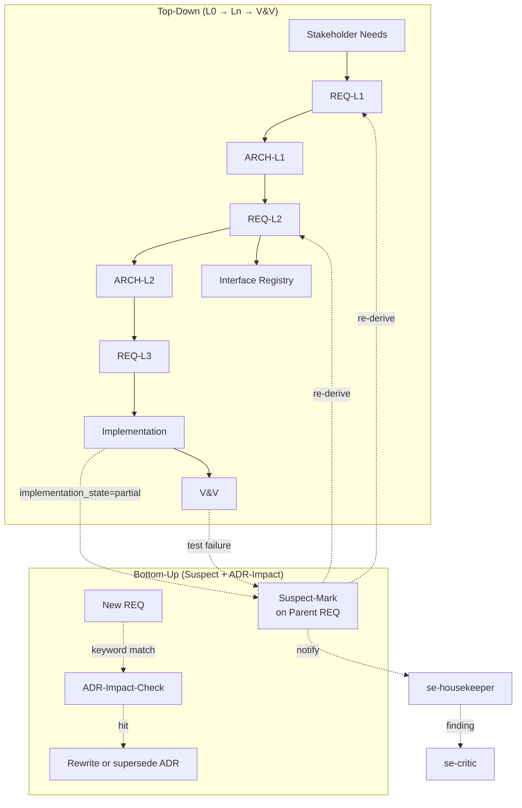
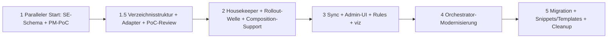

# Konzept: SE-Kaskaden-Standardisierung & Prompt-Modernisierung

> Status: **Konzept-Entwurf v1.0 — zusammengeführt aus se-cascade-optimization-339.md (v1.2) und prompt-modernization.md (v2.1)** | 2026-06-29
> Issue: #339 (SE-Kaskade) + Prompt-Optimierungs-Initiative
> Bezugsdokumente: `se-agent-concept.md`, `se-pipeline-extension.md`, `admin-ui-concept.md`, `dynamic-model-presets.md`
> Quellen: `reports/prompt-optimization/00_SUMMARY.md`, alle SE-Reports

---

## 1. Executive Summary

### 1.1 Motivation und Kontext

Das SE-Framework von agent-meta (14 Agenten, V-Modell, fraktale Decomposition) hat in der praktischen Nutzung sechs strukturelle Befunde gezeigt: fehlende ADR-Standards, uneinheitliche REQ-Frontmatter, ungetaxonomierte Strategie-Dokumente, verletzte L2-Trennregel, fehlender Review-Lifecycle und fehlende Bottom-Up-Rückkopplung. Diese Lücken werden in Issue #339 dokumentiert und führen in der Praxis zu Wildwuchs in `docs/se/**`.

Parallel hat die systematische Evaluierung aller 55 generischen Agenten-Templates (`reports/prompt-optimization/00_SUMMARY.md`) wiederkehrende Anti-Patterns aufgedeckt: JSON-Mock-Data-Bloat in A2A-Handoff-Definitionen, erzählender Fließtext statt struktureller Sektionen, schwache Strukturierung durch Markdown-Header ohne syntaktische Schließung, Lost-in-the-Middle-Effekte bei langen Prompts und Redundanz zentraler Verhaltensregeln. Beides — die SE-Hygiene und die Prompt-Architektur — sind Hebel für Token-Effizienz, Regeltreue und Wartbarkeit des gesamten Frameworks.

### 1.2 SE-Kaskade: Kernproblem und Lösung

Das SE-Framework hat sechs strukturelle Befunde (B1–B6): fehlende ADR-Standards (B1), uneinheitliche REQ-Frontmatter (B2), ungetaxonomierte Strategie-Dokumente (B3), verletzte L2-Trennregel (B4), fehlender Review-Lifecycle (B5), fehlende Bottom-Up-Rückkopplung (B6). Dieses Konzept standardisiert die SE-Dokumenten-Taxonomie, führt eine verbindliche YAML-Frontmatter-Sprache für REQ/ADR/Review ein, ergänzt einen neuen `se-housekeeper`-Agenten für kontinuierliche Compliance-Prüfung und schließt die Kaskade bidirektional. Zielgruppe: SE-Operatoren in Projekten mit `SE_ENABLED: true`.

### 1.3 Prompt-Modernisierung: Kernproblem und Lösung

Die aktuellen Agenten-Templates in `agent-meta/agents/1-generic/` sind überwiegend als narrative Markdown-Dokumente verfasst. Statt eines großen Big-Bang-Rewrites wird ein **zweigleisiges System** eingeführt:

| Modus | Bedeutung | Einsatz |
|-------|-----------|---------|
| **Legacy** | Bestehende Markdown-Templates unverändert | Default, Rückwärtskompatibilität |
| **Hybrid** | Legacy-Inhalt, aber automatisch in XML-Sektionen gewrappt | Sanfter Übergang, keine Template-Änderung |
| **Modern** | Native XML-Struktur + TypeScript-Contracts + Constraints am Ende | Neue/Rewrite-Agenten, höchste Token-Effizienz |

Der Modus wird **pro Rolle** in `.meta-config/project.yaml` konfiguriert. Damit können einzelne Agenten schrittweise migriert werden, während der Rest des Ökosystems stabil bleibt.

### 1.4 Erwarteter Impact

| Metrik | Hypothese | Begründung |
|--------|-----------|------------|
| Input-Token-Kostenreduktion | **15–20 %** für `developer.md` | XML-Tags ersetzen Markdown-Header-Padding; TypeScript-Interfaces ersetzen JSON-Beispiele |
| Reduzierte "Lost-in-the-Middle"-Effekte | **Deutlich reduziert** | Constraints am Ende (Recency Bias) |
| Halluzinations-Risiko | **Deutlich reduziert** | Keine ausufernden Mock-Daten; Constraints am Ende |
| Regeltreue | **Höher** | Harte Constraints werden syntaktisch abgegrenzt und wiederholt |
| SE-Compliance | **0 % Verstöße** | `se-housekeeper`-Audits auf `docs/se/**` |
| SE-Doku-Wildwuchs (`_v6`) | **Eliminiert** | Verbindliche Taxonomie, Git statt Dateinamen-Versionierung |

**Hinweis:** Time-to-First-Token (TTFT) ist keine sinnvolle Zielgröße für diese Prompt-Modernisierung, da TTFT primär von Netzwerk- und Modell-Initialisierungslatenz abhängt und nicht vom Prompt-Format. Die relevante Metrik ist die **Input-Token-Kostenreduktion**.

Die Schätzung von 15–20 % für `developer.md` basiert auf einem Vorab-Vergleich: Legacy 197 LOC vs. Modern ~150 LOC plus einer Heuristik für den XML-Tag-Overhead (siehe Abschnitt 6.8 und 14.3).

**Validierung:** Die 15–20 % sind eine **Hypothese** auf Basis von Zeilenvergleich plus Tag-Overhead-Heuristik. "Zeichenzahl / 4" ist für deutsche Templates unscharf. Die erste belastbare Messung erfolgt im PoC via `scripts/token-counter.py`. Erst danach wird die Zahl als verifiziertes Ziel verankert.

### 1.5 PoC-Empfehlung Prompt-Modernisierung

**Empfohlener PoC-Agent: `developer`** (statt `orchestrator`).

Begründung:
- `developer.md` hat 197 Zeilen und einen klar abgegrenzten Scope.
- Der Orchestrator hat 849 Zeilen und ist das zentrale Routing-Nervensystem — ein Fehler hier blockiert das gesamte Framework.
- Der `developer` deckt alle relevanten Struktur-Elemente ab (Persona, Workflow, A2A-Handoff, Constraints, Reflection-Loop), ohne die komplexe Routing-Matrix des Orchestrators zu benötigen.
- Validierung ist einfacher: Ein Feature-Implementierungstask kann vor und nach der Modernisierung auf Token-Verbrauch und Regeltreue verglichen werden.

Der PoC soll in einem separaten Branch `feat/prompt-modernization-poc` durchgeführt werden.

---

## 2. SE-Framework: Ist-Zustand & Befunde

### 2.1 Reifegrad

**Auslöser:** Issue #339 dokumentiert 6 Befunde aus realen SE-Projekten (`se-pipeline-extension.md` zeigt ähnliche Symptome: fehlende Persistenz, Rollenverstoß).

**Reifegrad heute:**

| Bereich | Status | Lücke |
|---------|--------|-------|
| 14 SE-Agenten | ✅ vorhanden | Aber: keine einheitliche Doku-Taxonomie |
| `SE_ENABLED`-Mechanismus | ✅ implementiert (`config.py:368`) | Conditional-Injection-Pattern etabliert |
| `{{#if SE_ENABLED}}`-Blöcke | ✅ aktiv | Aktuell nur in `orchestrator.md:128`, `se-orchestrator.md:4,7` |
| `strip_inactive_conditional_blocks()` | ✅ implementiert (`config.py:467+`) | Zero-Overhead bereits möglich |
| 5 SE-Schemas | ✅ vorhanden | Aber: keine `se-requirements.schema.json` für neues Frontmatter-Schema |
| A2A-Envelope | ✅ unterstützt Supersession, trace_context | Review-Iteration-Tokens fehlen |
| `docs/se/**`-Template | ❌ **fehlt komplett** | Framework generiert keine SE-Output-Struktur |
| `se-housekeeper` | ❌ **fehlt** | Keine Compliance-Prüfung |
| Bottom-Up-Rückkopplung | ❌ **fehlt** | Kaskade ist L0→V&V einbahn |
| Admin-UI | ❌ **nicht im Repo** | Nur Konzept-Skizze in `planned/admin-ui-concept.md` |

### 2.2 B1 — ADR-Standard (HOCH)

**Ist:** ADRs werden ad-hoc unter `docs/se/ADR/` abgelegt, ohne einheitliche Struktur.
**Soll:** Verbindlicher MADR-Minimal-Standard mit YAML-Frontmatter und Lifecycle-Status.

**Umsetzung:**

- Verzeichnis: `docs/se/ADR/ADR-NNN_kurztitel.md` (NNN = 3-stellig, monoton steigend)
- Frontmatter-Felder: `status: proposed|review|accepted|deprecated|superseded`, `date`, `deciders: []`, `affected_reqs: []` (REQ-IDs), `superseded_by: ADR-NNN` (optional)
- Body-Felder (H2-Sektionen): `## Kontext`, `## Alternativen`, `## Entscheidung`, `## Konsequenzen`
- Lifecycle: `proposed` → Auto-Review-Trigger → `accepted` | `deprecated` | `superseded` (Referenz auf neue ADR)
- **Akzeptanzkriterium:** `se-housekeeper` meldet 0 % nicht-konforme ADRs in einem Audit (gemessen über `docs/se/ADR/**/*.md`).

### 2.3 B2 — REQ-Frontmatter-Schema (HOCH)

**Ist:** `Implementation State`, `Review Findings`, `Test Status`, `Remarks` als Freitext mit uneinheitlichen Werten.
**Soll:** Offizielles YAML-Frontmatter-Schema mit Enums.

**Umsetzung:**

```yaml
implementation_state: not_implemented | partially_implemented | implemented
test_status:          missing | partial | covered
review_state:         open | reviewed | approved
open_adrs:            []                # Liste von ADR-IDs, die diese REQ betreffen
last_reviewed:        2026-06-28        # ISO-8601
reviewer:             se-critic | se-housekeeper | <agent-name>
review_iteration:     0                 # monoton steigend
```

- **Akzeptanzkriterium:** `se-requirements.schema.json` validiert 100 % der REQ-Frontmatter im Projekt; Freitext-Felder sind in `additionalProperties: false` blockiert.

### 2.4 B3 — SE-Doku-Taxonomie (MITTEL)

**Ist:** Versionen im Dateinamen (`_v6`), keine einheitliche Struktur.
**Soll:** Verbindliche 8-Verzeichnis-Taxonomie + YAML-Frontmatter-Pflicht für alle SE-Dokumente + verschachtelte Hierarchie.

**Taxonomie** (siehe Abschnitt 12 — Verzeichnisstruktur):
- 8 flache/gemischte Verzeichnisse (`L0/`, `L1/`, `L2/`, `L3/`, `ADR/`, `VV/`, `reviews/`, `traceability/`)
- **Verschachtelt** unter `L1/`, `L2/`, `Components/`: System-/Component-Ordner mit Postfix-Konvention (`AuthServiceSystem`, `TokenValidatorComponent`)
- Frontmatter-Pflicht: `type: ADR|REQ|REVIEW|TRACE|STRATEGY|VV-DOC`, `scope: project|<subscope>`, `status`, `date`, `author_agent`
- Versionskontrolle via Git, **nie** via Dateinamen-Suffix — das **Verbot von `_v6`-Suffixen** im Dateinamen ist hart: `VV_Strategy_new_needs_v6.md` ist exakt die #339-Sünde (POC-Referenz in Abschnitt 23)
- **Postfix-Konvention:** System-Ordner IMMER auf `System` endend (z.B. `AuthServiceSystem`), Component-Ordner IMMER auf `Component` (z.B. `TokenValidatorComponent`). Ermöglicht eindeutige Zell-Identifikation ohne explizite Tag-Ebene.
- **Akzeptanzkriterium:** `se-housekeeper` Block 1 ("Dateinamen-Standard") prüft `^docs/se/(L0|L1|L2|L3|ADR|VV|reviews|traceability)/[A-Z]+-\d+_.+\.md$` — 0 % Abweichung.

### 2.5 B4 — L2-Trennregel (HOCH)

**Ist:** Architektur-Decomposition, Review-Befunde, Traceability-Matrizen inline in REQ-Dateien.
**Soll:** REQ-Dateien enthalten NUR Anforderungen. Alles andere in dedizierte Dateien.

**Umsetzung:**

- REQ-Datei: max. 1 H1 (Titel), 1 H2 "Beschreibung", N×H2 "Akzeptanzkriterien", YAML-Frontmatter.
- Architektur → `docs/se/L<n>/ARCH-L<n>_<subscope>.md` mit YAML-Frontmatter `type: ARCH`.
- Review-Befunde → `docs/se/reviews/REVIEW_<YYYY-MM-DD>_<scope>.md`.
- Traceability → `docs/se/traceability/TRACE_<scope>.md` mit `kind: derives|satisfies|verifies|implements`.

**Verzeichnis-basierte Trennung (siehe Abschnitt 12):**

| Artefakt | Ablageort | Erlaubt in REQ-Datei? |
|----------|-----------|----------------------|
| Architecture | `L{N}_*_Architecture.md` innerhalb des Zellen-Ordners | ❌ — nie inline |
| Implementation | `implementation/`-Subfolder innerhalb der Zelle | ❌ |
| Review-Protokolle | `docs/se/reviews/` (flach) | ❌ |
| Traceability-Matrizen | `docs/se/traceability/` (flach) | ❌ |
| V&V-Dokumente | `docs/se/VV/` (flach) | ❌ |
| ADRs | `docs/se/ADR/ADR-NNN_kurztitel.md` | ❌ — nur `open_adrs`-Referenz im Frontmatter |

- **Akzeptanzkriterium:** `se-housekeeper` Block 2 ("L2-Trennregel") findet 0 REQ-Dateien mit Sections, die nicht "Beschreibung" oder "Akzeptanzkriterien" sind.

### 2.6 B5 — Review-Lifecycle (MITTEL)

**Ist:** Reviews ohne Protokoll, ohne Iterationsnummer, ohne formalen Status.
**Soll:** 4-Phasen-Lifecycle mit Review-IDs und referenzierten Befunden.

**Lifecycle:**

```
Open ──► Review (Iteration N) ──► Response ──► Closed
            │                                  ▲
            └─► Iteration N+1 (Re-Review) ─────┘
```

- Review-IDs: `RVW-YYYY-MM-DD-NNN` (NNN = 3-stellig)
- `review_iteration` in REQ-Frontmatter (B2) wird mit jeder Iteration inkrementiert
- Befunde referenzieren REQ-IDs, sind NICHT inline in REQ-Dateien (siehe B4)
- **Akzeptanzkriterium:** Jede `review_state: reviewed` REQ hat genau eine korrespondierende Datei in `docs/se/reviews/`.

### 2.7 B6 — Bottom-Up-Rückkopplung (MITTEL)

**Ist:** Kaskade läuft nur L0→L1→L2→V&V. Implementierungs-Befunde fließen nicht zurück.
**Soll:** Bidirektionale Kaskade mit Suspect-Mark und ADR-Impact-Prüfung.

**Rückkopplungs-Pfade:**



- **Suspect-Mark:** `se-critic` setzt `review_state: open` + `remarks: SUSPECT_PARENT: REQ-L1-007` auf alle REQs, die eine abhängige REQ betreffen.
- **ADR-Impact-Prüfung:** Beim Erstellen einer neuen REQ durchsucht `se-requirements` den Text nach ADR-Keywords (z.B. "database choice", "deployment topology") und listet betroffene ADRs in `open_adrs: []`.
- **Akzeptanzkriterium:** Mindestens 1 Beispielprojekt durchläuft beide Pfade ohne Verlust von Befunden (gemessen via `trace_context.viz_task_id`).

---

## 3. Prompt-Modernisierung: Two-Mode-Architektur

### 3.1 State of the Art: Context Engineering 2026

Der Report identifiziert drei zentrale Trends, die das Konzept prägen:

1. **Vom Prompting zum Context Engineering:** Die wichtigste Metrik ist die Informationsdichte. "Deletion-based Compaction" (gezieltes Löschen von Füllwörtern) ist Standard.
2. **Struktur über Prosa:** XML-Tags zur Sektionierung und TypeScript-Interfaces zur Datendefinition schlagen Markdown-Header.
3. **TOON (Tabular Object-Oriented Notation):** Ein neuer Standard für große Input-Datenmengen, der JSON ersetzen kann und bis zu 60 % Struktur-Tokens spart.

**TOON-Positionierung in diesem Konzept:**
- TypeScript-Interfaces bleiben der Standard für A2A-Contracts (Output-Shaping und maschinenlesbare Verträge).
- TOON wird für Agenten mit großen reinen Input-Datenmengen (z. B. `log-analyzer`, `explorer`) in Phase 2+ evaluiert. Ein TOON-Converter würde in `scripts/lib/` als optionaler Wrapper implementiert werden, nicht als Pflicht für alle Agenten.

### 3.2 Report-Verifikationstabelle

Die folgende Tabelle dokumentiert, dass alle zentralen Befunde aus `reports/prompt-optimization/00_SUMMARY.md` im Konzept adressiert werden.

| # | Report-Befund | Kategorie | Konzept-Abschnitt | Adressiert |
|---|---------------|-----------|-------------------|------------|
| 1 | Context Engineering 2026 (Paradigmenwechsel) | State of the Art | 1.3, 3.1, 5 | Ja |
| 2 | Struktur > Prosa | State of the Art | 5 (6-Block-Template), 8 | Ja |
| 3 | TOON-Notation | State of the Art | 3.1, 22 (offener Punkt) | Ja |
| 4 | JSON Mock-Data Bloat | Befund A | 6.1, 6.7, Anhang E | Ja |
| 5 | Narrative Workflows | Befund B | 5, 8 | Ja |
| 6 | Markdown vs XML (schwache Strukturierung) | Befund C | 5, 7.7, Anhang D | Ja |
| 7 | Lost in the Middle | Befund D | 1.3, 5, 7.6 | Ja |
| 8 | Framework-Verletzungen in `1-generic` | Befund E | 8.3, 14 | Ja |
| 9 | Phase 1: Structure & Contract | Architektur | 5, 6, 7, 10 | Ja |
| 10 | Phase 2: Compaction (Deletion-based) | Architektur | 1.3, 6.7, 14.3 | Ja |
| 11 | Phase 3.1: TOON-Evaluierung | Architektur | 3.1, 22 | Ja |
| 12 | Phase 3.2: Output Shaping | Architektur | 5, 6.4, Anhang D | Ja |
| 13 | Phase 3.3: A2A-Rules-Zentralisierung | Architektur | 7.6, 10 | Ja |

### 3.3 Zwei-Modi-Übersicht

```
┌─────────────────────────────────────────────────────────────────────┐
│                     agent-meta Prompt Pipeline                       │
│                                                                      │
│  agents/1-generic/<role>.md                                          │
│       │                                                              │
│       ▼                                                              │
│  ┌─────────────────┐    ┌─────────────────┐    ┌─────────────────┐  │
│  │   Legacy Mode   │    │   Hybrid Mode   │    │   Modern Mode   │  │
│  │                 │    │                 │    │                 │  │
│  │ Markdown-Header │    │ Markdown-Header │    │ 6 XML-Blöcke    │  │
│  │ + Prosa         │    │ + XML-Sections  │    │ + TypeScript    │  │
│  │                 │    │ (wrap_sections) │    │ + Constraints   │  │
│  └─────────────────┘    └─────────────────┘    └─────────────────┘  │
│       ▲                      ▲                      ▲                │
│       │                      │                      │                │
│   Keine Änderung      Auto-Wrapper            Neue Templates         │
│   am Template         auf Legacy-Inhalt       in 1-generic-modern/   │
│                                                                      │
└─────────────────────────────────────────────────────────────────────┘
```

**Legacy Mode (Status Quo):**
- Quelle: `agents/1-generic/<role>.md`
- Format: Markdown mit YAML-Frontmatter
- Verhalten: Unverändert zu heute
- Einsatz: Default für alle bestehenden Projekte
- Keine neuen Abhängigkeiten, kein Migrationstaufwand

**Hybrid Mode (Sanfter Migrationspfad):**
- Quelle: Weiterhin `agents/1-generic/<role>.md`
- Mechanik: `wrap_sections_in_xml()` ist **bereits implementiert** in `scripts/lib/agents.py:355` und wird über das Flag `xml-section-wrapping: enabled: true` in `.meta-config/project.yaml` aktiviert (`agents.py:941–944`).
- Ergebnis: Der Markdown-Inhalt bleibt erhalten, wird aber in `<section name="...">`-Tags eingefasst.
- **Aufwand für Hybrid-Mode: 0** — nur Config-Flag setzen, kein neuer Code nötig.
- Vorteil: Sofortige strukturelle Verbesserung ohne Rewrite
- Nachteil: Keine TypeScript-Contracts, keine echte 6-Block-Struktur

**Modern Mode (Zielarchitektur):**
- Quelle: `agents/1-generic-modern/<role>.md` (Vorschlag) oder ein neues Unterverzeichnis
- Format: Nativer XML-Block-Aufbau nach dem 6-Block-Template
- Einsatz: Für neu hinzugefügte oder vollständig rewrite-te Agenten
- Voraussetzung: Template-Autor muss XML-Struktur bewusst nutzen

**Mode-Switch-Granularität:**

Die Granularität ist **pro Rolle** in `project.yaml` konfigurierbar:

```yaml
agent-prompts:
  default: legacy          # globaler Default
  modes:
    developer: modern      # developer wird modernisiert
    orchestrator: hybrid   # orchestrator erstmal nur hybrid
    concept-reviewer: modern
```

Diese Konfiguration ist bewusst **außerhalb** der `variables:`-Sektion platziert, weil sie das Sync-Verhalten selbst steuert und nicht nur Text-Substitutionen auslöst.

---

## 4. Gemeinsamer Mechanismus: Conditional Injection

### 4.1 SE_ENABLED-Mechanismus (4 Ebenen)

**Prinzip:** ALLE SE-spezifischen Templates, Rules, Frontmatter-Blöcke und Agenten werden NUR dann in den generierten Output geschrieben, wenn `SE_ENABLED: true` in `project.yaml`. Bei `false` → **Zero-Overhead**.

**Technische Durchsetzung (4 Ebenen):**

| Ebene | Mechanismus | Datei | Status |
|-------|-------------|-------|--------|
| 1. Variablen-Resolution | `SE_ENABLED` wird in `config.py:368` gesetzt | `scripts/lib/config.py` | ✅ existiert |
| 2. Conditional-Blöcke | `{{#if SE_ENABLED}}…{{/if}}` in Templates | `agents/1-generic/*.md` | ⚠️ nur 2 Dateien nutzen es |
| 3. Block-Stripping | `strip_inactive_conditional_blocks()` entfernt inaktive Blöcke zur Build-Zeit | `scripts/lib/config.py:467+` | ✅ existiert |
| 4. Rollen-Whitelist | `delegation_table.py:75` filtert SE-Rollen aus `AGENT_DELEGATION_TABLE` wenn `SE_ENABLED=false` | `scripts/lib/delegation_table.py` | ✅ existiert |

**Erweiterung für dieses Konzept:**

- **Neue Whitelist-Konstante:** `SE_PLACEHOLDER_VARS = {"SE_ENABLED", "SE_BASE_DIR", "SE_MIN_DEPTH", …}` in `scripts/lib/placeholders.py:61` ergänzen.
- **Neue Templates in `{{#if SE_ENABLED}}…{{/if}}` einwickeln:** Alle neuen `agents/1-generic/se-housekeeper.md` (B-Sektion), alle SE-spezifischen Frontmatter-Schemata, alle `docs/se/**`-Pfade in `howto/`-Dateien.
- **Verifikation:** Automatischer Test in `tests/test_sync_conditional.py` (neu) prüft für `SE_ENABLED=false`: (a) keine `se-*-Agent` in `.opencode/agents/`, (b) keine `{{#if SE_ENABLED}}`-Marker im Output, (c) keine `docs/se/**`-Verweise in generierten Provider-Configs. Test-Aufbau: `pytest` + `tmp_path` ruft `sync.py --dry-run` zweimal auf (mit/ohne `SE_ENABLED`), vergleicht `.opencode/agents/` Byte-für-Byte und failt bei Differenz.

**Akzeptanzkriterium:** Sync mit `SE_ENABLED=false` produziert byte-identischen Output zur Variante **vor** diesem Konzept (gemessen via `git diff` auf `.opencode/`).

### 4.2 Strikt getrennte Conditional-Systeme

Legacy-Templates und Modern-Templates nutzen unterschiedliche Mechanismen für bedingte Inhalte — sie dürfen nicht vermischt werden:

- **Legacy-Templates** verwenden `{{#if VAR}}...{{/if}}` (über `strip_inactive_conditional_blocks`) — bleibt unverändert.
- **Modern-Templates** verwenden AUSSCHLIESSLICH vorab aufgelöste Block-Variablen wie `{{DOD_REQ_BLOCK}}`, `{{DOD_TESTS_BLOCK}}`, `{{A2A_HANDOFF_BLOCK}}`, `{{ANTI_RECURSION_BLOCK}}`. `{{#if}}`-Conditionals werden in Modern-Templates **nicht unterstützt**.

→ Vollständige Begründung und Build-Logik siehe Abschnitt 7.3.

---

## 5. XML-Struktur-Spezifikation (Modern Mode)

### 5.1 Das 6-Block-Template

Jeder Modern-Mode-Agent besteht aus genau sechs XML-Blöcken. Die Reihenfolge ist fix; `<constraints>` steht absichtlich am Ende, um den Recency Bias auszunutzen.

```xml
<persona>
  <!-- Rolle, Tonfall, Selbstverständnis -->
</persona>

<workflow>
  <!-- Schrittfolge, Routing, Entscheidungslogik -->
</workflow>

<context>
  <!-- Projektspezifischer Kontext, Variablen, Contracts -->
</context>

<tools>
  <!-- Erlaubte Tools und ihre Verwendung -->
</tools>

<output_contract>
  <!-- Erwartetes Ausgabeformat -->
</output_contract>

<constraints>
  <!-- Harte Verbote, Anti-Recursion-Guard, Don'ts -->
</constraints>
```

### 5.2 Block-Beschreibungen

| Block | Inhalt | Beispiel-Elemente |
|-------|--------|-------------------|
| `<persona>` | Kurze Rolle, Tonfall, Scope | `Du bist der Developer für {{PROJECT_NAME}}.` |
| `<workflow>` | Ablauf als nummerierte/schrittweise Anweisung | `1. Verstehe Aufgabe → 2. Implementiere → 3. Validiere` |
| `<context>` | Projekt-Kontext, A2A-Contracts, Variablen | `{{PROJECT_CONTEXT}}`, Handoff-Schema |
| `<tools>` | Tool-Liste und Regeln für deren Einsatz | `Read, Write, Edit, Bash` |
| `<output_contract>` | Struktur der Rückgabe | TypeScript-Interfaces, STATUS-Header, Output-Shaping |
| `<constraints>` | Harte Regeln am Ende | Don'ts, Anti-Recursion, HITL-Gates |

### 5.3 XML-Escaping und Frontmatter

Das YAML-Frontmatter bleibt erhalten. Der XML-Block folgt direkt nach dem Frontmatter. Innerhalb von XML müssen folgende Zeichen escaped werden:

| Zeichen | Escape |
|---------|--------|
| `<` | `&lt;` |
| `>` | `&gt;` |
| `&` | `&amp;` |

Im Regelfall enthalten die XML-Blöcke jedoch nur Markdown-Text, keine Code-Blöcke mit XML-Syntax. Code-Beispiele werden in Markdown-Code-Fences (` ``` `) eingebettet, die den XML-Parser nicht stören.

### 5.4 Unterschied Hybrid vs. Modern

**Hybrid (automatisch generiert):**

```xml
<section name="deine-zustaendigkeiten">
### 1. Feature-Implementierung
- Minimal implementieren
...
</section>
```

**Modern (manuell/autor-intendiert):**

```xml
<workflow>
1. Parse A2A-Envelope (falls vorhanden)
2. Lese REQ-ID aus `docs/REQUIREMENTS.md` (falls DOD_REQ_TRACEABILITY)
3. Implementiere minimalen Scope
4. Validiere: bestehende Tests dürfen nicht brechen
5. Gib Ergebnis im Output-Contract-Format zurück
</workflow>
```

---

## 6. TypeScript-Interface-Spezifikation

### 6.1 Grundprinzip

A2A-Handoff-Payloads werden nicht mehr durch vollständige JSON-Beispiele, sondern durch **kompakte TypeScript-Interfaces** spezifiziert. Das reduziert die Token-Anzahl deutlich, weil Klammern, Anführungszeichen und Beispielwerte entfallen.

### 6.2 Interface: `IPayload`

```typescript
/**
 * A2A-Payload — kompakte Task-Spezifikation.
 * Feldnamen sind absichtlich kurz (Compact Mode).
 */
interface IPayload {
  /** Task-Beschreibung in einem Satz, max. {{A2A_T_SIZE_LIMIT}} Zeichen */
  t: string;
  /** Kontext als strukturierter Text oder Key-Value-Block */
  ctx?: string | Record<string, unknown>;
  /** Constraints-Liste */
  con?: string[];
  /** Referenzen (Dateien, Schemas, URLs) */
  refs?: string[];
  /** Priorität: low | medium | high | critical */
  pri?: 'low' | 'medium' | 'high' | 'critical';
  /** Abhängigkeiten/Vorbedingungen */
  dep?: string[];
}
```

### 6.3 Interface: `IEnvelope`

```typescript
/**
 * A2A-Envelope — Transport-Container für jede Delegation.
 */
interface IEnvelope {
  protocol_version: '1.0.0';
  handoff_id: string;        // HOFF-YYYYMMDD-NNN
  source_agent: string;
  target_agent: string;
  schema_ref: string;        // z.B. 'task-spec-v1'
  payload: IPayload | IPayload[];
  trace_parent?: string | null;
}
```

### 6.4 Interface: `IResult`

```typescript
/**
 * Standard-Rückgabeformat aller Worker-Agenten.
 */
interface IResult {
  status: 'done' | 'partial' | 'failed' | 'escalate';
  result: string;            // 1–2 Sätze
  artifacts?: string[];      // geänderte Dateien
  errors?: string[];         // leer wenn keiner
}
```

### 6.5 Interface: `IEscalation`

```typescript
/**
 * Erweitertes Rückgabeformat bei Eskalation oder Partial-Completion.
 */
interface IEscalation extends IResult {
  status: 'escalate' | 'partial';
  escalate_reason: string;
  recommended_tier: 'junior-developer' | 'developer' | 'senior-developer' | string;
  partial_work: string;
  next_steps: string[];
}
```

### 6.6 Interface: `IBatchPayload`

```typescript
/**
 * Batch-Mode für FANOUT — mehrere Tasks an denselben Agententyp.
 */
interface IBatchPayload {
  batch: true;
  payload: Array<IPayload & { batch_task_id: string }>;
}
```

### 6.7 Vorher/Nachher-Vergleich

**Vorher (JSON-Beispiel im Prompt):**

```json
{
  "protocol_version": "1.0.0",
  "handoff_id": "HOFF-20260628-001",
  "source_agent": "orchestrator",
  "target_agent": "developer",
  "schema_ref": "task-spec-v1",
  "payload": {
    "t": "Fix login bug",
    "ctx": "User reports 401 on /api/login",
    "con": ["Do not touch auth middleware"],
    "pri": "high"
  }
}
```

**Nachher (TypeScript-Interface im Prompt):**

```typescript
interface IEnvelope {
  protocol_version: '1.0.0';
  handoff_id: string;
  source_agent: string;
  target_agent: string;
  schema_ref: 'task-spec-v1';
  payload: IPayload;
}
```

Token-Ersparnis: ca. 60–70 % für den reinen Struktur-Teil.

### 6.8 Token-Reduktions-Schätzung für `developer.md`

| Quelle | Zeilen | Bemerkung |
|--------|--------|-----------|
| Legacy `developer.md` | 197 | Markdown-Prosa mit Tabellen |
| Modern `developer.md` | ~150 | 6 XML-Blöcke, TypeScript-Interfaces |
| Rohe Zeilenreduktion | ~24 % | (197 − 150) / 197 |
| Geschätzter XML-Tag-Overhead | ~+4–9 % | `<persona>`, `</persona>` etc. |
| **Erwartete Token-Einsparung** | **15–20 %** | Konservativ geschätzt |

Die Schätzmethode ist bewusst einfach gehalten: Zeilenvergleich plus Overhead-Heuristik. Die finale Messung erfolgt mit `scripts/token-counter.py` im PoC.

---

## 7. Mode-Switch-Implementation

### 7.1 Neue Config-Section `agent-prompts`

In `.meta-config/project.yaml` wird eine neue Sektion eingeführt:

```yaml
agent-prompts:
  default: legacy          # legacy | hybrid | modern
  modes:
    developer: modern
    orchestrator: hybrid
    concept-reviewer: modern
```

### 7.2 Schema-Erweiterung

In `config/project-config.schema.json` wird ergänzt:

```json
{
  "agent-prompts": {
    "type": "object",
    "description": "Controls prompt generation mode per role.",
    "properties": {
      "default": {
        "type": "string",
        "enum": ["legacy", "hybrid", "modern"],
        "default": "legacy"
      },
      "modes": {
        "type": "object",
        "description": "Per-role prompt mode override.",
        "additionalProperties": {
          "type": "string",
          "enum": ["legacy", "hybrid", "modern"]
        }
      }
    },
    "additionalProperties": false
  }
}
```

### 7.3 Neue Variablen in `build_variables()` — Entscheidung gegen Template-Logik

**Entscheidung:** Für bedingte Inhalte im Modern Mode werden **keine** `{{#if}}`-Conditionals in die Templates eingeführt. Stattdessen wandert die Logik in `build_variables()`/`_inject_dod()`.

**Begründung:**
- `sync.py` substituiert nur Strings und kennt keine Template-Logik.
- Eine Mini-Template-Engine (`{{#if}}`, `{{#ifeq}}`) wäre ein neues Subsystem mit Parser, Scope, Escaping und Tests.
- Die bestehende `substitute()`-Funktion arbeitet mit einfachen `{{VAR}}`-Platzhaltern; eine Erweiterung würde die Wartbarkeit senken und das Risiko von Parsing-Fehlern erhöhen.
- Stattdessen werden vorab aufgelöste String-Variablen injiziert, z. B. `{{DOD_REQ_BLOCK}}`, `{{DOD_TESTS_BLOCK}}`, `{{A2A_HANDOFF_BLOCK}}`.
- Wenn ein DoD-Kriterium nicht aktiv ist, enthält die Variable einen leeren String. Damit entfällt jede Template-Logik.

```python
def build_variables(config: dict, agent_meta_root: Path) -> tuple[dict, list[str]]:
    variables = {}
    # ... bestehende Variablen ...

    # Agent-Prompt-Mode pro Rolle
    prompt_config = config.get("agent-prompts", {})
    default_mode = prompt_config.get("default", "legacy")
    per_role_modes = prompt_config.get("modes", {})

    for role in config.get("roles", []):
        mode = per_role_modes.get(role, default_mode)
        variables[f"AGENT_PROMPTS_MODE_{role.upper().replace('-', '_')}"] = mode

    # Bedingte Blöcke werden als vollständige Strings vorab gebaut
    variables["DOD_REQ_BLOCK"] = _build_dod_req_block(config)
    variables["DOD_TESTS_BLOCK"] = _build_dod_tests_block(config)
    variables["A2A_HANDOFF_BLOCK"] = _build_a2a_handoff_block(config)
    variables["ANTI_RECURSION_BLOCK"] = _build_anti_recursion_block(config)

    return variables, []
```

Diese Variablen können in Modern-Templates direkt eingesetzt werden:

```xml
<constraints>
{{ANTI_RECURSION_BLOCK}}
{{DOD_REQ_BLOCK}}
{{DOD_TESTS_BLOCK}}
</constraints>
```

Damit bleibt `substitute()` simpel und Modern-Templates sind frei von Template-Engine-Logik.

### 7.4 Source-Layout-Vorschlag

```
agents/
├── 1-generic/               # Legacy-Templates (Status Quo)
│   ├── developer.md
│   └── orchestrator.md
├── 1-generic-modern/        # Modern-Templates (neu)
│   ├── developer.md
│   └── concept-reviewer.md
├── 2-platform/              # Plattform-Overrides
└── 3-project/               # Projekt-Extensions
```

Alternativ kann der Modern-Mode auch durch ein Flag im Frontmatter gesteuert werden (`mode: modern`). Die getrennte Verzeichnisstruktur ist jedoch vorzuziehen, weil sie:
- Klar trennt, welche Templates gewartet werden müssen
- Ein einfacheres Rollback ermöglicht
- Die Pfadlogik in `sync.py` deterministisch bleibt

### 7.5 Neue Sync-Funktion für Modern-Mode

In `scripts/lib/agents.py` wird eine neue Funktion eingeführt:

```python
def _resolve_agent_source(
    role: str,
    agent_meta_root: Path,
    prompt_mode: str,
) -> Path:
    """Resolve the source template for a role considering the prompt mode.

    Order of precedence:
    1. agents/1-generic-modern/<role>.md  (only if prompt_mode == 'modern')
    2. agents/1-generic/<role>.md         (legacy / hybrid / fallback)
    3. agents/2-platform/<platform>-<role>.md
    4. agents/3-project/<role>.md
    """
    modern_path = agent_meta_root / AGENTS_DIR / "1-generic-modern" / f"{role}.md"
    legacy_path = agent_meta_root / AGENTS_DIR / GENERIC_DIR / f"{role}.md"

    if prompt_mode == "modern" and modern_path.exists():
        return modern_path
    return legacy_path
```

**Zusätzlich anzupassen:** `collect_sources()` in `scripts/lib/agents.py` iteriert heute nur über `1-generic/`, `2-platform/`, `3-project/` und `0-external/`. Das Verzeichnis `1-generic-modern/` muss zur Discovery hinzugefügt werden, sonst werden Modern-Templates nicht erkannt und nicht generiert. Dieser Eingriff ist **Pflichtbestandteil von Phase 1, Step 2**.

### 7.6 Frontmatter-Injection und A2A-Block-Zentralisierung

Der Sync-Prozess injiziert den Prompt-Mode in das generierte Frontmatter:

```yaml
---
name: developer
version: "3.0.0"
description: "..."
hint: "..."
tools: [...]
prompt_mode: modern
---
```

Das Feld `prompt_mode` ist meta-informativ und hat keinen Einfluss auf das Laufzeitverhalten des Agenten. Es erleichtert jedoch Debugging und die Admin-UI-Darstellung.

**A2A-Handoff-Block-Zentralisierung:**
Der Report empfiehlt, die immer gleichen Anti-Recursion-Guards nicht 55× hart in den Prompts zu pflegen. Stattdessen bietet `sync.py` einen zentralen Include-Mechanismus:

- Quelle: `snippets/prompt-modernization/a2a-handoff-block.md`
- Injektion als Variable `{{A2A_HANDOFF_BLOCK}}` in den `<context>`-Block jedes Modern-Mode-Agenten
- Bei Änderungen an den A2A-Rules muss nur die Snippet-Datei gepflegt werden

### 7.7 Bedingte XML-Wrapping-Logik

Die bestehende `wrap_sections_in_xml()` wird beibehalten, aber bedingt aufgerufen:

```python
if prompt_mode in ("hybrid", "modern"):
    if prompt_mode == "hybrid":
        content = wrap_sections_in_xml(content)
    # Modern-Mode verwendet native XML-Struktur, keinen zusätzlichen Wrap
```

Für den Modern-Mode wird **kein** automatisches Wrapping angewendet, weil das Template bereits die 6-Block-Struktur enthält. Stattdessen kann eine Validierungsfunktion prüfen, ob alle sechs Blöcke vorhanden sind.

### 7.8 Composition-Patch-Constraint (Blocking)

Modern-Mode-Templates dürfen in Phase 1 und Phase 2 **KEINE** `extends:`/`patches:`-Targets sein.

**Begründung:** `compose_agent()` in `scripts/lib/agents.py` arbeitet auf Markdown-Anchors (`anchor: "## Heading"`). Modern-Mode-Templates ersetzen `## Heading` durch `<workflow>` etc. Bestehende 2-platform/3-project-Patches würden brechen.

**Lösungspfad (Phase 2+):**
- `compose_agent()` um XML-Anchor-Support erweitern: `anchor: "<workflow>"`
- Danach können 2-platform/3-project-Overrides auf Modern-Templates zugreifen.

**Betroffene Dateien heute:** `agents/2-platform/agent-meta-developer.md` nutzt `extends: "1-generic/developer.md"` mit `anchor: "## Deine Zuständigkeiten"`. Diese Datei kann erst migriert werden, wenn XML-Anchors in `compose_agent()` funktionieren.

---

## 8. Mode-Switch für Rules, Templates, Snippets

### 8.1 Rules-Mode-Switch (Phase 3+)

Rules erhalten ebenfalls einen Mode-Switch. Es gibt zwei konkurrierende Layouts:

| Layout | Pfad | Vorteil | Nachteil |
|--------|------|---------|----------|
| Verzeichnis-basiert | `rules/1-generic/` vs. `rules/1-generic-modern/` | Klare Trennung, einfaches Rollback | Doppelte Pflege bei parallelem Betrieb |
| Frontmatter-Flag | `rules/1-generic/a2a-delegation-gates.md` mit `mode: modern` | Weniger Dateien | Sync muss Frontmatter parsen |

**Empfehlung:** Verzeichnis-basiertes Layout für Rules, analog zu `agents/1-generic-modern/`.

**Modern-Mode-Rule-Beispiel:**

Das Regelwerk `a2a-delegation-gates.md` könnte im Modern Mode als XML-Struktur formuliert werden:

```xml
<rule name="a2a-delegation-gates">
  <purpose>Anti-Re-Delegation und Struktur-Schutz für A2A-Handoffs.</purpose>
  <hard_gates>
    - source_agent == target_agent → HARD REJECT
    - delegation_depth > {{A2A_MAX_DEPTH}} → HARD REJECT
    - payload.t > {{A2A_T_SIZE_LIMIT}} Zeichen → HARD REJECT
    - payload.t startet mit "Du bist..." → HARD REJECT
  </hard_gates>
  <soft_gates>
    - >{{MAX_PARALLEL_AGENTS}} Delegationen → User informieren
    - Gleicher Agent >3× für selben Intent → Schleife vermuten
  </soft_gates>
</rule>
```

**Pfad-Mapping pro Provider via Platzhalter:**

Rules werden in generierte Provider-Verzeichnisse propagiert. Die Pfad-Mapping-Logik bleibt provider-agnostisch:

```yaml
# In role-defaults.yaml oder prompt-modes.yaml
rules:
  legacy_source: "rules/1-generic/"
  modern_source: "rules/1-generic-modern/"
  target_path: "{{RULES_PATH}}/"
```

Erlaubte Platzhalter in 1-generic: `{{RULES_PATH}}`, `{{EXTENSION_DIR}}`, `{{SNIPPETS_DIR}}`. Keine konkreten Provider-Pfade wie `.claude/rules/` oder `.opencode/rules/`.

### 8.2 Templates und Snippets (Phase 5)

**Templates:**

Templates in `templates/` (z. B. `claude-md-managed.md`, `SE-STRATEGY.template.md`) erhalten optional einen Modern-Mode:

```yaml
agent-prompts:
  templates:
    default: legacy
    modes:
      se-strategy: modern
      claude-md-managed: hybrid
```

**Snippets:**

Snippet-Pfade in `snippets/` können ebenfalls mit einem Mode-Flag versehen werden:

```yaml
agent-prompts:
  snippets:
    default: legacy
    modes:
      developer: modern
      tester: hybrid
```

### 8.3 Provider-Agnostik-Garantie

Alle Modern-Mode-Prompts, Rules und Templates in `1-generic/` müssen provider-agnostisch bleiben. Provider-Spezifika werden in `2-platform/` oder zur Sync-Zeit durch Platzhalter ersetzt.

**Whitelist erlaubter Pfade in `1-generic`:**

| Platzhalter | Bedeutung |
|-------------|-----------|
| `{{EXTENSION_DIR}}` | Projekt-spezifische Extension-Dateien |
| `{{SNIPPETS_DIR}}` | Code-Snippets für Sprach-Best-Practices |
| `{{RULES_PATH}}` | Provider-spezifischer Rules-Ordner |
| `{{AGENTS_DIR}}` | Provider-spezifischer Agenten-Ordner |
| `{{ARTIFACTS_DIR}}` | Temporäre Artifact-Ablage |

**Verbotene Strings** (geprüft durch `scripts/check-provider-agnostic.py`):

- Konkrete Provider-Verzeichnisse: `.claude/`, `.opencode/`, `.gemini/`, `.continue/`, `.github/copilot/`
- Provider-spezifische Tool-Syntax: `claude -a`, `task()`, `define_subagent`, `@<role>`
- Provider-Namen in imperativen Kontexten: `background(agent=...)`, `invoke_subagent(...)`

Ausnahmen:
- Dokumentation in `docs/` darf Provider-Namen nennen, wenn sie erklärend sind.
- `agents/2-platform/`, `rules/2-platform/` und Provider-spezifische Konfigurationen sind von diesem Scan ausgenommen.

---

## 9. `se-housekeeper`-Agent

**Rolle:** Read-only Compliance-Prüfer für SE-Artefakte. Findet Verstöße, fixt **nicht** automatisch. Eskaliert an Critic/Reviewer.

**Frontmatter-Entwurf** (wird in Phase 2 in `agents/1-generic/se-housekeeper.md` angelegt):

```yaml
---
name: se-housekeeper
version: 1.0.0
description: "Read-only SE-Compliance-Pruefer: REQ-Frontmatter, L2-Trennregel, ADR-Verlinkung, Review-Protokoll, Dateinamen-Standard"
hint: "Verwende diesen Agenten fuer regelmaessige SE-Artefakt-Audits"
workflow_tier: optional
se_only: true
tools: [Read, Glob, Grep, Bash]
---
```

**5 Befund-Blöcke:**

| Block | Prüft | Quelle | Eskalation |
|-------|-------|--------|------------|
| **HK-1 Dateinamen-Standard** | Regex `^docs/se/(L0\|L1\|L2\|L3\|ADR\|VV\|reviews\|traceability)/[A-Z]+-\d+_.+\.md$` | `glob docs/se/**` | `se-requirements` (Umbenennung) |
| **HK-2 L2-Trennregel** | REQ-Dateien enthalten nur `Beschreibung` + `Akzeptanzkriterien` als H2 | `grep` H2-Header in `docs/se/**/REQ-*.md` | `se-critic` (Inhalt extrahieren) |
| **HK-3 ADR-Verlinkung** | Jede REQ mit architektur-relevanter Aussage hat ≥1 Eintrag in `open_adrs` | `grep "arch_impact: true"` vs. Frontmatter-Parse | `se-architect` (ADR erstellen) |
| **HK-4 Review-Protokoll** | Jede `review_state: reviewed` REQ hat korrespondierende Datei in `docs/se/reviews/RVW_*.md` | Cross-Reference | `se-critic` (Review nachholen) |
| **HK-5 Frontmatter-Schema** | YAML-Validierung gegen `se-requirements.schema.json` | `jsonschema` Validate | `se-requirements` (Frontmatter korrigieren) |

**Trigger:**

- **Manuell:** `se-housekeeper` direkt vom Orchestrator aufrufen (A2A-Handoff).
- **Automatisch:** Post-Implementation-Hook (jedes Mal wenn `se-developer` committed), Pre-Validation-Hook (vor `se-validator`).
- **Scheduled:** Optional via `.meta-config/project.yaml → lifecycle-triggers` (z.B. wöchentlich).

**Output-Format:** JSON-Liste von Befunden, A2A-kompatibel:

```json
{
  "housekeeper_run_id": "HK-2026-06-28-001",
  "scope": "docs/se/**",
  "findings": [
    {
      "block": "HK-1",
      "severity": "major",
      "file": "docs/se/L1/REQ-L1-007.md",
      "issue": "Filename missing scope prefix",
      "fix_proposal": "rename to REQ-L1-007_user-auth.md",
      "escalate_to": "se-requirements"
    }
  ]
}
```

**Akzeptanzkriterium:** `se-housekeeper` läuft in einem Test-Repo mit 5 absichtlich eingebauten Verstößen → gibt 5 Befunde aus, 0 Auto-Fixes.

---

## 10. Cascaden nativ im Schema

### 10.1 Abgrenzung quality_pipelines vs. cascades

**Frage:** Sind `quality_pipelines` aus `role-defaults.yaml` die "Cascaden"?

**Antwort:** Nein — mit einer wichtigen Einschränkung.

- `quality_pipelines` in `role-defaults.yaml` und `.meta-config/project.yaml` sind **Quality-Pipelines** für den Software-Entwicklungs-Lebenszyklus (Feature, Bugfix, Refactoring, Dokumentation, SE-Kaskade).
- Sie werden von `scripts/lib/pipelines.py` geladen, zusammengeführt, validiert und in provider-spezifische Notation übersetzt.
- Der Begriff "Cascaden" im Kontext dieses Konzepts bezeichnet ein **allgemeineres Schema-Konzept** für rekursive, bedingte und stufenweise Agenten-Ausführung. Die SE-Kaskade ist ein **spezifischer Anwendungsfall** einer solchen Cascade.

**Beziehung:** `quality_pipelines` sind eine konkrete Implementierung von Cascaden-ähnlichem Verhalten, aber sie sind **kein First-Class-Schema-Konzept**. Das `cascades`-Feature in `project-config.schema.json` würde Quality-Pipelines ergänzen, nicht ersetzen.

### 10.2 cascades-Property Schema

```json
{
  "cascades": {
    "type": "object",
    "description": "First-class cascade definitions for recursive, conditional, multi-stage agent execution.",
    "properties": {
      "definitions": {
        "type": "object",
        "additionalProperties": {
          "$ref": "#/$defs/cascadeDefinition"
        }
      },
      "bindings": {
        "type": "object",
        "description": "Bind cascade definitions to trigger roles or intents.",
        "additionalProperties": {
          "type": "string"
        }
      }
    },
    "additionalProperties": false
  }
}
```

### 10.3 Cascade-Definition Schema

```json
{
  "$defs": {
    "cascadeDefinition": {
      "type": "object",
      "properties": {
        "name": {
          "type": "string"
        },
        "description": {
          "type": "string"
        },
        "trigger": {
          "type": "object",
          "properties": {
            "role": {
              "type": "string"
            },
            "intent": {
              "type": "string"
            }
          }
        },
        "stages": {
          "type": "array",
          "items": {
            "$ref": "#/$defs/cascadeStage"
          }
        },
        "on_error": {
          "type": "string",
          "enum": ["escalate", "skip", "retry", "stop"]
        }
      },
      "required": ["name", "trigger", "stages"]
    },
    "cascadeStage": {
      "type": "object",
      "properties": {
        "id": {
          "type": "string"
        },
        "agent": {
          "type": "string"
        },
        "task": {
          "type": "string"
        },
        "mode": {
          "type": "string",
          "enum": ["sequential", "parallel_group", "fanout", "loop", "conditional"]
        },
        "condition": {
          "type": "object",
          "properties": {
            "type": {
              "type": "string"
            },
            "agent": {
              "type": "string"
            },
            "expression": {
              "type": "string"
            }
          }
        },
        "next": {
          "type": "object",
          "description": "Stage routing: on_success, on_failure, on_decision.",
          "properties": {
            "on_success": {
              "type": "string"
            },
            "on_failure": {
              "type": "string"
            },
            "on_decision": {
              "type": "object",
              "additionalProperties": {
                "type": "string"
              }
            }
          }
        }
      },
      "required": ["id", "agent", "task", "mode"]
    }
  }
}
```

### 10.4 Verwendung und Phasen-Zuordnung

Cascaden werden vom Orchestrator oder von spezialisierten Cascade-Runnern interpretiert. Sie sind **kein Syncer-Feature** — `sync.py` validiert sie nur gegen das Schema und stellt sie als Variablen bereit. Die Ausführung bleibt Sache des Agenten-Runtimes.

- **Phase 1:** JSON-Schema-Erweiterung `cascades` in `project-config.schema.json` (siehe 10.2/10.3, Anhang G).
- **Phase 3+:** Cascade-Runtime — wie Orchestrator/Runner Cascaden interpretiert, Stages ausführt, Conditions auswertet, on_error behandelt. Dieses Konzept spezifiziert die Runtime explizit **nicht**. Sie ist Gegenstand eines Folge-Konzepts.

Bis dahin sind `cascades`-Einträge in `project.yaml` Schema-validiert, aber inaktiv (keine Ausführung).

### 10.5 SE-Kaskade als First-Class-Cascade

```yaml
cascades:
  definitions:
    se-recursive-decomposition:
      name: "SE Recursive Decomposition"
      description: "Zig-Zag Requirements ↔ Architecture bis Leaf-Level"
      trigger:
        role: orchestrator
        intent: se-cascade
      stages:
        - id: l0-stakeholder
          agent: se-requirements
          task: "Stakeholder Needs → formal SN-xxx Requirements"
          mode: loop
          condition:
            type: max_iterations
            expression: "{{SE_MAX_CRITIC_ITERATIONS}}"
          next:
            on_success: l1-requirements
        - id: l1-requirements
          agent: se-requirements
          task: "L1 System Requirements (REQ-L1) from Stakeholder Needs"
          mode: loop
          next:
            on_success: l1-architecture
        - id: l1-architecture
          agent: se-architect
          task: "L1 System White-Box Decomposition (ARCH-L1)"
          mode: loop
          next:
            on_success: termination
        - id: termination
          agent: se-termination
          task: "Per-system leaf/continue decision"
          mode: conditional
          condition:
            type: agent_decision
            agent: se-termination
          next:
            on_decision:
              continue: "spawn_next_level"
              leaf: implementation
        - id: implementation
          agent: orchestrator
          task: "Route leaf components to implementation"
          mode: fanout
      on_error: escalate
```

### 10.6 Verhältnis zu `quality_pipelines`

| Aspekt | `quality_pipelines` | `cascades` |
|--------|---------------------|------------|
| Zweck | Software-Lifecycle-Pipelines | Beliebige rekursive/bedingte Abläufe |
| Schema-Status | Implementiert | Neu als First-Class-Konzept |
| Ausführung | `scripts/lib/pipelines.py` | Noch zu definieren (Cascade Runner) |
| Beispiel | `standard-feature`, `bugfix` | `se-recursive-decomposition` |

### 10.7 Sync-Integration und Runtime-Scope

`sync.py` validiert `cascades` gegen `project-config.schema.json` und injiziert sie als kompakte Variablen in den Orchestrator. Die tatsächliche Ausführung obliegt dem Agenten-Runtime.

Phase 1 liefert ausschließlich das Schema. Die Cascade-Runtime (Orchestrator-Interpretation, Stage-Ausführung, Condition-Evaluation, Error-Handling) ist explizit **Phase 3+** und wird in einem Folge-Konzept spezifiziert.

Bis dahin sind `cascades`-Einträge in `project.yaml` Schema-validiert, aber inaktiv (keine Ausführung).

---

## 11. Syncer-Integration

### 11.1 Änderungen an scripts/lib/

| Datei | Änderung | Phase |
|-------|----------|-------|
| `config.py:368` | Keine Änderung — `SE_ENABLED` bereits korrekt | — |
| `config.py:481` | `SE_ENABLED` ist bereits in `conditional_vars` — keine Änderung | — |
| `delegation_table.py:75` | `se-housekeeper` zur SE-Rollenliste hinzufügen (analog zu `se-critic`) | 2 |
| `placeholders.py:61` | `SE_HOUSEKEEPER_ENABLED` ergänzen (auto-derived: `"true" if "se-housekeeper" in config["roles"] else "false"`) | 2 |
| `agents.py` (in `lib/`) | Frontmatter-Injection für `se-housekeeper` analog zu `se-critic` | 2 |
| **Neu:** `frontmatter_validator.py` | Lädt `se-requirements.schema.json`, validiert REQ-Dateien | 3 |
| **Neu:** `housekeeper_runner.py` | CLI-Wrapper: `python scripts/se-housekeeper.py [--scope docs/se/]` | 3 |
| `sync.py` | Nach `sync()`-Lauf: optional `housekeeper_runner.py --scope docs/se/ --dry-run` triggern, Exit-Code 1 bei Major-Befunden | 3 |

### 11.2 Neue Rollen-Einträge in role-defaults.yaml

```yaml
se-housekeeper:
  tier: senior
  workflow_tier: optional
  se_only: true
  default_model: sonnet
  tools: [read, glob, grep, bash]
  description: "Read-only SE-Compliance-Pruefer"
  a2a_contract:
    accepts: ["audit_request", "post_implementation_check"]
    emits: ["housekeeper_report"]
```

### 11.3 Neue Platzhalter

| Variable | Quelle | Default |
|----------|--------|---------|
| `SE_HOUSEKEEPER_ENABLED` | auto-derived aus Rollenliste | `"false"` |
| `SE_DOCS_BASE_DIR` | `se_output.docs_base_dir` | `"docs/se"` |
| `SE_REVIEW_DIR` | `se_output.review_dir` | `"docs/se/reviews"` |

### 11.4 Schema-Updates in project-config.schema.json

- `properties.systems-engineering.properties.enabled`: bleibt
- **Neu:** `properties.se_output.properties.docs_base_dir` (string, default `"docs/se"`)
- **Neu:** `properties.se_output.properties.review_dir` (string)
- **Neu:** `properties.systems-engineering.properties.housekeeper_enabled` (boolean, default `true` wenn `enabled=true`)

---

## 12. Verzeichnisstruktur SE-Artefakte

**Ziel:** Ablösung des flachen `L0/`–`L2/`-Layouts (siehe Anhang B) durch eine verschachtelte, Zellen-basierte Verzeichnisstruktur. Jede System-Zelle ist ein vollständiger SE-Stack mit eigener `.se-state.yaml`, eigenem `implementation/`-Subfolder und versionierten Iterations-Drafts.

**Inspiration:** Codeberg-POC `feat/se-implementation` (siehe Abschnitt 23 — POC-Referenz). Die Struktur wurde für #339 um reviews/, traceability/ und reports/ erweitert.

```
docs/se/
├── ADR/                                                      ← flach, ADR-NNN_Kurztitel.md
├── L0/                                                       ← flach (SN sind nicht hierarchisch)
│   ├── SN_Stakeholder_Needs.md
│   └── SN_Stakeholder_Needs_Backlog.md
├── L1/
│   └── {SystemName}System/                                   ← Postfix "System" Pflicht
│       ├── L1_{System}_Requirements.md
│       ├── L1_{System}_Architecture.md
│       ├── L1_clarifications_iter-N.md                       ← User-Klärungs-Iterationen
│       ├── L2_architectural_decomposition_iter-N.md          ← Decomposition-Iterationen
│       ├── L2_architectural_decomposition_critic-...md       ← Critic-Findings je Iteration
│       ├── .se-state.yaml                                    ← cell-local, NICHT global
│       └── L2/
│           └── {SubSystemName}System/                        ← rekursiv verschachtelt
│               ├── L2_{SubSystem}_Requirements.md
│               ├── L2_{SubSystem}_Architecture.md
│               ├── L3_clarifications_iter-N.md
│               ├── implementation/                           ← NICHT inline in REQs
│               │   ├── L2_{SubSystem}_Impl.md
│               │   └── L2_{SubSystem}_Validation.md
│               ├── .se-state.yaml
│               └── Components/                               ← L3
│                   └── {ComponentId}Component/               ← Postfix "Component"
│                       ├── L3_{Component}_Requirements.md
│                       ├── L3_{Component}_Architecture.md
│                       ├── implementation/
│                       └── .se-state.yaml
├── VV/                                                       ← flach
│   └── VV_Strategy.md                                        ← KEIN _v6 mehr
├── reviews/                                                  ← flach, neu in #339
│   └── REVIEW_YYYY-MM-DD_SCOPE.md
├── traceability/                                             ← flach, neu in #339
│   └── TRACEABILITY_SCOPE.md
└── reports/                                                  ← flach (Status, Audit, Validierung)
    ├── se-phase{N}-{stage}-{date}.md
    └── *_audit_{date}.md
```

**Begründung für Verschachtelung:**

| Argument | Detail |
|----------|--------|
| **Fraktale Decomposition** | Jede System-Zelle (L1-/L2-/Component-Ordner) ist ein vollständiger SE-Stack: Requirements, Architecture, Clarifications, Implementation, Cell-State. Kapselung ermöglicht parallele Bearbeitung ohne Konflikte. |
| **Cell-local `.se-state.yaml`** | Resume bei Recursion-Abbruch ohne globale Locks. Jede Zelle speichert ihren eigenen `current_level`, `last_completed_step`, `next_expected_step`. Beim Wiederaufsetzen wird nur die aktuelle Zelle geladen, nicht der gesamte Graph. |
| **Iteration-Pattern** | `*_iter-N.md` für Critic-Drafts, `*_critic-...md` für Critic-Reviews. Versionierte Kritik-Schleifen sind nachvollziehbar und auditierbar. |
| **Postfix-Konvention** | `System`/`Component`-Postfix ermöglicht eindeutige Identifikation von Zellen ohne explizite Tag-Ebene. Verzeichnisname = Rollentyp. |
| **Kein `_v6` mehr** | Dateinamen wie `VV_Strategy_new_needs_v6.md` (exakte #339-Sünde) sind durch versionslose, Git-versionierte Namen ersetzt. |

**Akzeptanzkriterium:** Ein `se-housekeeper`-Lauf auf einem migrierten Projekt prüft:
1. Alle L1/L2-Ordner enden auf `System`, alle Component-Ordner auf `Component`
2. Jede Zelle enthält genau eine `.se-state.yaml`
3. Keine Datei hat einen `_v\d+`-Suffix im Namen (ausgenommen `_iter-N`/`_critic-...`)
4. `implementation/`-Subfolder existiert nur innerhalb von Zellen, nie auf Root-Ebene

### 12.1 Source of Truth: JSON-Graph (intern)

**Hierarchie der Wahrheitsquellen:**

```
1. JSON-Graph (intern) ──── Single Source of Truth
        │                        └── referenziert in .se-state.yaml
        │
        ├── 2. Markdown-Adapter ──── Fallback-Export (menschenlesbare Reviews)
        ├── 3. GitHub-Issues / Jira / ReqIF ──── Phase-2/3-Exports
        └── 4. Direct MD-Edit ──── Temporär, wird beim nächsten se-export überschrieben
```

**Konzept-Regel:** Konflikte zwischen JSON-Graph und MD-Dateien → JSON-Graph gewinnt. Der `se-housekeeper`-Agent MUSS bei Abweichungen einen Major-Befund melden.

**Verweise auf existierende Infrastruktur:**

| Komponente | Pfad | Rolle |
|------------|------|-------|
| CLI-Tool | `scripts/se-export.py` (170 Zeilen) | Liest JSON-Graph, ruft `adapter.export_graph()` auf |
| Abstrakter Adapter | `scripts/lib/se_export/base.py` (171 Zeilen) | `SEAdapter`-Interface mit `export_graph()`-Orchestrierung |
| Default-Adapter | `scripts/lib/se_export/markdown_adapter.py` (235 Zeilen) | Schreibt flache `docs/se/REQ-XXX.md` + `index.md` |
| Adapter-Doku | `howto/se-mcp-adapters.md` (250 Zeilen) | Dokumentiert "JSON-Graph → Adapter → Zielsystem" |
| Decomposition-Schema | `schemas/se-decomposition.schema.json` (339 Zeilen) | Hat `l1_system`, `l2_subsystems`, `l3_components`, `sub_components` |
| State-Schema | `schemas/se-state.schema.json` (88 Zeilen) | Derzeit GLOBAL — muss für cell-local erweitert werden |

**Frontmatter-Marker `source: graph-json`** (in JEDER exportierten Datei):

```yaml
---
source: graph-json
graph_export_timestamp: 2026-06-28T12:00:00Z
graph_export_run_id: SE-EXPORT-2026-06-28-001
req_id: REQ-L1-007
title: "Authentifizierte Benutzer-Sessions"
implementation_state: not_implemented
test_status: missing
review_state: open
open_adrs: [ADR-001, ADR-003]
review_iteration: 0
arch_impact: false
---
```

**Verhalten bei MD-Edit:** Der Adapter generiert eine `.md.unchanged-marker`-Datei mit Timestamp. Beim nächsten `se-export` werden veränderte MDs neu generiert (mit Warnung "Manual edits will be overwritten"). Ohne `--force`-Flag erstellt der Adapter ein Backup (`<file>.md.bak`).

### 12.2 Markdown-Adapter-Refactoring

**IST-Zustand:** `markdown_adapter.py` (235 Zeilen) schreibt alle REQs flach nach `docs/se/REQ-XXX.md`. Die `export_graph()`-Methode iteriert `l1_system` → `l2_subsystems` → `l3_components` → `sub_components` ohne Hierarchie-Bewusstsein.

**SOLL-Erweiterungen für verschachtelte Verzeichnisstruktur:**

| Methode | Aktuell | Neu |
|---------|---------|-----|
| `create_requirement()` | Schreibt `docs/se/<req_id>.md` | Pfad-Aufbau aus `parent_id`-Hierarchie: rekursiv durch JSON-Graph |
| `write_index()` | Ein `index.md` im Root | Rekursiv: pro Zelle optional eigener `index.md` mit Mini-Mermaid; Root-`index.md` linked auf alle Zell-Indizes |
| `export_graph()` | Flache Iteration L1→L2→L3→Sub | Cell-Hierarchie verstehen: `sub_components` mit `parent_id` → Pfad-Aufbau |
| `link_requirements()` | Append an REQ-Datei | Cross-Zellen-Links (relativ zu `docs/se/`) |
| _Neu:_ `_get_cell_path()` | — | Rekursive Navigation durch JSON-Graph: aus `parent_id`-Kette den Ziel-Ordner ableiten |

**Pfad-Aufbau-Logik (rekursiv):**

```
req_id="REQ-L1-AuthServiceSystem-001", parent_id="REQ-L1-007"
  → erzeugt: docs/se/L1/AuthServiceSystem/L1_AuthService_Requirements.md
  → schreibt parent_id als "**Parent:**"-Link

L2-REQ mit parent_id=L1-System
  → docs/se/L1/{System}/L2/{SubSystem}System/L2_{SubSystem}_Requirements.md

parent_id: None (Top-Level)
  → docs/se/L{level}/<req_id>.md
```

**Frontmatter-Marker `source: graph-json`:** JEDE exportierte Datei erhält diesen Marker im YAML-Frontmatter (siehe 12.1).

**Backward-Compat:** Bei flachem Graph (alle `parent_id: null`) → flache Ablage wie bisher (`docs/se/REQ-XXX.md`). Automatische Erkennung durch Prüfung der `parent_id`-Hierarchie. Der flache Modus wird mit Phase 5 (Migration) abgeschaltet, danach Hard-Fail.

**Verhalten bei manuellen Edits:**

1. Adapter generiert `.md.unchanged-marker` mit Timestamp
2. Beim nächsten Export: Prüft ob MD neuer als Marker → wenn ja: Warnung + Backup `.md.bak`
3. Ohne `--force`: Export bricht ab, User muss Konflikt auflösen
4. Mit `--force`: Überschreibt MD (Backup bleibt erhalten)

**Schema-Erweiterung für `se-state.schema.json`:**

```json
{
  "cell_path": {
    "type": "string",
    "description": "Relativer Pfad zur Zelle, z.B. L1/AuthServiceSystem"
  },
  "cell_id": {
    "type": "string",
    "description": "Eindeutige Zellen-ID, z.B. L1-AuthServiceSystem"
  }
}
```

Diese Felder werden in `.se-state.yaml` PRO ZELLE gespeichert (cell-local), nicht im globalen State. Das bestehende `se-state.schema.json` wird um `cell_path` und `cell_id` als optional properties erweitert.

**Akzeptanzkriterium:** Ein `se-export --graph test-graph.json` auf einem verschachtelten Graphen erzeugt die korrekte Verzeichnisstruktur laut obenstehendem Baum. Ein flacher Graph (`parent_id: null` überall) erzeugt weiterhin die alte flache Struktur.

---

## 13. Schema-Erweiterungen

### 13.1 REQ-Frontmatter-Schema

Neue Felder im REQ-Frontmatter (siehe Abschnitt 2.3 für Details):

| Feld | Typ | Enum / Werte | Pflicht? | Backward-Compat |
|------|-----|--------------|----------|-----------------|
| `implementation_state` | enum | `not_implemented` \| `partially_implemented` \| `implemented` | ja | Default: `not_implemented` |
| `test_status` | enum | `missing` \| `partial` \| `covered` | ja | Default: `missing` |
| `review_state` | enum | `open` \| `reviewed` \| `approved` | ja | Default: `open` |
| `open_adrs` | array of strings | `["ADR-001", …]` | nein | Default: `[]` |
| `last_reviewed` | date (ISO-8601) | `YYYY-MM-DD` | nein | Default: `null` |
| `reviewer` | string | Agent-Name | nein | Default: `null` |
| `review_iteration` | integer | ≥ 0 | nein | Default: `0` |
| `arch_impact` | boolean | `true` \| `false` | nein | Default: `false` |

### 13.2 ADR-Frontmatter-Schema

Neue Felder im ADR-Frontmatter (siehe Abschnitt 2.2):

| Feld | Typ | Enum / Werte | Pflicht? |
|------|-----|--------------|----------|
| `status` | enum | `proposed` \| `review` \| `accepted` \| `deprecated` \| `superseded` | ja |
| `date` | date | ISO-8601 | ja |
| `deciders` | array of strings | `["se-architect", "user"]` | ja |
| `affected_reqs` | array of strings | `["REQ-L1-007"]` | nein |
| `superseded_by` | string | `ADR-NNN` | nur wenn `status: superseded` |

### 13.3 Review-Frontmatter-Schema

| Feld | Typ | Werte | Pflicht? |
|------|-----|-------|----------|
| `review_id` | string | `RVW-YYYY-MM-DD-NNN` | ja |
| `target_req` | string | `REQ-…` | ja |
| `iteration` | integer | ≥ 1 | ja |
| `status` | enum | `open` \| `response` \| `closed` | ja |
| `findings` | array | Major/Minor/Info | ja |

**Backward-Compat-Strategie (Variante a — Strict-Modus ab Phase 5):**

- `se-requirements.schema.json` setzt `additionalProperties: false` auf Root-Ebene. Keine Toleranz für unbekannte Felder.
- Migrations-Script (Phase 5, siehe Abschnitt 18) entfernt **alle** Legacy-Felder (`Implementation State`, `Test Status`, `Review Findings`, `Remarks`) und setzt **alle 8 neuen Felder** mit Defaults (siehe Tabelle oben).
- `se-housekeeper` Block 5 ("Frontmatter-Schema") läuft im **`severity: major`**-Modus: jeder Schema-Verstoß blockiert die Validierung (Exit-Code 1).
- **Begründung:** Zero-Overhead und saubere Validierung erfordern strikte Schemata. Toleranz würde zu dauerhaftem Legacy-Schutz-Wildwuchs führen.

### 13.4 agent-prompts + cascades in project-config.schema.json

```json
{
  "agent-prompts": {
    "type": "object",
    "description": "Controls prompt generation mode per role, rule, snippet and template.",
    "properties": {
      "default": {
        "type": "string",
        "enum": ["legacy", "hybrid", "modern"],
        "default": "legacy"
      },
      "modes": {
        "type": "object",
        "description": "Per-role prompt mode override.",
        "additionalProperties": {
          "type": "string",
          "enum": ["legacy", "hybrid", "modern"]
        }
      },
      "rules": {
        "type": "object",
        "properties": {
          "default": { "type": "string", "enum": ["legacy", "hybrid", "modern"], "default": "legacy" },
          "modes": { "type": "object", "additionalProperties": { "type": "string", "enum": ["legacy", "hybrid", "modern"] } }
        }
      },
      "snippets": {
        "type": "object",
        "properties": {
          "default": { "type": "string", "enum": ["legacy", "hybrid", "modern"], "default": "legacy" },
          "modes": { "type": "object", "additionalProperties": { "type": "string", "enum": ["legacy", "hybrid", "modern"] } }
        }
      },
      "templates": {
        "type": "object",
        "properties": {
          "default": { "type": "string", "enum": ["legacy", "hybrid", "modern"], "default": "legacy" },
          "modes": { "type": "object", "additionalProperties": { "type": "string", "enum": ["legacy", "hybrid", "modern"] } }
        }
      }
    },
    "additionalProperties": false
  },
  "cascades": {
    "type": "object",
    "description": "First-class cascade definitions for recursive, conditional, multi-stage agent execution.",
    "properties": {
      "definitions": {
        "type": "object",
        "additionalProperties": { "$ref": "#/$defs/cascadeDefinition" }
      },
      "bindings": {
        "type": "object",
        "additionalProperties": { "type": "string" }
      }
    },
    "additionalProperties": false
  }
}
```

---

## 14. Prüf-Skripte

### 14.1 Übersicht

Vier neue Skripte werden eingeführt, um den Modern-Mode zu validieren und zu überwachen:

| Skript | Zweck | Integration |
|--------|-------|-------------|
| `scripts/validate-modern-templates.py` | XML-Wohlgeformtheit, TypeScript-Interface-Syntax, Pflicht-Blöcke | `sync.py --validate` |
| `scripts/token-counter.py` | Token-Vergleich Legacy vs Modern | PoC, CI |
| `scripts/check-provider-agnostic.py` | Keine Provider-Pfade in 1-generic | `sync.py --validate` |
| `scripts/audit-prompt-mode.py` | Welche Rollen haben welchen Mode | Admin-Reporting |

### 14.2 `scripts/validate-modern-templates.py`

**Zweck:** Prüft Modern-Mode-Templates auf formale Korrektheit.

**Eingabe:**
- `--role <role>`: Einzelne Rolle prüfen
- `--all`: Alle Rollen in `agents/1-generic-modern/` prüfen
- `--schema <path>`: Pfad zum JSON Schema (optional)

**Ausgabe:**
- Liste der geprüften Dateien
- Fehler pro Datei (fehlende XML-Blöcke, schlecht geformtes XML, ungültige TypeScript-Interfaces)
- Exit-Code 0 bei Erfolg, 1 bei Fehlern

**CLI-Flags:**
```bash
python scripts/validate-modern-templates.py --role developer
python scripts/validate-modern-templates.py --all --strict
```

**Exit-Codes:**
- `0`: Alle Prüfungen bestanden
- `1`: Mindestens ein Template ungültig
- `2`: Konfigurationsfehler (z. B. unbekannte Rolle)

### 14.3 `scripts/token-counter.py`

**Zweck:** Vergleicht Token-Anzahl von Legacy- und Modern-generierten Agenten.

**Eingabe:**
- `--legacy <path>`: Pfad zur Legacy-Datei
- `--modern <path>`: Pfad zur Modern-Datei
- `--role <role>`: Automatisch `.opencode/agents/<role>.md` im Legacy- und Modern-Modus generieren und vergleichen

**Ausgabe:**
```
Role: developer
Legacy tokens:  4820
Modern tokens:  3980
Reduction:      17.4 %
```

**CLI-Flags:**
```bash
python scripts/token-counter.py --role developer
python scripts/token-counter.py --legacy .opencode/agents/developer.md --modern /tmp/developer-modern.md
```

**Exit-Codes:**
- `0`: Vergleich erfolgreich
- `1`: Datei nicht gefunden
- `2`: Reduktion unter konfiguriertem Schwellenwert (wenn `--threshold 15` gesetzt)

**Schätzmethode:**
- Zeichenzahl / 4 als grobe Token-Schätzung (Englisch/Deutsch)
- Optional: Tiktoken/Claude-Tokenizer wenn verfügbar, sonst Fallback

### 14.4 `scripts/check-provider-agnostic.py`

**Zweck:** Scannt `agents/1-generic/`, `rules/1-generic/`, `templates/` und `snippets/` auf verbotene Provider-Strings.

**Verbotene Strings (Whitelist-Ansatz):**
- `.claude/`, `.opencode/`, `.gemini/`, `.continue/`, `.github/copilot/`
- `claude -a`, `task()`, `define_subagent`, `@<role>`
- Provider-Namen in Tool-Syntax: `background(agent=...)` (außerhalb von 2-platform)

**Eingabe:**
- `--path <dir>`: Zu prüfendes Verzeichnis
- `--exclude <pattern>`: Auszuschließende Dateien

**Ausgabe:**
- Liste der Verstöße mit Datei, Zeile, gefundenem String
- Exit-Code 0 wenn sauber, 1 bei Verstößen

**CLI-Flags:**
```bash
python scripts/check-provider-agnostic.py --path agents/1-generic
python scripts/check-provider-agnostic.py --path rules/1-generic --strict
```

**Exit-Codes:**
- `0`: Keine Provider-Strings gefunden
- `1`: Verstöße gefunden

### 14.5 `scripts/audit-prompt-mode.py`

**Zweck:** Zeigt für jede aktive Rolle den aktuellen Prompt-Mode an.

**Eingabe:**
- `--config <path>`: Pfad zur `.meta-config/project.yaml`
- `--format table|json|csv`

**Ausgabe:**
```
ROLE              MODE     SOURCE
orchestrator      hybrid   project.yaml
developer         modern   project.yaml
concept-reviewer  legacy   default
```

**CLI-Flags:**
```bash
python scripts/audit-prompt-mode.py --config .meta-config/project.yaml
python scripts/audit-prompt-mode.py --format json
```

**Exit-Codes:**
- `0`: Audit erfolgreich
- `1`: Konfigurationsdatei nicht gefunden

### 14.6 Integration in `sync.py --validate`

`sync.py --validate` ruft bei aktiviertem Modern-Mode für mindestens eine Rolle automatisch auf:

1. `validate-modern-templates.py --all`
2. `check-provider-agnostic.py --path agents/1-generic --strict`
3. `audit-prompt-mode.py --format json`

---

## 15. Zentrale Mode-Definition

### 15.1 Auflösungskette

Die Mode-Definition folgt einer kaskadierenden Auflösung:

```
project.yaml > role-defaults.yaml (oder prompt-modes.yaml) > hardcoded Legacy
```

| Ebene | Datei | Gilt für |
|-------|-------|----------|
| Projekt | `.meta-config/project.yaml → agent-prompts` | Einzelnes Projekt |
| Zentral | `agent-meta/config/prompt-modes.yaml` (neu) | Alle Projekte, die agent-meta syncen |
| Fallback | Hardcoded in `scripts/lib/config.py` | Legacy, wenn nichts konfiguriert |

### 15.2 Zentrale Konfiguration: `config/prompt-modes.yaml`

```yaml
# agent-meta/config/prompt-modes.yaml
# Framework-weite Defaults für Prompt-Modes.
# Wird von role-defaults.yaml oder project.yaml überschrieben.

agent-prompts:
  default: legacy
  modes:
    developer: legacy
    orchestrator: legacy

rules:
  default: legacy
  modes:
    a2a-delegation-gates: legacy

snippets:
  default: legacy
  modes: {}

templates:
  default: legacy
  modes: {}
```

### 15.3 Projektspezifische Konfiguration: `.meta-config/project.yaml`

```yaml
agent-prompts:
  default: legacy
  modes:
    developer: modern
    orchestrator: hybrid

rules:
  default: legacy
  modes:
    a2a-delegation-gates: modern

snippets:
  default: legacy
  modes:
    developer: modern

templates:
  default: legacy
  modes:
    se-strategy: modern
```

### 15.4 Hardcoded Fallback

Wenn weder `project.yaml` noch `prompt-modes.yaml` einen Mode definieren, fällt `sync.py` auf `legacy` zurück. Das garantiert Rückwärtskompatibilität für alle bestehenden Projekte.

---

## 16. viz-Logger-Integration

**Aktueller Stand:** `viz-logger.py` unterstützt `trace_context.viz_task_id`, default off, aktivierbar via `viz.debug: true`. Siehe `docs/viz-architecture.md`.

**4 neue SE-spezifische Event-Kategorien:**

| Event-Name | Wann emittiert | Payload-Felder |
|------------|----------------|----------------|
| `se.adr.created` | `se-architect` erstellt ADR | `adr_id`, `affected_reqs[]`, `status` |
| `se.review.iteration` | `se-critic` schließt Iteration ab | `req_id`, `iteration`, `findings_count` |
| `se.req.status_changed` | REQ-Frontmatter `implementation_state`/`test_status`/`review_state` ändert sich | `req_id`, `old_value`, `new_value` |
| `se.housekeeper.finding` | `se-housekeeper` meldet Befund | `block`, `severity`, `file` |

**Performance:** Events werden **async** in eine Ringbuffer-Datei geschrieben (`logs/viz-events.jsonl`), max. 10 MB, Rotation. Kein Sync-Overhead bei `viz.debug: false`.

**Toggle:** Zentral in `.meta-config/project.yaml`:

```yaml
viz:
  debug: true
  se_events:
    adr_created: true
    review_iteration: true
    req_status_changed: true
    housekeeper_finding: true
```

**Akzeptanzkriterium:** Für jede definierte Testkonfiguration (z.B. 10 REQ-Iterationen, 3 Housekeeper-Runs, 1 ADR, 1 Status-Wechsel) wird die exakte Event-Anzahl in `logs/viz-events.jsonl` geschrieben, ohne Sync-Verlangsamung >5%. Test-Konstanten sind in `tests/test_viz_se_events.py` definiert.

---

## 17. Admin-UI

### 17.1 Admin-UI als Future-Work

**Bestand:** Keine Admin-UI im Repo. Konzept-Skizze in `docs/concepts/planned/admin-ui-concept.md`.

**Lücke:** SE-spezifische Konfiguration (`systems-engineering`, `se_output`, `se-required`) ist nicht in der geplanten UI vorgesehen.

**Empfehlung:** **Future-Work** — kein Bestandteil dieses Konzepts. Begründung:

1. Admin-UI ist eigenständiges Projekt mit eigener Roadmap.
2. SE-Konfiguration umfasst 11 Variablen (`SE_BASE_DIR`, `SE_MIN_DEPTH`, …) — überschaubar, manuelle YAML-Bearbeitung akzeptabel.
3. Priorität: Housekeeper-Linter (CI-Integration) liefert 80% des UI-Nutzens (Live-Validation, Inline-Fehler).

**Minimaler Hook für spätere UI-Integration:**

- Alle SE-Variablen in `config/role-defaults.yaml → se_variables:` sind bereits zentral dokumentiert.
- `se-requirements.schema.json` (Phase 3) liefert maschinenlesbare Metadaten für Formular-Generierung.

**Akzeptanzkriterium:** Dokumentation in `howto/se-workflow.md` verweist auf die manuelle Edit-Anleitung für SE-Variablen.

### 17.2 Geplante Prompt-Mode-Erweiterungen für Admin-UI

Die Admin-UI ist laut `admin-ui-concept.md` erst Phase 5 (>20 Tage entfernt). Daher werden Admin-UI-Features in diesem Konzept nur als Roadmap-Einträge geführt und sind **nicht Teil des 1-Wochen-PoC**.

| Feature | Phase | Beschreibung |
|---------|-------|--------------|
| Prompt-Mode Matrix | Phase 4 | Sidebar-Section "Prompt Mode" mit Dropdown pro Rolle |
| Template-Editor Toggle | Phase 5 | "Edit as Markdown" vs. "Edit as XML" im Super-Admin-Bereich |
| Warnungen | Phase 4 | Fehlende Modern-Templates, unvollständige 6-Block-Struktur |
| Viz-Badge | Phase 4 | Farbcodierung pro Prompt-Mode im Agenten-Graphen |

**Viz-Feature-Änderungen:**

Die Funktion `build_agent_hierarchy()` in `scripts/lib/viz.py` muss den `prompt_mode` pro Node mitführen:

```python
def build_agent_hierarchy(agent_meta_root: Path, project_root: Path, config: dict) -> dict:
    # ... bestehende Logik ...
    prompt_config = config.get("agent-prompts", {})
    default_mode = prompt_config.get("default", "legacy")
    per_role_modes = prompt_config.get("modes", {})

    for role in roles:
        nodes.append({
            "id": role,
            "label": role,
            "tier": role_tiers.get(role, "optional"),
            "prompt_mode": per_role_modes.get(role, default_mode),
            # ... weitere Felder ...
        })
```

In `docs/agent-graph.html` und `docs/live-dashboard.html` wird pro Node ein Badge angezeigt:

| Mode | Badge | Farbe |
|------|-------|-------|
| Legacy | L | Grau (`#868e96`) |
| Hybrid | H | Gelb (`#ffd43b`) |
| Modern | M | Grün (`#69db7c`) |

Das Viz-Event-System erhält einen neuen Event-Typ:

```json
{
  "timestamp": "2026-06-28T14:32:00Z",
  "event": "prompt-mode-changed",
  "role": "developer",
  "old_mode": "legacy",
  "new_mode": "modern",
  "source": "admin-ui"
}
```

---

## 18. Migrations-Plan SE-Artefakte

**Schritt-für-Schritt:**

1. **Dry-Run:** `python scripts/migrate-se-frontmatter.py --dry-run` listet alle REQ-Dateien mit fehlenden neuen Feldern, Ausgabe als JSON.
2. **Backup:** `cp -r docs/se docs/se.backup-$(date +%F)`.
3. **Migration:** `python scripts/migrate-se-frontmatter.py --apply` setzt Default-Werte und konvertiert Legacy-Felder:
   - `Implementation State: ☐` → `implementation_state: not_implemented`
   - `Test Status: partial` → `test_status: partial`
   - `Review Findings: open` → `review_state: open`
4. **Validierung:** `python scripts/sync.py --validate` + `python scripts/se-housekeeper.py --scope docs/se/ --dry-run`.
5. **Manuelle Korrektur:** Housekeeper-Befunde manuell fixen (Auto-Fix in Phase 5 als optional).
6. **Cleanup:** Nach 30 Tagen `rm -rf docs/se.backup-*`.

**Migrations-Script-Skizze** (`scripts/migrate-se-frontmatter.py`):

```python
#!/usr/bin/env python3
"""Migrate legacy REQ frontmatter to new schema (Issue #339)."""
import re, sys, yaml
from pathlib import Path

LEGACY_MAP = {
    "Implementation State": ("implementation_state", _normalize_implementation),
    "Test Status":          ("test_status", _normalize_test),
    "Review Findings":      ("review_state", _normalize_review),
    "Remarks":              (None, None),  # remove-only, no migration target
}

FIELD_DEFAULTS = {
    "implementation_state": "not_implemented",
    "test_status": "missing",
    "review_state": "open",
    "open_adrs": [],
    "last_reviewed": None,
    "reviewer": None,
    "review_iteration": 0,
}

def migrate_file(path: Path) -> bool:
    text = path.read_text(encoding="utf-8")
    m = re.match(r"^---\n(.*?)\n---\n", text, re.DOTALL)
    if not m: return False
    fm = yaml.safe_load(m.group(1)) or {}
    changed = False
    # Legacy-Felder mappen
    for old, (new, normalize) in LEGACY_MAP.items():
        if old in fm and new is not None and new not in fm:
            fm[new] = normalize(fm.pop(old))
            changed = True
    # Defaults für alle 8 neuen Felder setzen
    for field, default in FIELD_DEFAULTS.items():
        if field not in fm:
            fm[field] = default
            changed = True
    # Strict-Mode: alle Legacy-Felder entfernen (None-Targets: nur pop ohne Mapping)
    for old, (new, _) in LEGACY_MAP.items():
        if old in fm:
            fm.pop(old)
            changed = True
    if changed:
        path.write_text(f"---\n{yaml.dump(fm)}---{text[m.end():]}", encoding="utf-8")
    return changed
```

**Risiko:** Pflichtfelder ohne Default → `additionalProperties: false` bricht alte REQs. Mitigation: Migrations-Script setzt strikt alle 8 Felder, Housekeeper-Block 5 läuft im `severity: major`-Modus (siehe Abschnitt 13.3).

---

## 19. Test-Strategie

### 19.1 Unit-Tests

Neue Tests unter `tests/test_prompt_modes.py`:

```python
import pytest
from pathlib import Path
from scripts.lib.config import build_variables
from scripts.lib.agents import _resolve_agent_source, wrap_sections_in_xml


def test_build_variables_injects_prompt_mode_vars():
    config = {
        "roles": ["developer", "orchestrator"],
        "agent-prompts": {
            "default": "legacy",
            "modes": {"developer": "modern"}
        }
    }
    variables, _ = build_variables(config, Path("."))
    assert variables["AGENT_PROMPTS_MODE_DEVELOPER"] == "modern"
    assert variables["AGENT_PROMPTS_MODE_ORCHESTRATOR"] == "legacy"


def test_resolve_agent_source_prefers_modern_when_configured():
    root = Path("agents")
    # Mocks setzen ...
    src = _resolve_agent_source("developer", root, "modern")
    assert "1-generic-modern" in str(src)


def test_wrap_sections_in_xml_closes_sections():
    content = "## A\nText\n## B\nMore"
    wrapped = wrap_sections_in_xml(content)
    assert "<section name=\"a\">" in wrapped
    assert "</section>" in wrapped
```

### 19.2 Integrationstests

```bash
# Standard-Sync mit Default (Legacy)
python scripts/sync.py --dry-run

# Modern-Mode für developer aktivieren
python scripts/sync.py --dry-run --mode modern --roles developer

# Validierung aller generierten Agenten
python scripts/sync.py --validate
```

### 19.3 Token-Counter-Skript

`scripts/token-counter.py` wird im PoC eingesetzt, um Legacy- und Modern-Version von `developer.md` zu vergleichen (siehe Abschnitt 14.3).

### 19.4 PoC-Validierung

Der PoC wird anhand folgender Kriterien bewertet:

| Kriterium | Messmethode | Ziel |
|-----------|-------------|------|
| Token-Reduktion | `scripts/token-counter.py --role developer` | 15–20 % |
| Regeltreue | Test-Task vor/nachher | Keine Regressions |
| Halluzinationen | Stichprobe von 10 Outputs | Keine Beispieldaten in Output |
| XML-Struktur | `scripts/validate-modern-templates.py --role developer` | Alle 6 Blöcke vorhanden |

---

## 20. Koordinierter Phasen-Plan

Beide Initiativen — SE-Kaskaden-Standardisierung und Prompt-Modernisierung — laufen **parallel** wo möglich. Sie greifen an unterschiedlichen Stellen der `scripts/lib/`-Codebasis an und kollidieren nur an wenigen Punkten (Schema-Erweiterungen, Frontmatter-Injection). Die folgenden Phasen sind so geschnitten, dass beide Tracks in jeder Phase Fortschritt machen.

### 20.1 Phase 1 — Paralleler Start (Woche 1–2)

| Task | Initiative | Aufwand | Owner |
|------|-----------|---------|-------|
| SE: Schema-Definition (3 JSON-Schemas: `se-requirements.schema.json`, `se-adr.schema.json`, `se-review.schema.json`) | SE | S | senior-developer |
| PM: Config-Section `agent-prompts` + cascades-Schema in `project-config.schema.json` | PM | 1 Tag | senior-developer |
| PM: `_resolve_agent_source()` + `collect_sources()` erweitern (inkl. `1-generic-modern/`-Discovery) | PM | 1 Tag | senior-developer |
| PM: `token-counter.py` + `check-provider-agnostic.py` implementieren | PM | 1 Tag | developer |
| PM: Modern-Template `developer.md` (6-Block, TypeScript) erstellen | PM | 2 Tage | senior-developer |
| PM: Sync + PoC-Validierung | PM | 1 Tag | senior-developer |

**Akzeptanzkriterium Phase 1:**
- 3 JSON-Schemas validieren 10 Beispiel-REQs grün
- `developer` wird im Modern Mode generiert, alle 6 XML-Blöcke vorhanden
- Token-Reduktion gemessen via `token-counter.py`
- `sync.py --validate` erfolgreich

### 20.2 Phase 1.5 — Verzeichnisstruktur + PoC-Review (Woche 2–3)

| Task | Initiative | Aufwand | Owner |
|------|-----------|---------|-------|
| SE: Verzeichnisstruktur-Spec + `markdown_adapter.py` Refactoring (Pfad-Aufbau, Frontmatter-Marker, Backward-Compat) | SE | M | senior-developer |
| SE: `se-state.schema.json` Erweiterung (cell_path, cell_id) | SE | S | senior-developer |
| PM: Token-Messung + PoC-Review-Ergebnis dokumentieren | PM | 1 Tag | concept-reviewer |

**Akzeptanzkriterium Phase 1.5:**
- `se-export` auf verschachteltem Graph erzeugt korrekte Baum-Struktur laut Abschnitt 12
- PoC-Token-Reduktion-Ergebnis als verifizierte Zahl im Konzept verankert

### 20.3 Phase 2 — Housekeeper + Rollout-Welle (Woche 3–5)

| Task | Initiative | Aufwand | Owner |
|------|-----------|---------|-------|
| SE: `se-housekeeper` Agent (`agents/1-generic/se-housekeeper.md`, `config/role-defaults.yaml`, `placeholders.py`) | SE | M | senior-developer |
| PM: `compose_agent()` um XML-Anchor-Support erweitern (`anchor: "<workflow>"`) — Voraussetzung für 2-platform-Overrides auf Modern-Templates | PM | 2 Tage | senior-developer |
| PM: 5–8 weitere Agenten modernisieren (`concept-reviewer`, `agent-meta-manager`, `git`, `feedback`, `documenter`, `junior-developer`, `code-reviewer`) | PM | ~2 Wochen | senior-developer |
| PM: `audit-prompt-mode.py` + `validate-modern-templates.py` (XML-Wohlgeformtheit, 6-Block-Check) | PM | 2 Tage | developer |
| PM: Integrationstests | PM | 2 Tage | tester |

**Akzeptanzkriterium Phase 2:**
- Audit auf Test-Repo mit 5 Verstößen → 5 Housekeeper-Befunde, 0 Auto-Fixes
- Modern-Templates können via 2-platform-Patches überschrieben werden (XML-Anchor-Support)
- 5–8 Modern-Agenten produktiv, Token-Reduktion konsistent

### 20.4 Phase 3 — Sync-Integration + Admin-UI + Rules-Mode (Woche 5–8)

| Task | Initiative | Aufwand | Owner |
|------|-----------|---------|-------|
| SE: Sync-Integration (`delegation_table.py`, `frontmatter_validator.py`, `housekeeper_runner.py`) | SE | M | senior-developer |
| SE: viz-Logger (4 SE-Events) + Bottom-Up-Rückkopplung (Suspect-Mark in `se-critic`) | SE | M | senior-developer |
| PM: Admin-UI Prompt-Mode Matrix (Sidebar-Section, Dropdown pro Rolle) | PM | 2 Tage | senior-developer |
| PM: Viz-Badge (L/H/M, Farbcodierung) + `prompt-mode-changed` Event | PM | 2 Tage | developer |
| PM: Rules-Mode-Switch (`rules/1-generic-modern/`) implementieren | PM | 2 Tage | senior-developer |
| PM: Cascade-Runtime-Konzept ausarbeiten (Folge-Konzept) | PM | 3 Tage | architect / senior-developer |

**Akzeptanzkriterium Phase 3:**
- Sync mit `SE_ENABLED=false` produziert byte-identischen Output zur Pre-Konzept-Variante
- 1 Beispielprojekt durchläuft Bottom-Up-Rückkopplung ohne Verlust von Befunden
- Rules-Mode-Switch funktional, mind. 1 Rule im Modern-Mode

### 20.5 Phase 4 — Orchestrator-Modernisierung (Woche 8–11)

Der Orchestrator wird bewusst spät migriert, weil er das komplexeste Template ist (849 LOC).

| Task | Initiative | Aufwand | Owner |
|------|-----------|---------|-------|
| PM: SE-Mode in Extension extrahieren | PM | 3 Tage | senior-developer |
| PM: Routing-Matrix komprimieren | PM | 2 Tage | senior-developer |
| PM: Anti-Recursion/Constraints in `<constraints>`-Block | PM | 2 Tage | senior-developer |
| PM: TypeScript-Contracts für A2A integrieren | PM | 2 Tage | senior-developer |
| PM: Umfassende Integrationstests | PM | 3 Tage | tester |
| PM: Review und Feinschliff | PM | 2 Tage | concept-reviewer |

**Akzeptanzkriterium Phase 4:**
- Orchestrator im Modern-Mode produktiv, 849 LOC → ~600 LOC (XML + TypeScript)
- Token-Reduktion ≥15 % verifiziert
- Alle SE- und Standard-Flows funktionieren regressionsfrei

### 20.6 Phase 5 — Migration + Rollout & Cleanup (Woche 11–13)

| Task | Initiative | Aufwand | Owner |
|------|-----------|---------|-------|
| SE: Migration Bestandsprojekte (`migrate-se-frontmatter.py`, `howto/se-workflow.md`, `howto/migrate-se-339.md`, Pilotprojekt agent-meta selbst) | SE | L | senior-developer |
| PM: Snippets-Mode-Switch (`snippets/<mode>/`) einführen | PM | 3 Tage | developer |
| PM: Templates-Mode-Switch (`templates/<mode>/`) einführen | PM | 3 Tage | developer |
| PM: Restliche Agenten modernisieren oder auf Hybrid setzen | PM | 1 Woche | developer |
| PM: Legacy-Templates als `deprecated` markieren, falls Modern-Variante existiert | PM | 1 Tag | developer |
| PM: Dokumentation aktualisieren (`CLAUDE.md`, `AGENTS.md`, `CODEBASE_OVERVIEW.md`) | PM | 2 Tage | documenter |
| Gesamt: Major-Version-Bump agent-meta (wegen neuer Default-Verhaltensmöglichkeiten + SE-Schema-Strict-Mode) | Beide | — | release |

**Akzeptanzkriterium Phase 5:**
- Pilotprojekt (agent-meta selbst): 0 Breaking Changes, 100 % Frontmatter-Valid
- Flacher SE-Modus abgeschaltet, Hard-Fail bei flachem Graph
- Snippets und Templates können pro Rolle/Name auf Modern gesetzt werden
- Major-Version-Bump dokumentiert in `CHANGELOG.md`

### 20.7 Geschätzte Gesamtzeit

| Phase | Dauer |
|-------|-------|
| Phase 1 (Paralleler Start) | 2 Wochen |
| Phase 1.5 (Verzeichnisstruktur + PoC-Review) | 1 Woche |
| Phase 2 (Housekeeper + Rollout-Welle) | 2.5 Wochen |
| Phase 3 (Sync + Admin-UI + Rules) | 3 Wochen |
| Phase 4 (Orchestrator) | 3 Wochen |
| Phase 5 (Migration + Cleanup) | 2.5 Wochen |
| **Gesamt (parallelisiert)** | **~14 Wochen** |

**Phasen-Diagramm:**



---

## 21. Risiken & Mitigationen

Zusammengeführte Risikotabelle beider Initiativen. Identische Risiken (z. B. `SE_ENABLED`-Leakage + `collect_sources()`) erscheinen nur einmal mit kombinierter Mitigation.

| Risiko | Wahrscheinlichkeit | Impact | Mitigation |
|--------|--------------------|--------|------------|
| Breaking Change für SE-Bestandsprojekte | hoch | hoch | Migrations-Script mit `--dry-run` (Phase 5), 30-Tage-Backup, Strict-Mode (alle Legacy-Felder entfernt + 8 Default-Felder gesetzt) |
| Housekeeper erzeugt False-Positives | mittel | mittel | Strikte Whitelist (Abschnitt 9), Test-Repo mit 50 REQs als Regression-Basis |
| `{{#if SE_ENABLED}}` nicht konsequent genutzt → Leakage | mittel | mittel | Automatischer Test in `tests/test_sync_conditional.py` (Phase 3); `collect_sources()` muss `1-generic-modern/` kennen — Pflichtbestandteil Phase 1, Step 2 |
| Suspect-Mark propagiert zu aggressiv (Kaskaden-Bombe) | niedrig | hoch | Max. 2 Iterationen, dann User-Approval erzwungen |
| Schema-Konflikt zwischen REQ-, ADR- und `agent-prompts`-Frontmatter | niedrig | mittel | Phase 1: Alle Schemata in einem Design-Review abstimmen |
| viz-Logger-Performance-Einbruch bei großen Repos | niedrig | mittel | Async-Logging + Ringbuffer (10 MB Cap) |
| Admin-UI-Lücke bleibt dauerhaft | hoch | niedrig | Dokumentation in Howto, explizit als Future-Work markiert |
| XML in YAML-Frontmatter Round-Trip mit PyYAML | mittel | hoch | Tests für `_update_frontmatter_dict()` erweitern; XML-Blöcke nach Frontmatter platzieren |
| Extensions (3-project) sind mit Modern Mode inkompatibel | mittel | mittel | Extensions werden nach dem Modern-Template geladen; Composition-Patches müssen XML-Blöcke respektieren (Phase 2: XML-Anchor-Support in `compose_agent()`) |
| Test-Repository-Workflow bricht | niedrig | hoch | PoC zuerst im agent-meta-Repo selbst; danach in einem Zielrepo testen |
| Provider-spezifische XML-Strukturen | niedrig | mittel | 1-generic-modern bleibt provider-agnostisch; Provider-Spezifika in 2-platform |
| TypeScript vs. TOON | niedrig | niedrig | Für A2A-Contracts bleibt TypeScript; TOON nur für große Input-Daten evaluieren |
| Hybrid-Mode wird zur Falle (Stagnation auf halbem Weg) | mittel | mittel | Klare Kommunikation: Hybrid ist Übergang, nicht Endzustand; Modern-Mode für wichtige Rollen forcieren |
| Modern-Templates sind in Phase 1+2 keine Composition-Targets | sicher (Tatsache) | mittel | Constraint in Abschnitt 7.8 dokumentiert; XML-Anchor-Support in `compose_agent()` ist Phase-2-Task |
| Cascade-Runtime nicht in Phase 1 verfügbar | sicher (Tatsache) | niedrig | Phase 1 liefert nur das Schema; `cascades`-Einträge Schema-validiert, aber inaktiv. Runtime ist Phase-3+-Folge-Konzept |
| 15–20 % Token-Reduktion ist Hypothese | mittel | niedrig | Erste Messung im PoC, dann als verifiziertes Ziel verankert |

---

## 22. Offene Fragen

Zusammengeführte Fragen aus beiden Konzepten. Bereits entschiedene Punkte sind explizit gekennzeichnet.

### SE-Kaskade

1. **`se-required: true` erzwingen?** Soll der neue Standard nur für `se-required: recommended`/`true` verfügbar sein, oder auch für `false` (mit Hinweis "SE deaktiviert")? → **default: recommended + true**
2. **Default-Werte für `implementation_state`:** Soll `not_implemented` der sichere Default sein, oder lieber `partially_implemented` um Bestandsprojekte nicht "rot" zu markieren? → **Empfehlung: not_implemented** (ehrlich)
3. **Housekeeper Auto-Fix in Phase 5?** Striktes Befund-Modus oder optionaler `--fix`-Flag für triviale Korrekturen (z.B. Dateinamen-Rename)? → **default: kein Auto-Fix**
4. **Review-IDs persistent im Repo?** Soll `docs/se/reviews/` in Git committed werden, oder als generierter Output (`.gitignore`)? → **Empfehlung: committen** (Audit-Trail)
5. **Pilotprojekt für Phase 5:** Welches Bestandsprojekt zuerst migrieren? agent-meta selbst (Meta-Hund) oder ein externes Test-Repo? → **default: agent-meta selbst**
6. **`se-housekeeper` Tier:** `senior` (volle Befugnisse) oder `junior` (nur read-only)? → **default: senior mit read-only-Constraint im Frontmatter**
7. **Migrations-Script: Auto-Commit?** Soll `migrate-se-frontmatter.py --apply` direkt committen oder nur Working-Tree ändern? → **default: nur Working-Tree**, User committed manuell
8. **Postfix-Pflicht:** Soll die `System`/`Component`-Postfix-Konvention hart erzwungen werden (Housekeeper-Block 1: Verstoß = major finding) oder nur empfohlen? → **default: hart erzwungen**
9. **Cell-local `.se-state.yaml`:** Pro Zelle eine eigene Datei, oder ein zentrales `docs/se/.se-state-index.yaml` mit Referenzen auf Zellen-States? → **default: cell-local** (Resume ohne Index-Lookup)
10. **Frontmatter-Marker `source: graph-json`:** Soll der Adapter veränderte MD-Dateien ohne Marker warnungslos überschreiben, oder muss User `--force` setzen? → **default: warnen + Backup `.md.bak`**
11. **Backward-Compat-Modus:** Wann wird der flache SE-Modus abgeschaltet? Mit Phase 5 (Migration), oder erst nach 6 Monaten Adoption-Phase? → **default: mit Phase 5, danach Hard-Fail bei flachem Graph**
12. **`sub_components` Recursion-Tiefe:** Aktuell in `se-decomposition.schema.json` ist nur eine Ebene `sub_components` modelliert. Soll das Schema erweitert werden auf beliebige Tiefe (`sub_components.sub_components...`), oder bleibt es bei expliziten Ebenen? → **default: Schema-Erweiterung auf rekursive `sub_components`**
13. **POC-Referenz als externe Datei?** Soll die POC-Referenz in einer neuen Datei `docs/concepts/poc-references/se-implementation.md` ausgelagert werden, oder inline im Konzept bleiben? → **default: inline, aber separate H2-Sektion für bessere Verlinkung**

### Prompt-Modernisierung

14. **Soll `1-generic-modern/` ein eigenes Verzeichnis erhalten, oder reicht ein Frontmatter-Flag?**
    - **Entschieden:** Eigenes Verzeichnis für klare Trennung, deterministischer Sync-Pfad und einfaches Rollback.

15. **Wie werden Composition-Patches (2-platform, 3-project) im Modern Mode behandelt?**
    - **Entschieden:** In Phase 1+2 sind Modern-Templates KEINE `extends:`/`patches:`-Targets (Constraint, siehe Abschnitt 7.8). In Phase 2 wird `compose_agent()` um XML-Anchor-Support (`anchor: "<workflow>"`) erweitert. Danach können 2-platform/3-project-Overrides auf Modern-Templates zugreifen.

16. **Soll der Hybrid-Mode der neue Default werden?**
    - Vorschlag: Nein — erst nach erfolgreichem PoC und Rollout-Welle diskutieren.

17. **Wie verhält sich `wrap_sections_in_xml()` zu bestehenden Code-Blöcken innerhalb von Sektionen?**
    - Antwort: Code-Fences werden nicht verändert; der Wrapper arbeitet nur auf `##`-Ebene.

18. **Soll die `prompt_mode`-Frontmatter-Variable in den generierten Agenten sichtbar sein?**
    - Vorschlag: Ja, als Meta-Information für Debugging und UI.

19. **Soll `config/prompt-modes.yaml` als separate Datei oder als Teil von `role-defaults.yaml` geführt werden?**
    - Vorschlag: Separate Datei für klare Trennung der Prompt-Mode-Defaults von Rollen-Definitionen.

20. **TOON-Notation für `log-analyzer`/`explorer`-Inputs?** Phase 2+ evaluieren, nicht im PoC.

---

## 23. POC-Referenz SE

**Referenz-Branch:** `feat/se-implementation` auf Codeberg (POC — nicht in diesem Repo verfügbar). Die Dateien dienen als Inspiration, nicht als 1:1-Vorlage.

### Inspizierte POC-Dateien

| Datei | Größe | Relevanz für #339 |
|-------|-------|-------------------|
| `docs/se/L1/Gesamtsystem/L1_Gesamtsystem_Requirements.md` | 1476 Zeilen | Zeigt REQ-Format mit Implementation State, Review Findings, Test Status, Remarks — exakt die #339 Befund-2-Sünden (daher REQ-Frontmatter-Standard nötig) |
| `docs/se/L1/Gesamtsystem/L2/ApplicationServiceSystem/L2_ApplicationServiceSystem_Requirements.md` | 1142 Zeilen | Zeigt L2-Struktur mit Postfix `System` |
| `docs/se/L1/Gesamtsystem/.se-state.yaml` | — | Cell-local state (Vorlage für cell-local `.se-state.yaml`) |
| `docs/se/ADR/ADR-001_Sandbox-Mechanismus.md` | 107 Zeilen | ADR-Format (MADR-konform, bestätigt B1-Ansatz) |
| `docs/se/VV/VV_Strategy_new_needs_v6.md` | — | Die `_v6`-Sünde — exakt wie in #339 Befund 3 beschrieben |

### Warum die POC-Struktur sinnvoll ist

| Eigenschaft | Begründung |
|-------------|------------|
| **Fraktale Decomposition** | Jede Zelle (System/Component-Ordner) ist ein vollständiger SE-Stack: Requirements, Architecture, Clarifications, Implementation, Cell-State. Parallele Bearbeitung ohne Konflikte. |
| **Cell-local `.se-state.yaml`** | Resume bei Recursion-Abbruch ohne globale Locks. Beim Wiederaufsetzen wird nur die aktuelle Zelle geladen, nicht der gesamte Graph. |
| **Iteration-Pattern** | `*_iter-N.md` für Critic-Drafts, `*_critic-...md` für Critic-Reviews. Versionierte Kritik-Schleifen sind auditierbar. |
| **Postfix-Konvention** | `System`/`Component`-Postfix ermöglicht eindeutige Identifikation ohne explizite Tag-Ebene. |
| **Kein `_v6` mehr** | Die POC zeigt: Dateinamen-Versionierung führt zu Chaos. Git ist der Versionierer. |

**POC-Pfad nicht in diesem Repo verfügbar — Referenz dient nur als Inspiration.** Die konkrete Umsetzung in agent-meta weicht ab: flache reviews/traceability/reports-Ordner, erweiterte `se-state.schema.json`, Frontmatter-Marker `source: graph-json`.

---

## 24. DECISION

```
DECISION
context:
  agent-meta-Prompts sollen strukturierter und token-effizienter werden, ohne bestehende
  Projekte zu brechen. Parallel soll das SE-Framework von Wildwuchs (uneinheitliche
  REQ-Frontmatter, _v6-Dateinamen, verletzte L2-Trennregel, fehlender Review-Lifecycle,
  fehlende Bottom-Up-Rückkopplung) befreit werden.
choice:
  Einführung einer Two-Mode-Prompt-Architektur (Legacy / Hybrid / Modern) mit pro-Rollen-
  Config in project.yaml; PoC startet mit `developer`. Parallel: SE-Standardisierung mit
  verbindlichen YAML-Frontmatter-Schemata (REQ/ADR/Review), neuer se-housekeeper-Agent
  (read-only, kein Auto-Fix), verschachtelte Verzeichnisstruktur mit Postfix-Konvention
  (System/Component hart erzwungen) und cell-local .se-state.yaml. Template-Logik wird
  NICHT in sync.py eingeführt — stattdessen werden bedingte Blöcke als String-Variablen
  in build_variables() vorab aufgelöst. Cascaden werden als First-Class-Schema-Konzept
  neben quality_pipelines definiert. Rules, Snippets und Templates erhalten analoge
  Mode-Switches. Frontmatter-Marker `source: graph-json` in JEDER exportierten SE-Datei.
  Backward-Compat: flacher SE-Modus wird mit Phase 5 abgeschaltet, danach Hard-Fail.
alternatives:
  - Big-Bang-Rewrite aller 55 Agenten → zu riskant, keine Rückwärtskompatibilität
  - Nur Hybrid-Mode für alle → begrenzter Impact, kein volles Potenzial
  - PoC mit `orchestrator` → zu komplex, hoher Blast-Radius, schwer zu validieren
  - Mini-Template-Engine ({{#if}}) in sync.py → neues Subsystem, Parser-Risiko, unterschätzte Wartungslast
  - Cascaden als Ersatz für quality_pipelines → pipelines.py erfüllt bereits einen spezifischen Zweck; Cascaden sollen ergänzen, nicht ersetzen
  - Sofortige Composition-Patch-Unterstützung für Modern-Templates → verschoben auf Phase 2, da compose_agent() heute Markdown-Anchor-basiert ist
  - SE-Housekeeper mit Auto-Fix → erhöht Risiko von ungewollten Änderungen; read-only ist sicherer
  - Postfix-Konvention nur empfohlen → würde zu Wildwuchs führen, daher hart erzwungen (Housekeeper HK-1: major finding)
  - Globaler .se-state.yaml-Index → Resume-Overhead bei großen Graphen; cell-local ist performanter
  - Flacher SE-Modus dauerhaft als Backward-Compat → Legacy-Schutz-Wildwuchs; daher Phase-5-Abschaltung
consequences:
  + Schrittweise Migration möglich
  + Bestehende wrap_sections_in_xml() und _extract_and_append_critical_footer() werden wiederverwendet
  + Hybrid-Mode ist bereits funktional — nur Config-Flag xml-section-wrapping: enabled: true, kein Code-Aufwand
  + Admin-UI und Viz können Mode pro Rolle visualisieren
  + A2A-Handoff-Blocks lassen sich zentral in Snippets pflegen
  + Provider-Agnostik wird durch automatisierte Checks garantiert
  + SE-Compliance via se-housekeeper-Audits messbar (0 % Verstöße als Akzeptanzkriterium)
  + _v6-Dateinamen-Wildwuchs strukturell eliminiert
  + Bidirektionale Kaskade ermöglicht Bottom-Up-Rückkopplung von V&V zu REQ
  + Frontmatter-Marker source: graph-json macht Konflikte zwischen JSON-Graph und MD-Edit erkennbar
  - Zusätzliche Verzeichnisstruktur 1-generic-modern/ nötig
  - collect_sources() muss in Phase 1 um 1-generic-modern/ erweitert werden, sonst keine Discovery
  - Modern-Templates sind in Phase 1+2 keine Composition-Targets (Constraint 7.8); compose_agent()-XML-Anchor-Support ist Phase-2-Task
  - Cascade-Runtime ist explizit Phase 3+, Phase 1 liefert nur das Schema
  - 15–20 % Token-Reduktion ist Hypothese, nicht Ziel — erste Messung im PoC
  - Strict-Mode in se-requirements.schema.json bricht Bestandsprojekte ohne Migration; Migrations-Script in Phase 5 zwingend
  - Postfix-Konvention zwingt Umbenennungen in Bestandsprojekten
  - Flacher SE-Modus wird mit Phase 5 abgeschaltet (Hard-Fail) — keine dauerhafte Backward-Compat
```

---

## Anhang A: YAML-Schemata

### A.1 — REQ-Frontmatter (verbindlich ab Phase 5)

```yaml
---
req_id: REQ-L1-007
title: "Authentifizierte Benutzer-Sessions"
type: REQ
scope: user-auth
level: L1
status: draft
implementation_state: not_implemented
test_status: missing
review_state: open
open_adrs: [ADR-001, ADR-003]
last_reviewed: null
reviewer: null
review_iteration: 0
arch_impact: false
created: 2026-06-28
author_agent: se-requirements
---
```

### A.2 — ADR-Frontmatter (MADR-konform)

```yaml
---
adr_id: ADR-001
title: "PostgreSQL als primäre Datenbank"
status: proposed
date: 2026-06-28
deciders: [se-architect, user]
affected_reqs: [REQ-L1-007, REQ-L1-012]
superseded_by: null
---

# PostgreSQL als primäre Datenbank

## Kontext
Multi-Tenant-SaaS, ACID-Pflicht, JSONB-Support gewünscht.

## Alternativen
- PostgreSQL (gewählt)
- MongoDB
- DynamoDB

## Entscheidung
PostgreSQL 16+ mit Row-Level-Security.

## Konsequenzen
- Positiv: ACID, JSONB, etabliert
- Negativ: Skalierung > 10 TB erfordert Sharding-Strategie
```

### A.3 — Review-Frontmatter

```yaml
---
review_id: RVW-2026-06-28-001
target_req: REQ-L1-007
iteration: 1
status: open
date: 2026-06-28
reviewer: se-critic
findings:
  - id: F-001
    severity: major
    category: "Akzeptanzkriterium unvollstaendig"
    description: "Gueltigkeitsdauer der Session nicht spezifiziert"
    suggested_fix: "REQ-L1-007: Gültigkeit 24h erwaehnen"
  - id: F-002
    severity: minor
    category: "Traceability fehlt"
    description: "Kein Link zu ADR-001"
    suggested_fix: "open_adrs: [ADR-001] ergaenzen"
---
```

---

## Anhang B: Verzeichnis-Layout (Legacy — historische Referenz)

Die normative Beschreibung der Verzeichnisstruktur befindet sich in **Abschnitt 12 (Verzeichnisstruktur SE-Artefakte)**. Dieser Anhang dient nur als Kurzreferenz für das Pre-#339-Layout.

**Kurzfassung:** 8 flache/gemischte Verzeichnisse (`L0/`, `L1/`, `L2/`, `L3/`, `ADR/`, `VV/`, `reviews/`, `traceability/`, `reports/`) mit verschachtelten System-/Component-Ordnern unter `L1/`, `L2/` und `Components/`. Postfix-Konvention: System-Ordner enden auf `System`, Component-Ordner auf `Component`. Cell-local `.se-state.yaml` pro Zelle.

**Datei-Naming-Standard:** `<TYPE>-<ID>_<kurztitel>.md` (lowercase, snake_case, ASCII). Kein `_v\d+`-Suffix (außer `_iter-N`/`_critic-...` für Iterationen).

### B.1 — Legacy: Flaches Layout (vor #339 v2)

Das folgende flache Layout war der Stand vor der Einführung der verschachtelten Struktur in #339 v2. Es wird hier zu Dokumentationszwecken aufbewahrt:

```
docs/se/
├── L0/                              # Stakeholder Needs (SN-xxx)
│   └── SN-001_user-auth.md
├── L1/                              # L1 System Requirements + Architektur
│   ├── REQ-L1-007_user-auth.md
│   ├── REQ-L1-012_session-mgmt.md
│   └── ARCH-L1_topology.md
├── L2/                              # L2 Component Requirements + Architektur
│   ├── REQ-L2-003_jwt-validator.md
│   └── ARCH-L2_auth-service.md
├── L3/                              # L3 Implementation-Level
│   └── REQ-L3-001_token-refresh.md
├── ADR/                             # Architecture Decision Records
│   ├── ADR-001_postgresql.md
│   ├── ADR-002_jwt-vs-sessions.md
│   └── ADR-003_session-storage.md
├── VV/                              # Verification & Validation
│   ├── VV-L1-001_user-journey.md
│   └── VV-L2-001_auth-integration.md
├── reviews/                         # Review-Protokolle (RVW-…)
│   ├── RVW-2026-06-28-001_REQ-L1-007.md
│   └── RVW-2026-06-29-002_REQ-L1-007.md
└── traceability/                    # Bidirektionale Traceability-Matrizen
    ├── TRACE-L1-to-L2.md
    └── TRACE-REQ-to-ADR.md
```

Dieses Layout wird mit Phase 5 (Migration) abgelöst. Bestandsprojekte können parallel migrieren (siehe Abschnitt 18).

---

## Anhang C: Glossar

| Begriff | Definition |
|---------|------------|
| **6-Block-Template** | Verbindliche XML-Struktur für Modern-Mode-Agenten: `<persona>`, `<workflow>`, `<context>`, `<tools>`, `<output_contract>`, `<constraints>`. |
| **ADR** | Architecture Decision Record. Dokumentiert eine architektonische Entscheidung mit Kontext, Alternativen, Konsequenzen. MADR-konform. |
| **Bottom-Up-Rückkopplung** | Kaskaden-Pfad, der Implementierungs-/Test-Befunde zurück an übergeordnete REQs propagiert (Suspect-Mark). |
| **Cascade** | First-Class-Schema-Konzept für rekursive, bedingte, stufenweise Agenten-Ausführung. Definiert in `cascades`-Property von `project-config.schema.json`. |
| **Cell-Local State** | `.se-state.yaml` pro Zelle (statt global). Ermöglicht Resume bei Recursion-Abbruch ohne globale Locks. Jede Zelle speichert `current_level`, `last_completed_step`, `next_expected_step`. |
| **Composition-Patch-Constraint** | In Phase 1+2: Modern-Mode-Templates dürfen keine `extends:`/`patches:`-Targets sein, weil `compose_agent()` heute Markdown-Anchor-basiert ist. Behoben in Phase 2 durch XML-Anchor-Support. |
| **Frontmatter** | YAML-Block am Dateianfang (zwischen `---`-Markern) mit Metadaten. |
| **HK-N** | Housekeeper-Befund-Block (HK-1 bis HK-5). |
| **Hybrid Mode** | Prompt-Mode: Legacy-Markdown-Inhalt, aber automatisch in `<section>`-XML-Tags eingefasst durch `wrap_sections_in_xml()`. |
| **`{{#if SE_ENABLED}}`** | Conditional-Block in Legacy-Templates. Wird zur Build-Zeit entfernt, wenn `SE_ENABLED=false` in `project.yaml`. **Nur in Legacy-Templates erlaubt** — Modern-Templates verwenden vorab aufgelöste Block-Variablen. |
| **`IEnvelope`** | TypeScript-Interface für A2A-Handoff-Transport-Container. Ersetzt JSON-Beispiele in Modern-Mode-Prompts. |
| **`IResult`** | TypeScript-Interface für Standard-Worker-Rückgabe (`status`, `result`, `artifacts`, `errors`). |
| **L0/L1/L2/L3** | Hierarchie-Ebenen im V-Modell: Stakeholder → System → Component → Implementation. |
| **Legacy Mode** | Prompt-Mode: Bestehende Markdown-Templates unverändert. Default für alle bestehenden Projekte. |
| **MADR** | Markdown Any Decision Record. Minimal-Standard für ADRs. |
| **Modern Mode** | Prompt-Mode: Native XML-Struktur (6-Block-Template) + TypeScript-Contracts + Constraints am Ende. Höchste Token-Effizienz. |
| **REQ** | Requirement. Formale Anforderung mit ID, Akzeptanzkriterien, Frontmatter. |
| **RVW** | Review. Protokoll einer Critic-Iteration mit Findings. |
| **SE-Enabled** | Boolean-Flag in `project.yaml → systems-engineering.enabled`. Steuert Conditional-Injection. |
| **SE-Mode** | Betriebsmodus des Orchestrators für SE-Projekte. Wird via `{{#if SE_ENABLED}}` aktiviert. |
| **Source of Truth Hierarchy** | JSON-Graph (intern) als primäre Wahrheitsquelle → Markdown-Adapter (Fallback-Export) → GitHub/Jira/ReqIF (Phase 2/3) → Direct MD-Edit (temporär, wird überschrieben). Konflikte werden zu Gunsten des JSON-Graphen aufgelöst. |
| **Suspect-Mark** | Marker auf einer Parent-REQ, signalisiert "abhängige REQ hat Befund → Re-Derivation prüfen". |
| **TypeScript-Interface** | Kompakte Datenstruktur-Definition für A2A-Contracts. Ersetzt JSON-Beispiele in Modern-Mode-Prompts und reduziert Token-Verbrauch um 60–70 % für den Struktur-Teil. |
| **V&V** | Verification & Validation. V-Modell-Stufen: rechts (Tests, Abnahme). |
| **Zero-Overhead** | Prinzip: bei `SE_ENABLED=false` darf kein SE-Byte im generierten Output landen. |

---

## Anhang D: XML-Template-Beispiel `developer.md`

### D.1 Modern-Mode-Template

```markdown
---
name: template-developer
version: "3.0.0"
description: "Implementiert Features und Bugfixes im Modern Mode mit XML-Struktur und TypeScript-Contracts."
hint: "Feature-Implementierung und Bugfixes nach REQ-IDs"
tools:
  - Bash
  - Read
  - Write
  - Edit
  - Glob
  - Grep
  - TodoWrite
  - Agent
prompt_mode: modern
---

<persona>
Du bist der **Developer** für {{PROJECT_NAME}} — implementierst Features und Bugfixes.
Kommunikation auf Deutsch. Code-Kommentare und Commit-Messages auf {{CODE_LANGUAGE}}.
</persona>

<workflow>
1. **Eingang prüfen:** Falls A2A-Envelope vorhanden → parse `payload.t`, `ctx`, `con`, `refs`, `pri`.
2. **REQ-Check:** {{DOD_REQ_BLOCK}}
3. **Scope erfassen:** Minimale Änderung identifizieren — nur was die Aufgabe verlangt.
4. **Implementieren:** Code-Konventionen und Sprach-Best-Practices strikt einhalten.
5. **Validieren:** Bestehende Tests dürfen nicht brechen. {{DOD_TESTS_BLOCK}}
6. **Rückgabe:** Ergebnis im `IResult`-Format (siehe `<output_contract>`).
</workflow>

<context>
**Projektkontext:**
{{PROJECT_CONTEXT}}

**Ziel:** {{PROJECT_GOAL}}
**Sprachen:** {{PROJECT_LANGUAGES}}

{{A2A_HANDOFF_BLOCK}}

**HITL:** Bei `requires_human_approval: true` VOR Ausführung fragen:
> "[payload.t]. Ausführen? (yes/no)"
</context>

<tools>
- **Read** — Dateien lesen
- **Write** — Neue Dateien erstellen
- **Edit** — Bestehende Dateien ändern
- **Bash** — Build/Test/Shell-Kommandos
- **Glob/Grep** — Code-Recherche
- **TodoWrite** — Fortschritt tracken
- **Agent** — Delegation an andere Rollen (nur wenn explizit erlaubt)
</tools>

<output_contract>
Standard-Rückgabe:
```
STATUS: done|partial|failed|escalate
RESULT: <1-Satz-Zusammenfassung>
ARTIFACTS: <geänderte Dateien, optional>
ERRORS: <leer wenn keiner>
```

Bei Eskalation:
```
STATUS: escalate
RESULT: <was abgeschlossen>
ESCALATE_REASON: <kurz>
RECOMMENDED_TIER: <junior-developer|developer|senior-developer>
PARTIAL_WORK: <was bereits erledigt>
NEXT_STEPS: <konkrete nächste Schritte>
```
</output_contract>

<constraints>
{{ANTI_RECURSION_BLOCK}}
- KEINE Default-Exports
- KEINE Secrets / API-Keys im Code
{{DOD_REQ_BLOCK}}
{{DOD_TESTS_BLOCK}}
- Bei Unklarheit User fragen, nicht raten
</constraints>
```

### D.2 Hybrid-Mode-Ausgabe (Auszug)

Wenn `developer` auf `hybrid` gesetzt ist, würde der bestehende Legacy-Inhalt automatisch so aussehen:

```xml
<section name="deine-zustaendigkeiten">
### 1. Feature-Implementierung
- Minimal implementieren — nur was die Aufgabe verlangt
- Code-Konventionen einhalten (siehe unten)
</section>

<section name="commit-konventionen">
→ Vollständige Regeln: Globale Rule "commit-conventions.md" anwenden.
</section>
```

---

## Anhang E: TypeScript-Interface-Beispiele

### E.1 Vollständige A2A-Handoff-Definitionen

```typescript
// ============================================================
// A2A Handoff TypeScript Contracts — agent-meta Modern Mode
// ============================================================

/** Compact payload field names for FANOUT scenarios. */
interface IPayloadCompact {
  t: string;        // task
  ctx?: unknown;    // context
  con?: string[];   // constraints
  refs?: string[];  // references
  pri?: 'low' | 'medium' | 'high' | 'critical';
  dep?: string[];   // dependencies
}

/** Verbose payload field names for human-readable contexts. */
interface IPayloadVerbose {
  task: string;
  context?: unknown;
  constraints?: string[];
  references?: string[];
  priority?: 'low' | 'medium' | 'high' | 'critical';
  dependencies?: string[];
}

type IPayload = IPayloadCompact | IPayloadVerbose;

/** Envelope wrapping every delegation. */
interface IEnvelope {
  protocol_version: '1.0.0';
  handoff_id: string;
  source_agent: string;
  target_agent: string;
  schema_ref: string;
  payload: IPayload | IPayload[];
  trace_parent?: string | null;
}

/** Batch envelope for FANOUT to the same agent type. */
interface IBatchEnvelope extends Omit<IEnvelope, 'payload'> {
  batch: true;
  payload: Array<IPayloadCompact & { batch_task_id: string }>;
}

/** Standard result returned by every worker agent. */
interface IResult {
  status: 'done' | 'partial' | 'failed' | 'escalate';
  result: string;
  artifacts?: string[];
  errors?: string[];
}

/** Escalation or partial result with next-step guidance. */
interface IEscalation extends IResult {
  status: 'escalate' | 'partial';
  escalate_reason: string;
  recommended_tier: string;
  partial_work: string;
  next_steps: string[];
}

/** Lightweight artifact reference for BARRIER() aggregation. */
interface IArtifactReference {
  agent: string;
  result_key: string;
  artifact_path: string;
  summary: string;
}
```

### E.2 Verwendung im Prompt

Im Modern-Mode-Template wird nicht das gesamte JSON-Beispiel eingebettet, sondern nur die Interfaces:

```markdown
<output_contract>
Gib Ergebnisse in diesem Format zurück:

```typescript
interface IResult {
  status: 'done' | 'partial' | 'failed' | 'escalate';
  result: string;      // 1-Satz-Zusammenfassung
  artifacts?: string[];
  errors?: string[];
}
```

Keine Einleitung, kein Fazit — nur das reine Format.
</output_contract>
```

### E.3 Mapping zu bestehenden JSON-Schemas

| TypeScript-Interface | JSON Schema | Datei |
|----------------------|-------------|-------|
| `IEnvelope` | Envelope | `schemas/a2a-handoff.schema.json` |
| `IPayload` | Task Spec | `schemas/handoffs/task-spec.schema.json` |
| `IResult` | Dev Result | `schemas/handoffs/dev-result.schema.json` |

Die TypeScript-Interfaces dienen der **menschlichen/modellseitigen Kommunikation** im Prompt. Die JSON-Schemas bleiben die verbindliche Maschinen-Validierung. Bei Bedarf kann `sync.py` die Interfaces automatisch aus den JSON-Schemas generieren.

---

## Anhang F: Rules Modern Mode Beispiel

### F.1 `rules/1-generic-modern/a2a-delegation-gates.md`

```xml
---
name: a2a-delegation-gates
mode: modern
---

<rule>
<purpose>
Anti-Re-Delegation und Struktur-Schutz für A2A-Handoffs.
</purpose>

<hard_gates>
- source_agent == target_agent → HARD REJECT (Self-Handoff verboten)
- delegation_depth > {{A2A_MAX_DEPTH}} → HARD REJECT
- payload.t > {{A2A_T_SIZE_LIMIT}} Zeichen → HARD REJECT
- payload.t startet mit "Du bist" / "Du bist ein" / "Du bist eine" → HARD REJECT
</hard_gates>

<soft_gates>
- >{{MAX_PARALLEL_AGENTS}} Delegationen → User informieren
- Gleicher Agent >3× für selben Intent → Schleife vermuten, User informieren
- Gleicher Agent >5× gesamt → Task-Komplexität prüfen
</soft_gates>

<validation>
Prüfe VOR jedem Dispatch:
1. source_agent != target_agent
2. delegation_depth <= {{A2A_MAX_DEPTH}}
3. payload.t <= {{A2A_T_SIZE_LIMIT}} Zeichen
4. payload.t beginnt nicht mit "Du bist..."
</validation>
</rule>
```

### F.2 Pfad-Mapping

```yaml
# In project.yaml oder prompt-modes.yaml
rules:
  source:
    legacy: "rules/1-generic/"
    modern: "rules/1-generic-modern/"
  target: "{{RULES_PATH}}/"
```

---

## Anhang G: JSON-Schema-Erweiterung

### G.1 Neue Properties `agent-prompts` und `cascades`

```json
{
  "agent-prompts": {
    "type": "object",
    "description": "Controls prompt generation mode per role, rule, snippet and template.",
    "properties": {
      "default": {
        "type": "string",
        "enum": ["legacy", "hybrid", "modern"],
        "default": "legacy"
      },
      "modes": {
        "type": "object",
        "description": "Per-role prompt mode override.",
        "additionalProperties": {
          "type": "string",
          "enum": ["legacy", "hybrid", "modern"]
        }
      },
      "rules": {
        "type": "object",
        "properties": {
          "default": { "type": "string", "enum": ["legacy", "hybrid", "modern"], "default": "legacy" },
          "modes": { "type": "object", "additionalProperties": { "type": "string", "enum": ["legacy", "hybrid", "modern"] } }
        }
      },
      "snippets": {
        "type": "object",
        "properties": {
          "default": { "type": "string", "enum": ["legacy", "hybrid", "modern"], "default": "legacy" },
          "modes": { "type": "object", "additionalProperties": { "type": "string", "enum": ["legacy", "hybrid", "modern"] } }
        }
      },
      "templates": {
        "type": "object",
        "properties": {
          "default": { "type": "string", "enum": ["legacy", "hybrid", "modern"], "default": "legacy" },
          "modes": { "type": "object", "additionalProperties": { "type": "string", "enum": ["legacy", "hybrid", "modern"] } }
        }
      }
    },
    "additionalProperties": false
  },
  "cascades": {
    "type": "object",
    "description": "First-class cascade definitions for recursive, conditional, multi-stage agent execution.",
    "properties": {
      "definitions": {
        "type": "object",
        "additionalProperties": { "$ref": "#/$defs/cascadeDefinition" }
      },
      "bindings": {
        "type": "object",
        "additionalProperties": { "type": "string" }
      }
    },
    "additionalProperties": false
  }
}
```

### G.2 `$defs`-Ergänzung

```json
{
  "$defs": {
    "cascadeDefinition": {
      "type": "object",
      "required": ["name", "trigger", "stages"],
      "properties": {
        "name": { "type": "string" },
        "description": { "type": "string" },
        "trigger": {
          "type": "object",
          "properties": {
            "role": { "type": "string" },
            "intent": { "type": "string" }
          }
        },
        "stages": {
          "type": "array",
          "items": { "$ref": "#/$defs/cascadeStage" }
        },
        "on_error": { "type": "string", "enum": ["escalate", "skip", "retry", "stop"] }
      }
    },
    "cascadeStage": {
      "type": "object",
      "required": ["id", "agent", "task", "mode"],
      "properties": {
        "id": { "type": "string" },
        "agent": { "type": "string" },
        "task": { "type": "string" },
        "mode": { "type": "string", "enum": ["sequential", "parallel_group", "fanout", "loop", "conditional"] },
        "condition": {
          "type": "object",
          "properties": {
            "type": { "type": "string" },
            "agent": { "type": "string" },
            "expression": { "type": "string" }
          }
        },
        "next": {
          "type": "object",
          "properties": {
            "on_success": { "type": "string" },
            "on_failure": { "type": "string" },
            "on_decision": { "type": "object", "additionalProperties": { "type": "string" } }
          }
        }
      }
    }
  }
}
```

---

**Status:** Konzept-Entwurf v1.0 — zusammengeführt aus se-cascade-optimization-339.md (v1.2) und prompt-modernization.md (v2.1)
**Nächster Schritt:** Parallele Phase 1 starten — SE Schema-Definition + PM PoC (`feat/prompt-modernization-poc`).