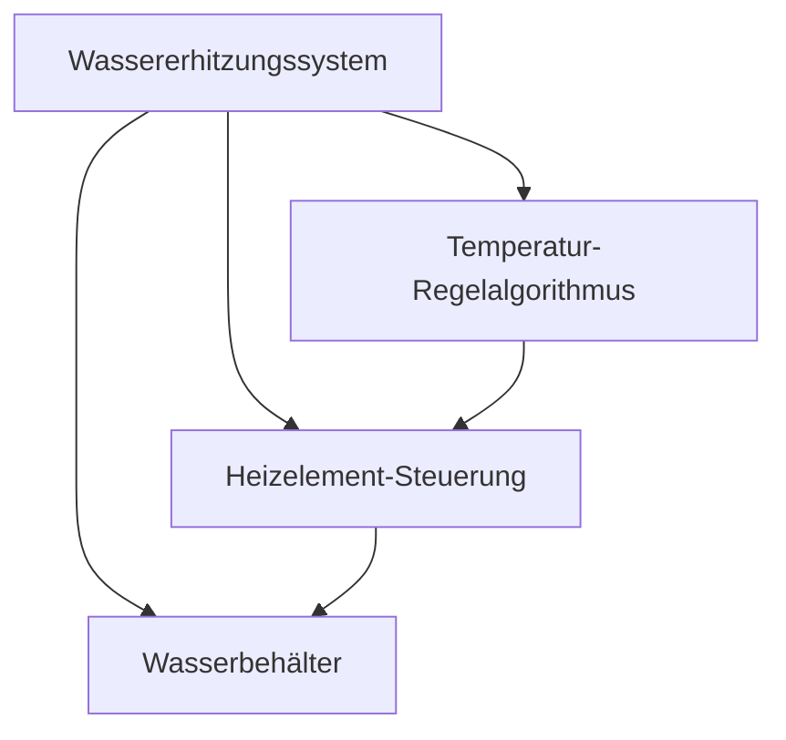

# Black-Box → White-Box Transition

Dieses Dokument erklärt die zentrale Methode der Systems-Engineering-Kaskade:
den Übergang von einer Black-Box-Anforderung zu einer White-Box-Architektur.

---

## Das Grundprinzip

### Black-Box (BB)
Beschreibt **was** ein System leisten muss, ohne zu verraten **wie** es das macht.

> "Das System soll 500 ml Wasser innerhalb von 120 s auf 90 °C erhitzen."

- Extern sichtbares Verhalten
- Kein Einblick in die interne Struktur
- Messbar und testbar

### White-Box (WB)
Beschreibt **wie** das System seine Aufgabe erfüllt — durch interne Sub-Komponenten und deren Kommunikation.

> "Um die BB zu erfüllen, benötigt man: Heizelement-Steuerung (HW), PID-Regelalgorithmus (SW), Wasserbehälter (MECH)."

- Interne Struktur sichtbar
- Sub-Komponenten mit Verantwortlichkeiten
- Schnittstellen zwischen den Sub-Komponenten

### Der Übergang
```
Ebene n (BB)  →  Architect  →  Ebene n (WB)
     ↑                                      |
     |                                      |
     +--- Sub-Komponenten werden zu BB ----+
                  für Ebene n+1
```

---

## Die 7 Schritte des Architects

1. **Analysiere** die Input-Anforderung auf funktionale, nicht-funktionale und Constraint-Aspekte.
2. **Definiere** die minimal notwendigen Sub-Komponenten.
3. **Weise** jeder Sub-Komponente eine Domäne zu (software, hardware, mechanics, system).
4. **Definiere** die internen Schnittstellen zwischen den Sub-Komponenten.
5. **Ordne** externe Interfaces den korrekten Sub-Komponenten zu.
6. **Leite** für jede Sub-Komponente eine neue Black-Box-Anforderung ab.
7. **Begründe** die Architekturentscheidung kurz (Trade-offs, Alternativen).

---

## Beispiel: Wassererhitzungssystem

### L1 Black-Box (System)

| Feld | Wert |
|------|------|
| **ID** | REQ-001 |
| **Beschreibung** | Das System soll 500 ml Wasser innerhalb von 120 s auf 90 °C erhitzen. |
| **Abnahmekriterium** | Messung: Wasser von 20 °C auf 90 °C in ≤ 120 s, Volumen 500 ml ± 10 ml. |

**Externe Schnittstellen:**
| Richtung | Typ | Beschreibung |
|----------|-----|-------------|
| Input | physical | 230 V AC Stromversorgung |
| Input | physical | Kaltwasserzulauf |
| Output | physical | Heißwasserauslauf |

### L1 White-Box (Architect-Output)



**Sub-Komponenten:**
| ID | Name | Domäne | BB-Anforderung |
|----|------|--------|---------------|
| COMP-001-01 | Heizelement-Steuerung | hardware | 2000 W Heizleistung, ±2 °C Genauigkeit |
| COMP-001-02 | Temperatur-Regelalgorithmus | software | PID-Regler, Sollwert 90 °C |
| COMP-001-03 | Wasserbehälter | mechanics | 500 ml, lebensmittelecht, 100 °C |

**Interne Schnittstellen:**
| Quelle | Ziel | Typ | Payload |
|--------|------|-----|---------|
| COMP-001-02 | COMP-001-01 | analog_signal | PWM 0-100 %, 5 V |
| COMP-001-01 | COMP-001-03 | thermal | Wärme 2000 W max, 50 cm² |

**Architektur-Begründung:**
> PID-Regelung als Software gewählt (flexibel parametrierbar, keine Bauteiltoleranzen).
> Alternative analoger Thermostat verworfen wegen geringerer Regelgenauigkeit.

---

## Regeln für den BB→WB-Übergang

### 1. Vollständigkeit
Die Summe aller Sub-Komponenten muss die Parent-Anforderung vollständig abdecken.

### 2. Keine Überlappung
Jede Sub-Komponente hat eine eindeutige Verantwortlichkeit.

### 3. Domänen-Treue
Eine Sub-Komponente sollte primär einer Domäne angehören.
Wenn sie mehrere Domänen überspannt → weiter zerlegen.

### 4. Schnittstellen-Klarheit
Jede Schnittstelle definiert:
- **Wer** spricht mit **wem**
- **Was** wird übertragen
- **Welches** Protokoll/Medium

### 5. Traceability
Jede Sub-Komponente referenziert ihre Parent-Anforderung.

### 6. Keine Implementation
White-Box beschreibt Struktur, nicht Code.
Keine Klassen, Methoden oder Dateipfade.

---

## Häufige Fehler

| Fehler | Ursache | Lösung |
|--------|---------|--------|
| Zu viele Sub-Komponenten | Über-Zerlegung | 3-7 Sub-Komponenten pro Ebene |
| Zu wenige Sub-Komponenten | Unter-Zerlegung | Prüfe ob alle Aspekte abgedeckt sind |
| Domänen-Mix | Verantwortlichkeiten nicht getrennt | Zerlege in domänen-reine Teile |
| Fehlende Schnittstellen | Vergessene Verbindungen | Critic prüft auf Lücken |
| Implizite Annahmen | Nicht dokumentiert | Explizit im architectural_rationale |

---

## Checkliste für den Critic

- [ ] Decken die Sub-Komponenten die Parent-Anforderung ab?
- [ ] Gibt es Lücken zwischen den Komponenten?
- [ ] Sind die Domänen-Zuweisungen sinnvoll?
- [ ] Sind alle externen Interfaces einer Sub-Komponente zugeordnet?
- [ ] Gibt es Widersprüche zwischen Sub-Komponenten?
- [ ] Sind die Interface-Typen kompatibel?
- [ ] Ist jede abgeleitete Black-Box messbar?
- [ ] Gibt es Akzeptanzkriterien?

---

## Weiterführende Artefakte

- `SE-STRATEGY.template.md` — Durable Anchor für das Gesamtprojekt
- `se-workflow.md` — Vollständiger rekursiver Workflow
- `se-interface-management.md` — Interface-Propagation im Detail
