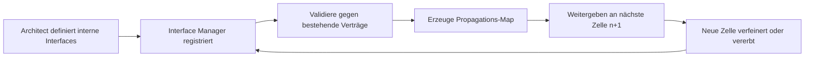

# Interface-Management in der SE-Kaskade

Das Interface-Management ist die **kritischste Rolle** für funktionierende Rekursion.
Wenn Komponente A und B in tieferen Ebenen unabhängig bearbeitet werden, müssen beide wissen, wie sie miteinander kommunizieren.

---

## Warum ein eigener Agent?

Interface-Definitionen sind nicht statisch. Wenn Ebene 3 eine API-Schnittstelle zwischen `AuthService` und `DatabaseService` definiert, muss bei der Zerlegung von `AuthService` in Ebene 4 geprüft werden:
- Ist das Datenformat noch kompatibel?
- Muss die Schnittstelle verfeinert werden?

Ein reiner Datenspeicher kann diese semantische Prüfung nicht leisten.

---

## Aufgaben des Interface Managers

1. **Registrieren** — Jedes Interface aus dem Architect-Output aufnehmen
2. **Validieren** — Gegen bestehende Verträge prüfen
3. **Propagieren** — Externe Interfaces an Sub-Komponenten weitergeben
4. **Spezifizieren** — Pro Komponente: Liste aller beteiligten Interfaces

---

## Interface-Lifecycle



---

## Die Propagations-Map

Die Propagations-Map ist der zentrale Mechanismus der Rekursion.
Bevor eine neue Zelle für eine Sub-Komponente gestartet wird, bekommt sie:
- Ihre eigene Black-Box-Anforderung
- **Alle Interfaces aus ihrer Zeile in der Propagations-Map**

### Beispiel

**Architect-Output (Ebene 1):**
```json
{
  "sub_components": [
    { "id": "COMP-001-01", "name": "Heizelement-Steuerung" },
    { "id": "COMP-001-02", "name": "Temperatur-Regelungsalgorithmus" },
    { "id": "COMP-001-03", "name": "Wasserbehälter" }
  ],
  "internal_interfaces": [
    {
      "source_id": "COMP-001-02",
      "target_id": "COMP-001-01",
      "type": "analog_signal",
      "payload": "PWM-Stellsignal 0-100%, 5V"
    },
    {
      "source_id": "COMP-001-01",
      "target_id": "COMP-001-03",
      "type": "thermal",
      "payload": "Wärme 2000W max, 50cm²"
    }
  ]
}
```

**Interface-Manager-Output:**
```json
{
  "propagation_map": {
    "COMP-001-01": {
      "inherited_external": ["230V AC Stromversorgung"],
      "new_internal_incoming": ["IF-001-01"],
      "new_internal_outgoing": ["IF-001-02"]
    },
    "COMP-001-02": {
      "inherited_external": [],
      "new_internal_incoming": [],
      "new_internal_outgoing": ["IF-001-01"]
    },
    "COMP-001-03": {
      "inherited_external": ["Kaltwasserzulauf", "Heißwasserauslauf"],
      "new_internal_incoming": ["IF-001-02"],
      "new_internal_outgoing": []
    }
  }
}
```

### Bedeutung der Felder

| Feld | Bedeutung |
|------|-----------|
| `inherited_external` | Externe Interfaces der Parent-Box, die dieser Komponente zugeordnet wurden |
| `new_internal_incoming` | Neue interne Interfaces, bei denen diese Komponente das **Ziel** ist |
| `new_internal_outgoing` | Neue interne Interfaces, bei denen diese Komponente die **Quelle** ist |

---

## Interface-Vererbung

### Externe Interfaces
Wenn Ebene 1 sagt "Gesamtsystem muss per WLAN kommunizieren", dann ist das ein externes Interface.
Der Architect auf Ebene 2 muss dieses Interface exakt der Sub-Komponente `Mainboard` zuordnen (nicht dem Gehäuse).

```
Ebene 1 (System):
  Extern: WLAN
  → zugeordnet zu COMP-001-01 (Mainboard)

Ebene 2 (Mainboard):
  Inherited external: WLAN
  → wird zu internem Interface zwischen WiFi-Chip und CPU
```

### Interne Interfaces
Neu geschaffene Interfaces zwischen Sub-Komponenten werden in der nächsten Ebene zu **internen Verträgen**.
Wenn `AuthService` eine API an `DatabaseService` definiert, muss bei der Zerlegung von `AuthService` geprüft werden: Ist das Datenformat noch kompatibel?

---

## Validierungs-Regeln

Der Interface Manager prüft:

1. **Existenz:** source_id und target_id existieren in sub_components
2. **Konsistenz:** Interface-Typ und Payload sind kompatibel
3. **Vollständigkeit:** Jede Komponente hat definierte Interfaces
4. **Keine Kollisionen:** Kein neues Interface widerspricht einem bestehenden Vertrag
5. **Korrekte Vererbung:** Externe Interfaces der Parent-Ebene wurden korrekt durchgereicht

---

## Interface-Registry-Format

Zentrale Registry über alle Ebenen:

```markdown
# Interface Registry

| ID | Quelle | Ziel | Typ | Payload | Ebene | Status |
|----|--------|------|-----|---------|-------|--------|
| IF-001-01 | COMP-001-02 | COMP-001-01 | analog_signal | PWM 0-100%, 5V | 1 | active |
| IF-001-02 | COMP-001-01 | COMP-001-03 | thermal | 2000W max, 50cm² | 1 | active |
| IF-001-01-01 | COMP-001-01-02 | COMP-001-01-01 | digital | I2C, 100kHz | 2 | active |
```

---

## Fehlerbeispiele

### Inkonsistente Spannung
```
COMP-A (Software): "Erwarte 5V Logikpegel"
COMP-B (Hardware):  "Liefere 3.3V"
→ Critic meldet: Konsistenz-Verletzung
→ Interface Manager markiert: blocked
```

### Fehlende Zuordnung
```
Ebene 1: Externes Interface "WLAN" nicht zugeordnet
→ Critic meldet: Vollständigkeit-Verletzung
→ Architect muss korrigieren
```

### Interface-Drift
```
Ebene 3: AuthService → DatabaseService API definiert als REST/JSON
Ebene 4: AuthService-Decomposition verwendet plötzlich gRPC
→ Interface Manager erkennt Kollision mit bestehendem Vertrag
→ Korrekturschleife erzwungen
```

---

## Zusammenfassung

- Interface-Propagation ist das Rückgrat der Rekursion
- Die Propagations-Map sichert, dass jede Zelle ihre Nachbaren kennt
- Vererbung externer Interfaces erfordert präzise Zuordnung durch den Architect
- Der Interface Manager verhindert Drift über Ebenen und parallele Zweige hinweg