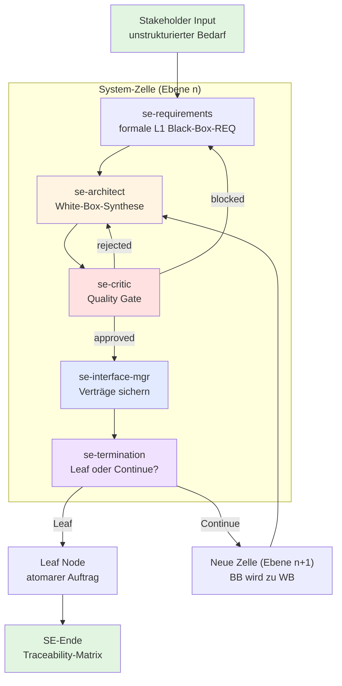

# SE-Workflow: Die rekursive Systems-Engineering-Kaskade

Dieses Dokument beschreibt den vollständigen Ablauf des fraktalen SE-Workflows in agent-meta.

> **Aktuell aktiv (Stand 2026-06-20):** 14 SE-Agenten-Templates — davon 13 aktiv und 1 deprecated (`se-orchestrator`).
> Die SE-Koordination läuft direkt über den Haupt-`orchestrator` im SE-Mode; `se-orchestrator` bleibt nur als Wrapper aus Backward-Compatibility-Gründen erhalten.

---

## Grundprinzip: Die System-Zelle

Anstatt alles auf einmal zu lösen, durchläuft jede Ebene — egal wie tief — exakt denselben systematischen Ablauf. Die **System-Zelle** ist die kleinste wiederholbare Einheit des Workflows.

### Eingabe (Black-Box)
"Das System muss X leisten"

### Ablauf
1. **Architect** — Synthese der White-Box-Architektur
2. **Critic** — Quality Gate (Vollständigkeit, Konsistenz, Testbarkeit)
3. **Interface Manager** — Verträge sichern und propagieren
4. **Terminator** — Entscheid: Leaf Node oder neue Zelle?

### Ausgabe
- Sub-Komponenten + Interface Contracts
- Oder: Fertige, atomare Arbeitsaufträge

---

## Rekursiver Fluss (Mermaid)



---

## Die Rollen im Detail

> Decomposition Floor (5 Rollen unten ausführlich) + Implementation Floor (3 Developer-Tiers, siehe Abschnitt »Implementation Floor«) + Validation Floor / V&V (5 Agenten, siehe Abschnitt »Validation Floor (V&V)«) = **13 aktive Rollen**. `se-orchestrator` ist deprecated.

### se-requirements
- Nimmt unstrukturierte Stakeholder-Bedarfe entgegen
- Formuliert messbare Black-Box-Anforderungen mit REQ-ID
- Definiert externe Schnittstellen und Domaenen
- **NEU: `arch_impact`-Flag** — signalisiert Architekturbedarf ohne die Entscheidung zu treffen (ISO/IEC 15288 Rollentrennung)
- **NEU: Teilresultat-Protokoll** — persistiert Output nach `requirements/...Requirements.md`

### se-architect
- Zerlegt Black-Box in White-Box-Architektur
- Weist Domaenen zu (software, hardware, mechanics, system)
- Definiert interne Schnittstellen und Sub-Komponenten
- Begruendet Architekturentscheidungen (Trade-offs)
- **NEU:** Verarbeitet `arch_trigger`-Liste aus Requirements — muss auf jeden Trigger in `architectural_rationale` eingehen
- **NEU: Teilresultat-Protokoll** — persistiert Output nach `architecture/...Architecture.iter-{N}.md`

### se-critic
- Prueft auf Vollstaendigkeit (Completeness)
- Prueft auf Konsistenz (Consistency)
- Prueft auf Testbarkeit (Verifiability)
- Prueft auf Traceability
- **NEU: Role Boundary Check** — prueft Requirements auf verbotene Architekturbegriffe und Rollenverstoesse
- Erzwingt Korrekturschleifen bei Maengeln (max. 3 Iterationen)
- **NEU: Teilresultat-Protokoll** — persistiert Output nach `...critic.iter-{N}.md`

### se-interface-mgr
- Zentrale Registry für alle Interface Contracts
- Erzeugt die Propagations-Map für jede Sub-Komponente
- Validiert gegen bestehende Verträge aus parallelen Zweigen
- Verhindert Interface-Drift über Ebenen hinweg

### se-termination
- Entscheidet pro Sub-Komponente: Leaf oder Continue
- Leaf-Kriterien: atomare Code-Einheit, Standard-Bauteil, ausgereizte Domäne, explizite Grenze
- Schutzregeln: max_depth, max_total_cells, Zirkular-Check

---

## Implementation Floor (Boden des V-Modells)

Nach `decision: leaf` werden Software-Komponenten an einen der 3 SE-Developer-Tiers dispatched (Routing nach Interface-Komplexität aus `propagation_map`):

| Tier | Trigger | Scope |
|------|---------|-------|
| `se-junior-developer` | 0–1 Interfaces | Atomare Wrapper, COTS-Adapter, trivial Data-Converter |
| `se-developer` | 2–4 Interfaces | Multi-Interface Services, contained Modules |
| `se-senior-developer` | 5+ Interfaces | Cross-Cutting, Boundary-Level, Security/Performance-Critical, Pre-Implementation Interface-Analyse |

Hardware-/Mechanik-Leafs werden als COTS-Spec dokumentiert, nicht implementiert.

---

## Validation Floor (V&V — Rechte Seite des V-Modells)

Im `se-cascade`-`validation`-Stage als `parallel_group` verdrahtet — läuft nach der Decomposition + Implementation:

| Agent | Zuständigkeit |
|-------|---------------|
| `se-validator` | L1 System-Validierung — End-to-End User Journeys gegen Stakeholder-Bedürfnisse |
| `se-verifier` | Multi-Level Verification (L1–Ln) — integrierte Systeme vs. Architektur-Spec |
| `se-test-engineer` | MBSE-Testmodelle, Integration Test Design (im Reflection Loop mit `se-testreviewer`) |
| `se-testreviewer` | Audit der Teststrategien (Edge-Cases, Boundary Values, Äquivalenzklassen, Flakiness) |
| `se-integration-and-test-manager` | V&V-Orchestrierung, Integrationsstrategie, Test-Ebenen-Koordination |

---

## Rekursion und Terminierung

### Übergang n → n+1
White-Box-Elemente der Ebene n werden zu Black-Box-Anforderungen der Ebene n+1.
Jede Sub-Komponente erhält:
- Ihre eigene Black-Box-Anforderung
- Alle Interfaces aus der Propagations-Map
- Die Parent-REQ-ID für Traceability

### Terminierungs-Bedingungen
- **Atomare Einheit:** Als einzelne Funktion/Klasse/Modul umsetzbar
- **COTS:** Commercial Off-The-Shelf, kaufbar
- **Domänengrenze:** Keine sinnvolle weitere Zerlegung möglich
- **Explizite Grenze:** Anforderung definiert Zukaufteil
- **max_depth:** Hartes Limit der Rekursionstiefe
- **max_total_cells:** Gesamtanzahl Zellen überschritten

---

## Parallelisierung

Zellen auf gleicher Ebene, die unabhängige Sub-Komponenten bearbeiten, laufen parallel:

```
Ebene 2:
├── Zelle A (Heizelement-Steuerung)     → parallel
├── Zelle B (Temperatur-Regelalgorithmus) → parallel
└── Zelle C (Wasserbehälter)            → parallel (terminiert sofort als Leaf)
```

Maximal `max_parallel_cells` gleichzeitige Zellen.

---

## Artefakte pro Ebene

| Artefakt | Format | Zweck |
|----------|--------|-------|
| STRATEGY.md | Markdown | Durable Anchor: Ziel, Constraints, Risks |
| requirements.md | Markdown | Flache Liste aller REQ-IDs |
| architecture.md | Markdown + Mermaid | Gesamtarchitektur |
| interface-registry.md | Markdown + Tabelle | Zentrale Interface-Tabelle |
| traceability-matrix.md | Markdown | Parent-Child-Matrix |
| REQ-xxx.md | Markdown | Einzelne Anforderung mit BB + WB |

---

## Korrekturschleifen

```
Architect → Critic
                |
                ├── approved → Interface Manager
                |
                ├── rejected → Architect (mit correction_hints, max 3x)
                |
                └── blocked → Parent-Zelle (Architektur auf Ebene n-1 revidieren)
```

---

## Konfiguration

Die Kaskade wird in `.meta-config/project.yaml` gesteuert:

```yaml
roles:
  - se-orchestrator
  - se-requirements
  - se-architect
  - se-critic
  - se-interface-mgr
  - se-termination

variables:
  SE_MAX_DEPTH: 5
  SE_MAX_CELLS: 20
  SE_MAX_CRITIC_ITERATIONS: 3
  SE_MAX_PARALLEL_CELLS: 4
  cost_limit_eur: 5.00
```

---

## Zusammenfassung

Der SE-Workflow ist ein **fraktaler, rekursiver Prozess**:
- Jede Ebene arbeitet identisch
- Die Granularitaet aendert sich, nicht die Methodik
- Harte Schutzmechanismen verhindern Endlosschleifen und Kostenexplosion
- Interface-Propagation sichert Konsistenz ueber alle Ebenen
- Der Output ist menschenlesbar (Markdown + Mermaid) und optional exportierbar

---

## Teilresultat-Protokoll (NEU — Loesung A)

Jeder SE-Agent persistiert seinen Output atomar nach jedem Schritt. Ermoeglicht Wiederaufnahme nach Session-Abbruch.

**Prinzip:** Write-Through-Cache auf Dateisystem-Ebene. Neue Session liest `.se-state.yaml` und setzt am letzten abgeschlossenen Schritt auf.

Siehe `howto/se-resume-session.md` fuer Details.

---

## Rollentrennung Requirements vs. Architect (NEU — Loesung B)

`se-requirements` signalisiert Architekturbedarf via `arch_impact: true` / `arch_trigger`, trifft aber KEINE Architekturentscheidung. `se-critic` erzwingt dies mit dem Role Boundary Check.

Siehe `howto/se-role-boundaries.md` fuer Details.

---

## Pipeline-Trennung (NEU — Loesung C, optional)

Zwei getrennte Pipelines reduzieren Overhead:

| Pipeline | Trigger | Stack |
|----------|---------|-------|
| **A — System-Level** | `scope: system` ODER `arch_impact: true` | requirements → architect → critic → interface-mgr → termination |
| **B — Component-Level** | `scope: component` AND `arch_impact: false` | requirements(refinement) → developer-tier → code-reviewer → validator + verifier |

Default: Pipeline A (sicherer Default — vollstaendige Kaskade).